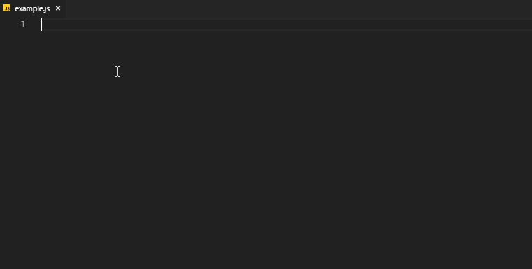

WSSnippets for Visual studio code
===========================

Visual Studio Code snippet plugin containing some very useful features.

<!-- TOC -->

- [1. Features](#1-features)
- [2. Setup (in 2 easy steps)](#2-setup-in-2-easy-steps)
- [3. Contribution guidelines](#3-contribution-guidelines)
- [4. Changelog](#4-changelog)
- [5. License](#5-license)
- [6. Documentation](#6-documentation)

<!-- /TOC -->

# 1. Features

Snippets for:
- Bricks
- Mjolnir 
- Font Awesome
- Material Icons
- Material Community Icons

# 2. Setup (in 2 easy steps)

1. Install plugin
  1. Press `F1`, paste `ext install wssnippets` & then press `enter` (or)
  2. Goto extensions by pressing `Ctrl-Shift-X` (Windows/Linux) or `Cmd-Shift-X` (Mac) & Search for `WSSnippets`, click on install
2. Reload your editor
3. **You are good to go...**

# 3. Contribution guidelines

1. Clone this repo
2. To modify snippets, you can find the templates for each snippet under `src/generators/`. These Html snippets must follow [sublime text snippet](http://docs.sublimetext.info/en/latest/extensibility/snippets.html) format. There is no need to update `snippets.json` manually. The build will take care of regenerating this file from template files.
3. If you need to change `README.md` (or) `package.json`, you should modify their templates (which are used to generate the root level files) under `files/`. For eg., If you want `package.json` at the root to be modified, you should change `package-template.json` under `files/`. These root level `package.json` & `README.md` are regenerated for every build from their corresponding templates.
4. To customize/create other generators, look at `source/util/config.js` or create your own customized generator as above mentioned. 
5. Send me a pull request

# 4. Changelog
See [here](CHANGELOG.md)

# 5. License

WSSnippets for Visual Studio Code plugin is open-sourced software licensed under the [MIT license](http://opensource.org/licenses/MIT).

**Enjoy!**

# 6. Documentation
Description|Shortcut
:---|:---
Bricks badge default | `bx-badge-default`
Bricks button accent | `bx-button-accent`
Bricks button default | `bx-button-default`
Bricks button flat | `bx-button-flat`
Bricks button onclick | `bx-button-onclick`
Bricks button primary | `bx-button-primary`
Bricks card default | `bx-card-default`
Bricks card header-menu-actions | `bx-card-header-menu-actions`
Bricks chip children-deletable-onclick | `bx-chip-children-deletable-onclick`
Bricks chip default | `bx-chip-default`
Bricks chip deletable | `bx-chip-deletable`
Bricks chip onclick | `bx-chip-onclick`
Bricks chip use-children | `bx-chip-use-children`
Bricks index default | `bx-index-default`
Bricks input-text default | `bx-input-text-default`
Bricks input-text email | `bx-input-text-email`
Bricks input-text password | `bx-input-text-password`
Bricks input-text tel | `bx-input-text-tel`
Bricks input-text url | `bx-input-text-url`
Bricks listview default | `bx-listview-default`
Bricks switch checked | `bx-switch-checked`
Bricks switch default | `bx-switch-default`
Bricks tabs default | `bx-tabs-default`
Bricks text default | `bx-text-default`
Bricks text tooltip | `bx-text-tooltip`
Bricks text-area text-area-required | `bx-text-area-text-area-required`
Bricks text-area text-area | `bx-text-area-text-area`
Mjolnir select phone | `mj-select-phone`
Mjolnir textinput phone | `mj-textinput-phone`
Font Awesome 500px | `fa-500px`
Font Awesome adjust | `fa-adjust`
Font Awesome adn | `fa-adn`
Font Awesome align-center | `fa-align-center`
Font Awesome align-justify | `fa-align-justify`
Font Awesome align-left | `fa-align-left`
Font Awesome align-right | `fa-align-right`
Font Awesome amazon | `fa-amazon`
Font Awesome ambulance | `fa-ambulance`
Font Awesome anchor | `fa-anchor`
Font Awesome android | `fa-android`
Font Awesome angellist | `fa-angellist`
Font Awesome angle-double-down | `fa-angle-double-down`
Font Awesome angle-double-left | `fa-angle-double-left`
Font Awesome angle-double-right | `fa-angle-double-right`
Font Awesome angle-double-up | `fa-angle-double-up`
Font Awesome angle-down | `fa-angle-down`
Font Awesome angle-left | `fa-angle-left`
Font Awesome angle-right | `fa-angle-right`
Font Awesome angle-up | `fa-angle-up`
Font Awesome apple | `fa-apple`
Font Awesome archive | `fa-archive`
Font Awesome area-chart | `fa-area-chart`
Font Awesome arrow-circle-down | `fa-arrow-circle-down`
Font Awesome arrow-circle-left | `fa-arrow-circle-left`
Font Awesome arrow-circle-o-down | `fa-arrow-circle-o-down`
Font Awesome arrow-circle-o-left | `fa-arrow-circle-o-left`
Font Awesome arrow-circle-o-right | `fa-arrow-circle-o-right`
Font Awesome arrow-circle-o-up | `fa-arrow-circle-o-up`
Font Awesome arrow-circle-right | `fa-arrow-circle-right`
Font Awesome arrow-circle-up | `fa-arrow-circle-up`
Font Awesome arrow-down | `fa-arrow-down`
Font Awesome arrow-left | `fa-arrow-left`
Font Awesome arrow-right | `fa-arrow-right`
Font Awesome arrow-up | `fa-arrow-up`
Font Awesome arrows | `fa-arrows`
Font Awesome arrows-alt | `fa-arrows-alt`
Font Awesome arrows-h | `fa-arrows-h`
Font Awesome arrows-v | `fa-arrows-v`
Font Awesome asterisk | `fa-asterisk`
Font Awesome at | `fa-at`
Font Awesome backward | `fa-backward`
Font Awesome balance-scale | `fa-balance-scale`
Font Awesome ban | `fa-ban`
Font Awesome bar-chart | `fa-bar-chart`
Font Awesome barcode | `fa-barcode`
Font Awesome bars | `fa-bars`
Font Awesome battery-empty | `fa-battery-empty`
Font Awesome battery-full | `fa-battery-full`
Font Awesome battery-half | `fa-battery-half`
Font Awesome battery-quarter | `fa-battery-quarter`
Font Awesome battery-three-quarters | `fa-battery-three-quarters`
Font Awesome bed | `fa-bed`
Font Awesome beer | `fa-beer`
Font Awesome behance | `fa-behance`
Font Awesome behance-square | `fa-behance-square`
Font Awesome bell | `fa-bell`
Font Awesome bell-o | `fa-bell-o`
Font Awesome bell-slash | `fa-bell-slash`
Font Awesome bell-slash-o | `fa-bell-slash-o`
Font Awesome bicycle | `fa-bicycle`
Font Awesome binoculars | `fa-binoculars`
Font Awesome birthday-cake | `fa-birthday-cake`
Font Awesome bitbucket | `fa-bitbucket`
Font Awesome bitbucket-square | `fa-bitbucket-square`
Font Awesome black-tie | `fa-black-tie`
Font Awesome bold | `fa-bold`
Font Awesome bolt | `fa-bolt`
Font Awesome bomb | `fa-bomb`
Font Awesome book | `fa-book`
Font Awesome bookmark | `fa-bookmark`
Font Awesome bookmark-o | `fa-bookmark-o`
Font Awesome briefcase | `fa-briefcase`
Font Awesome btc | `fa-btc`
Font Awesome bug | `fa-bug`
Font Awesome building | `fa-building`
Font Awesome building-o | `fa-building-o`
Font Awesome bullhorn | `fa-bullhorn`
Font Awesome bullseye | `fa-bullseye`
Font Awesome bus | `fa-bus`
Font Awesome buysellads | `fa-buysellads`
Font Awesome calculator | `fa-calculator`
Font Awesome calendar | `fa-calendar`
Font Awesome calendar-check-o | `fa-calendar-check-o`
Font Awesome calendar-minus-o | `fa-calendar-minus-o`
Font Awesome calendar-o | `fa-calendar-o`
Font Awesome calendar-plus-o | `fa-calendar-plus-o`
Font Awesome calendar-times-o | `fa-calendar-times-o`
Font Awesome camera | `fa-camera`
Font Awesome camera-retro | `fa-camera-retro`
Font Awesome car | `fa-car`
Font Awesome caret-down | `fa-caret-down`
Font Awesome caret-left | `fa-caret-left`
Font Awesome caret-right | `fa-caret-right`
Font Awesome caret-square-o-down | `fa-caret-square-o-down`
Font Awesome caret-square-o-left | `fa-caret-square-o-left`
Font Awesome caret-square-o-right | `fa-caret-square-o-right`
Font Awesome caret-square-o-up | `fa-caret-square-o-up`
Font Awesome caret-up | `fa-caret-up`
Font Awesome cart-arrow-down | `fa-cart-arrow-down`
Font Awesome cart-plus | `fa-cart-plus`
Font Awesome cc | `fa-cc`
Font Awesome cc-amex | `fa-cc-amex`
Font Awesome cc-diners-club | `fa-cc-diners-club`
Font Awesome cc-discover | `fa-cc-discover`
Font Awesome cc-jcb | `fa-cc-jcb`
Font Awesome cc-mastercard | `fa-cc-mastercard`
Font Awesome cc-paypal | `fa-cc-paypal`
Font Awesome cc-stripe | `fa-cc-stripe`
Font Awesome cc-visa | `fa-cc-visa`
Font Awesome certificate | `fa-certificate`
Font Awesome chain-broken | `fa-chain-broken`
Font Awesome check | `fa-check`
Font Awesome check-circle | `fa-check-circle`
Font Awesome check-circle-o | `fa-check-circle-o`
Font Awesome check-square | `fa-check-square`
Font Awesome check-square-o | `fa-check-square-o`
Font Awesome chevron-circle-down | `fa-chevron-circle-down`
Font Awesome chevron-circle-left | `fa-chevron-circle-left`
Font Awesome chevron-circle-right | `fa-chevron-circle-right`
Font Awesome chevron-circle-up | `fa-chevron-circle-up`
Font Awesome chevron-down | `fa-chevron-down`
Font Awesome chevron-left | `fa-chevron-left`
Font Awesome chevron-right | `fa-chevron-right`
Font Awesome chevron-up | `fa-chevron-up`
Font Awesome child | `fa-child`
Font Awesome chrome | `fa-chrome`
Font Awesome circle | `fa-circle`
Font Awesome circle-o | `fa-circle-o`
Font Awesome circle-o-notch | `fa-circle-o-notch`
Font Awesome circle-thin | `fa-circle-thin`
Font Awesome clipboard | `fa-clipboard`
Font Awesome clock-o | `fa-clock-o`
Font Awesome clone | `fa-clone`
Font Awesome cloud | `fa-cloud`
Font Awesome cloud-download | `fa-cloud-download`
Font Awesome cloud-upload | `fa-cloud-upload`
Font Awesome code | `fa-code`
Font Awesome code-fork | `fa-code-fork`
Font Awesome codepen | `fa-codepen`
Font Awesome coffee | `fa-coffee`
Font Awesome cog | `fa-cog`
Font Awesome cogs | `fa-cogs`
Font Awesome columns | `fa-columns`
Font Awesome comment | `fa-comment`
Font Awesome comment-o | `fa-comment-o`
Font Awesome commenting | `fa-commenting`
Font Awesome commenting-o | `fa-commenting-o`
Font Awesome comments | `fa-comments`
Font Awesome comments-o | `fa-comments-o`
Font Awesome compass | `fa-compass`
Font Awesome compress | `fa-compress`
Font Awesome connectdevelop | `fa-connectdevelop`
Font Awesome contao | `fa-contao`
Font Awesome copyright | `fa-copyright`
Font Awesome creative-commons | `fa-creative-commons`
Font Awesome credit-card | `fa-credit-card`
Font Awesome crop | `fa-crop`
Font Awesome crosshairs | `fa-crosshairs`
Font Awesome css3 | `fa-css3`
Font Awesome cube | `fa-cube`
Font Awesome cubes | `fa-cubes`
Font Awesome cutlery | `fa-cutlery`
Font Awesome dashcube | `fa-dashcube`
Font Awesome database | `fa-database`
Font Awesome delicious | `fa-delicious`
Font Awesome desktop | `fa-desktop`
Font Awesome deviantart | `fa-deviantart`
Font Awesome diamond | `fa-diamond`
Font Awesome digg | `fa-digg`
Font Awesome dot-circle-o | `fa-dot-circle-o`
Font Awesome download | `fa-download`
Font Awesome dribbble | `fa-dribbble`
Font Awesome dropbox | `fa-dropbox`
Font Awesome drupal | `fa-drupal`
Font Awesome eject | `fa-eject`
Font Awesome ellipsis-h | `fa-ellipsis-h`
Font Awesome ellipsis-v | `fa-ellipsis-v`
Font Awesome empire | `fa-empire`
Font Awesome envelope | `fa-envelope`
Font Awesome envelope-o | `fa-envelope-o`
Font Awesome envelope-square | `fa-envelope-square`
Font Awesome eraser | `fa-eraser`
Font Awesome eur | `fa-eur`
Font Awesome exchange | `fa-exchange`
Font Awesome exclamation | `fa-exclamation`
Font Awesome exclamation-circle | `fa-exclamation-circle`
Font Awesome exclamation-triangle | `fa-exclamation-triangle`
Font Awesome expand | `fa-expand`
Font Awesome expeditedssl | `fa-expeditedssl`
Font Awesome external-link | `fa-external-link`
Font Awesome external-link-square | `fa-external-link-square`
Font Awesome eye | `fa-eye`
Font Awesome eye-slash | `fa-eye-slash`
Font Awesome eyedropper | `fa-eyedropper`
Font Awesome facebook | `fa-facebook`
Font Awesome facebook-official | `fa-facebook-official`
Font Awesome facebook-square | `fa-facebook-square`
Font Awesome fast-backward | `fa-fast-backward`
Font Awesome fast-forward | `fa-fast-forward`
Font Awesome fax | `fa-fax`
Font Awesome female | `fa-female`
Font Awesome fighter-jet | `fa-fighter-jet`
Font Awesome file | `fa-file`
Font Awesome file-archive-o | `fa-file-archive-o`
Font Awesome file-audio-o | `fa-file-audio-o`
Font Awesome file-code-o | `fa-file-code-o`
Font Awesome file-excel-o | `fa-file-excel-o`
Font Awesome file-image-o | `fa-file-image-o`
Font Awesome file-o | `fa-file-o`
Font Awesome file-pdf-o | `fa-file-pdf-o`
Font Awesome file-powerpoint-o | `fa-file-powerpoint-o`
Font Awesome file-text | `fa-file-text`
Font Awesome file-text-o | `fa-file-text-o`
Font Awesome file-video-o | `fa-file-video-o`
Font Awesome file-word-o | `fa-file-word-o`
Font Awesome files-o | `fa-files-o`
Font Awesome film | `fa-film`
Font Awesome filter | `fa-filter`
Font Awesome fire | `fa-fire`
Font Awesome fire-extinguisher | `fa-fire-extinguisher`
Font Awesome firefox | `fa-firefox`
Font Awesome flag | `fa-flag`
Font Awesome flag-checkered | `fa-flag-checkered`
Font Awesome flag-o | `fa-flag-o`
Font Awesome flask | `fa-flask`
Font Awesome flickr | `fa-flickr`
Font Awesome floppy-o | `fa-floppy-o`
Font Awesome folder | `fa-folder`
Font Awesome folder-o | `fa-folder-o`
Font Awesome folder-open | `fa-folder-open`
Font Awesome folder-open-o | `fa-folder-open-o`
Font Awesome font | `fa-font`
Font Awesome fonticons | `fa-fonticons`
Font Awesome forumbee | `fa-forumbee`
Font Awesome forward | `fa-forward`
Font Awesome foursquare | `fa-foursquare`
Font Awesome frown-o | `fa-frown-o`
Font Awesome futbol-o | `fa-futbol-o`
Font Awesome gamepad | `fa-gamepad`
Font Awesome gavel | `fa-gavel`
Font Awesome gbp | `fa-gbp`
Font Awesome genderless | `fa-genderless`
Font Awesome get-pocket | `fa-get-pocket`
Font Awesome gg | `fa-gg`
Font Awesome gg-circle | `fa-gg-circle`
Font Awesome gift | `fa-gift`
Font Awesome git | `fa-git`
Font Awesome git-square | `fa-git-square`
Font Awesome github | `fa-github`
Font Awesome github-alt | `fa-github-alt`
Font Awesome github-square | `fa-github-square`
Font Awesome globe | `fa-globe`
Font Awesome google | `fa-google`
Font Awesome google-plus | `fa-google-plus`
Font Awesome google-plus-square | `fa-google-plus-square`
Font Awesome google-wallet | `fa-google-wallet`
Font Awesome graduation-cap | `fa-graduation-cap`
Font Awesome gratipay | `fa-gratipay`
Font Awesome h-square | `fa-h-square`
Font Awesome hacker-news | `fa-hacker-news`
Font Awesome hand-lizard-o | `fa-hand-lizard-o`
Font Awesome hand-o-down | `fa-hand-o-down`
Font Awesome hand-o-left | `fa-hand-o-left`
Font Awesome hand-o-right | `fa-hand-o-right`
Font Awesome hand-o-up | `fa-hand-o-up`
Font Awesome hand-paper-o | `fa-hand-paper-o`
Font Awesome hand-peace-o | `fa-hand-peace-o`
Font Awesome hand-pointer-o | `fa-hand-pointer-o`
Font Awesome hand-rock-o | `fa-hand-rock-o`
Font Awesome hand-scissors-o | `fa-hand-scissors-o`
Font Awesome hand-spock-o | `fa-hand-spock-o`
Font Awesome hdd-o | `fa-hdd-o`
Font Awesome header | `fa-header`
Font Awesome headphones | `fa-headphones`
Font Awesome heart | `fa-heart`
Font Awesome heart-o | `fa-heart-o`
Font Awesome heartbeat | `fa-heartbeat`
Font Awesome history | `fa-history`
Font Awesome home | `fa-home`
Font Awesome hospital-o | `fa-hospital-o`
Font Awesome hourglass | `fa-hourglass`
Font Awesome hourglass-end | `fa-hourglass-end`
Font Awesome hourglass-half | `fa-hourglass-half`
Font Awesome hourglass-o | `fa-hourglass-o`
Font Awesome hourglass-start | `fa-hourglass-start`
Font Awesome houzz | `fa-houzz`
Font Awesome html5 | `fa-html5`
Font Awesome i-cursor | `fa-i-cursor`
Font Awesome ils | `fa-ils`
Font Awesome inbox | `fa-inbox`
Font Awesome indent | `fa-indent`
Font Awesome industry | `fa-industry`
Font Awesome info | `fa-info`
Font Awesome info-circle | `fa-info-circle`
Font Awesome inr | `fa-inr`
Font Awesome instagram | `fa-instagram`
Font Awesome internet-explorer | `fa-internet-explorer`
Font Awesome ioxhost | `fa-ioxhost`
Font Awesome italic | `fa-italic`
Font Awesome joomla | `fa-joomla`
Font Awesome jpy | `fa-jpy`
Font Awesome jsfiddle | `fa-jsfiddle`
Font Awesome key | `fa-key`
Font Awesome keyboard-o | `fa-keyboard-o`
Font Awesome krw | `fa-krw`
Font Awesome language | `fa-language`
Font Awesome laptop | `fa-laptop`
Font Awesome lastfm | `fa-lastfm`
Font Awesome lastfm-square | `fa-lastfm-square`
Font Awesome leaf | `fa-leaf`
Font Awesome leanpub | `fa-leanpub`
Font Awesome lemon-o | `fa-lemon-o`
Font Awesome level-down | `fa-level-down`
Font Awesome level-up | `fa-level-up`
Font Awesome life-ring | `fa-life-ring`
Font Awesome lightbulb-o | `fa-lightbulb-o`
Font Awesome line-chart | `fa-line-chart`
Font Awesome link | `fa-link`
Font Awesome linkedin | `fa-linkedin`
Font Awesome linkedin-square | `fa-linkedin-square`
Font Awesome linux | `fa-linux`
Font Awesome list | `fa-list`
Font Awesome list-alt | `fa-list-alt`
Font Awesome list-ol | `fa-list-ol`
Font Awesome list-ul | `fa-list-ul`
Font Awesome location-arrow | `fa-location-arrow`
Font Awesome lock | `fa-lock`
Font Awesome long-arrow-down | `fa-long-arrow-down`
Font Awesome long-arrow-left | `fa-long-arrow-left`
Font Awesome long-arrow-right | `fa-long-arrow-right`
Font Awesome long-arrow-up | `fa-long-arrow-up`
Font Awesome magic | `fa-magic`
Font Awesome magnet | `fa-magnet`
Font Awesome male | `fa-male`
Font Awesome map | `fa-map`
Font Awesome map-marker | `fa-map-marker`
Font Awesome map-o | `fa-map-o`
Font Awesome map-pin | `fa-map-pin`
Font Awesome map-signs | `fa-map-signs`
Font Awesome mars | `fa-mars`
Font Awesome mars-double | `fa-mars-double`
Font Awesome mars-stroke | `fa-mars-stroke`
Font Awesome mars-stroke-h | `fa-mars-stroke-h`
Font Awesome mars-stroke-v | `fa-mars-stroke-v`
Font Awesome maxcdn | `fa-maxcdn`
Font Awesome meanpath | `fa-meanpath`
Font Awesome medium | `fa-medium`
Font Awesome medkit | `fa-medkit`
Font Awesome meh-o | `fa-meh-o`
Font Awesome mercury | `fa-mercury`
Font Awesome microphone | `fa-microphone`
Font Awesome microphone-slash | `fa-microphone-slash`
Font Awesome minus | `fa-minus`
Font Awesome minus-circle | `fa-minus-circle`
Font Awesome minus-square | `fa-minus-square`
Font Awesome minus-square-o | `fa-minus-square-o`
Font Awesome mobile | `fa-mobile`
Font Awesome money | `fa-money`
Font Awesome moon-o | `fa-moon-o`
Font Awesome motorcycle | `fa-motorcycle`
Font Awesome mouse-pointer | `fa-mouse-pointer`
Font Awesome music | `fa-music`
Font Awesome neuter | `fa-neuter`
Font Awesome newspaper-o | `fa-newspaper-o`
Font Awesome object-group | `fa-object-group`
Font Awesome object-ungroup | `fa-object-ungroup`
Font Awesome odnoklassniki | `fa-odnoklassniki`
Font Awesome odnoklassniki-square | `fa-odnoklassniki-square`
Font Awesome opencart | `fa-opencart`
Font Awesome openid | `fa-openid`
Font Awesome opera | `fa-opera`
Font Awesome optin-monster | `fa-optin-monster`
Font Awesome outdent | `fa-outdent`
Font Awesome pagelines | `fa-pagelines`
Font Awesome paint-brush | `fa-paint-brush`
Font Awesome paper-plane | `fa-paper-plane`
Font Awesome paper-plane-o | `fa-paper-plane-o`
Font Awesome paperclip | `fa-paperclip`
Font Awesome paragraph | `fa-paragraph`
Font Awesome pause | `fa-pause`
Font Awesome paw | `fa-paw`
Font Awesome paypal | `fa-paypal`
Font Awesome pencil | `fa-pencil`
Font Awesome pencil-square | `fa-pencil-square`
Font Awesome pencil-square-o | `fa-pencil-square-o`
Font Awesome phone | `fa-phone`
Font Awesome phone-square | `fa-phone-square`
Font Awesome picture-o | `fa-picture-o`
Font Awesome pie-chart | `fa-pie-chart`
Font Awesome pied-piper | `fa-pied-piper`
Font Awesome pied-piper-alt | `fa-pied-piper-alt`
Font Awesome pinterest | `fa-pinterest`
Font Awesome pinterest-p | `fa-pinterest-p`
Font Awesome pinterest-square | `fa-pinterest-square`
Font Awesome plane | `fa-plane`
Font Awesome play | `fa-play`
Font Awesome play-circle | `fa-play-circle`
Font Awesome play-circle-o | `fa-play-circle-o`
Font Awesome plug | `fa-plug`
Font Awesome plus | `fa-plus`
Font Awesome plus-circle | `fa-plus-circle`
Font Awesome plus-square | `fa-plus-square`
Font Awesome plus-square-o | `fa-plus-square-o`
Font Awesome power-off | `fa-power-off`
Font Awesome print | `fa-print`
Font Awesome puzzle-piece | `fa-puzzle-piece`
Font Awesome qq | `fa-qq`
Font Awesome qrcode | `fa-qrcode`
Font Awesome question | `fa-question`
Font Awesome question-circle | `fa-question-circle`
Font Awesome quote-left | `fa-quote-left`
Font Awesome quote-right | `fa-quote-right`
Font Awesome random | `fa-random`
Font Awesome rebel | `fa-rebel`
Font Awesome recycle | `fa-recycle`
Font Awesome reddit | `fa-reddit`
Font Awesome reddit-square | `fa-reddit-square`
Font Awesome refresh | `fa-refresh`
Font Awesome registered | `fa-registered`
Font Awesome renren | `fa-renren`
Font Awesome repeat | `fa-repeat`
Font Awesome reply | `fa-reply`
Font Awesome reply-all | `fa-reply-all`
Font Awesome retweet | `fa-retweet`
Font Awesome road | `fa-road`
Font Awesome rocket | `fa-rocket`
Font Awesome rss | `fa-rss`
Font Awesome rss-square | `fa-rss-square`
Font Awesome rub | `fa-rub`
Font Awesome safari | `fa-safari`
Font Awesome scissors | `fa-scissors`
Font Awesome search | `fa-search`
Font Awesome search-minus | `fa-search-minus`
Font Awesome search-plus | `fa-search-plus`
Font Awesome sellsy | `fa-sellsy`
Font Awesome server | `fa-server`
Font Awesome share | `fa-share`
Font Awesome share-alt | `fa-share-alt`
Font Awesome share-alt-square | `fa-share-alt-square`
Font Awesome share-square | `fa-share-square`
Font Awesome share-square-o | `fa-share-square-o`
Font Awesome shield | `fa-shield`
Font Awesome ship | `fa-ship`
Font Awesome shirtsinbulk | `fa-shirtsinbulk`
Font Awesome shopping-cart | `fa-shopping-cart`
Font Awesome sign-in | `fa-sign-in`
Font Awesome sign-out | `fa-sign-out`
Font Awesome signal | `fa-signal`
Font Awesome simplybuilt | `fa-simplybuilt`
Font Awesome sitemap | `fa-sitemap`
Font Awesome skyatlas | `fa-skyatlas`
Font Awesome skype | `fa-skype`
Font Awesome slack | `fa-slack`
Font Awesome sliders | `fa-sliders`
Font Awesome slideshare | `fa-slideshare`
Font Awesome smile-o | `fa-smile-o`
Font Awesome sort | `fa-sort`
Font Awesome sort-alpha-asc | `fa-sort-alpha-asc`
Font Awesome sort-alpha-desc | `fa-sort-alpha-desc`
Font Awesome sort-amount-asc | `fa-sort-amount-asc`
Font Awesome sort-amount-desc | `fa-sort-amount-desc`
Font Awesome sort-asc | `fa-sort-asc`
Font Awesome sort-desc | `fa-sort-desc`
Font Awesome sort-numeric-asc | `fa-sort-numeric-asc`
Font Awesome sort-numeric-desc | `fa-sort-numeric-desc`
Font Awesome soundcloud | `fa-soundcloud`
Font Awesome space-shuttle | `fa-space-shuttle`
Font Awesome spinner | `fa-spinner`
Font Awesome spoon | `fa-spoon`
Font Awesome spotify | `fa-spotify`
Font Awesome square | `fa-square`
Font Awesome square-o | `fa-square-o`
Font Awesome stack-exchange | `fa-stack-exchange`
Font Awesome stack-overflow | `fa-stack-overflow`
Font Awesome star | `fa-star`
Font Awesome star-half | `fa-star-half`
Font Awesome star-half-o | `fa-star-half-o`
Font Awesome star-o | `fa-star-o`
Font Awesome steam | `fa-steam`
Font Awesome steam-square | `fa-steam-square`
Font Awesome step-backward | `fa-step-backward`
Font Awesome step-forward | `fa-step-forward`
Font Awesome stethoscope | `fa-stethoscope`
Font Awesome sticky-note | `fa-sticky-note`
Font Awesome sticky-note-o | `fa-sticky-note-o`
Font Awesome stop | `fa-stop`
Font Awesome street-view | `fa-street-view`
Font Awesome strikethrough | `fa-strikethrough`
Font Awesome stumbleupon | `fa-stumbleupon`
Font Awesome stumbleupon-circle | `fa-stumbleupon-circle`
Font Awesome subscript | `fa-subscript`
Font Awesome subway | `fa-subway`
Font Awesome suitcase | `fa-suitcase`
Font Awesome sun-o | `fa-sun-o`
Font Awesome superscript | `fa-superscript`
Font Awesome table | `fa-table`
Font Awesome tablet | `fa-tablet`
Font Awesome tachometer | `fa-tachometer`
Font Awesome tag | `fa-tag`
Font Awesome tags | `fa-tags`
Font Awesome tasks | `fa-tasks`
Font Awesome taxi | `fa-taxi`
Font Awesome television | `fa-television`
Font Awesome tencent-weibo | `fa-tencent-weibo`
Font Awesome terminal | `fa-terminal`
Font Awesome text-height | `fa-text-height`
Font Awesome text-width | `fa-text-width`
Font Awesome th | `fa-th`
Font Awesome th-large | `fa-th-large`
Font Awesome th-list | `fa-th-list`
Font Awesome thumb-tack | `fa-thumb-tack`
Font Awesome thumbs-down | `fa-thumbs-down`
Font Awesome thumbs-o-down | `fa-thumbs-o-down`
Font Awesome thumbs-o-up | `fa-thumbs-o-up`
Font Awesome thumbs-up | `fa-thumbs-up`
Font Awesome ticket | `fa-ticket`
Font Awesome times | `fa-times`
Font Awesome times-circle | `fa-times-circle`
Font Awesome times-circle-o | `fa-times-circle-o`
Font Awesome tint | `fa-tint`
Font Awesome toggle-off | `fa-toggle-off`
Font Awesome toggle-on | `fa-toggle-on`
Font Awesome trademark | `fa-trademark`
Font Awesome train | `fa-train`
Font Awesome transgender | `fa-transgender`
Font Awesome transgender-alt | `fa-transgender-alt`
Font Awesome trash | `fa-trash`
Font Awesome trash-o | `fa-trash-o`
Font Awesome tree | `fa-tree`
Font Awesome trello | `fa-trello`
Font Awesome tripadvisor | `fa-tripadvisor`
Font Awesome trophy | `fa-trophy`
Font Awesome truck | `fa-truck`
Font Awesome try | `fa-try`
Font Awesome tty | `fa-tty`
Font Awesome tumblr | `fa-tumblr`
Font Awesome tumblr-square | `fa-tumblr-square`
Font Awesome twitch | `fa-twitch`
Font Awesome twitter | `fa-twitter`
Font Awesome twitter-square | `fa-twitter-square`
Font Awesome umbrella | `fa-umbrella`
Font Awesome underline | `fa-underline`
Font Awesome undo | `fa-undo`
Font Awesome university | `fa-university`
Font Awesome unlock | `fa-unlock`
Font Awesome unlock-alt | `fa-unlock-alt`
Font Awesome upload | `fa-upload`
Font Awesome usd | `fa-usd`
Font Awesome user | `fa-user`
Font Awesome user-md | `fa-user-md`
Font Awesome user-plus | `fa-user-plus`
Font Awesome user-secret | `fa-user-secret`
Font Awesome user-times | `fa-user-times`
Font Awesome users | `fa-users`
Font Awesome venus | `fa-venus`
Font Awesome venus-double | `fa-venus-double`
Font Awesome venus-mars | `fa-venus-mars`
Font Awesome viacoin | `fa-viacoin`
Font Awesome video-camera | `fa-video-camera`
Font Awesome vimeo | `fa-vimeo`
Font Awesome vimeo-square | `fa-vimeo-square`
Font Awesome vine | `fa-vine`
Font Awesome vk | `fa-vk`
Font Awesome volume-down | `fa-volume-down`
Font Awesome volume-off | `fa-volume-off`
Font Awesome volume-up | `fa-volume-up`
Font Awesome weibo | `fa-weibo`
Font Awesome weixin | `fa-weixin`
Font Awesome whatsapp | `fa-whatsapp`
Font Awesome wheelchair | `fa-wheelchair`
Font Awesome wifi | `fa-wifi`
Font Awesome wikipedia-w | `fa-wikipedia-w`
Font Awesome windows | `fa-windows`
Font Awesome wordpress | `fa-wordpress`
Font Awesome wrench | `fa-wrench`
Font Awesome xing | `fa-xing`
Font Awesome xing-square | `fa-xing-square`
Font Awesome y-combinator | `fa-y-combinator`
Font Awesome yahoo | `fa-yahoo`
Font Awesome yelp | `fa-yelp`
Font Awesome youtube | `fa-youtube`
Font Awesome youtube-play | `fa-youtube-play`
Font Awesome youtube-square | `fa-youtube-square`
Font Awesome glass | `fa-glass`
Material Icons 3d_rotation | `mi-3d_rotation`
Material Icons accessibility | `mi-accessibility`
Material Icons accessibility_new | `mi-accessibility_new`
Material Icons accessible | `mi-accessible`
Material Icons accessible_forward | `mi-accessible_forward`
Material Icons account_balance | `mi-account_balance`
Material Icons account_balance_wallet | `mi-account_balance_wallet`
Material Icons account_box | `mi-account_box`
Material Icons account_circle | `mi-account_circle`
Material Icons add_shopping_cart | `mi-add_shopping_cart`
Material Icons alarm | `mi-alarm`
Material Icons alarm_add | `mi-alarm_add`
Material Icons alarm_off | `mi-alarm_off`
Material Icons alarm_on | `mi-alarm_on`
Material Icons all_inbox | `mi-all_inbox`
Material Icons all_out | `mi-all_out`
Material Icons android | `mi-android`
Material Icons announcement | `mi-announcement`
Material Icons arrow_right_alt | `mi-arrow_right_alt`
Material Icons aspect_ratio | `mi-aspect_ratio`
Material Icons assessment | `mi-assessment`
Material Icons assignment | `mi-assignment`
Material Icons assignment_ind | `mi-assignment_ind`
Material Icons assignment_late | `mi-assignment_late`
Material Icons assignment_return | `mi-assignment_return`
Material Icons assignment_returned | `mi-assignment_returned`
Material Icons assignment_turned_in | `mi-assignment_turned_in`
Material Icons autorenew | `mi-autorenew`
Material Icons backup | `mi-backup`
Material Icons book | `mi-book`
Material Icons bookmark | `mi-bookmark`
Material Icons bookmark_border | `mi-bookmark_border`
Material Icons bookmarks | `mi-bookmarks`
Material Icons bug_report | `mi-bug_report`
Material Icons build | `mi-build`
Material Icons cached | `mi-cached`
Material Icons calendar_today | `mi-calendar_today`
Material Icons calendar_view_day | `mi-calendar_view_day`
Material Icons camera_enhance | `mi-camera_enhance`
Material Icons card_giftcard | `mi-card_giftcard`
Material Icons card_membership | `mi-card_membership`
Material Icons card_travel | `mi-card_travel`
Material Icons change_history | `mi-change_history`
Material Icons check_circle | `mi-check_circle`
Material Icons check_circle_outline | `mi-check_circle_outline`
Material Icons chrome_reader_mode | `mi-chrome_reader_mode`
Material Icons class | `mi-class`
Material Icons code | `mi-code`
Material Icons commute | `mi-commute`
Material Icons compare_arrows | `mi-compare_arrows`
Material Icons contact_support | `mi-contact_support`
Material Icons copyright | `mi-copyright`
Material Icons credit_card | `mi-credit_card`
Material Icons dashboard | `mi-dashboard`
Material Icons date_range | `mi-date_range`
Material Icons delete | `mi-delete`
Material Icons delete_forever | `mi-delete_forever`
Material Icons delete_outline | `mi-delete_outline`
Material Icons description | `mi-description`
Material Icons dns | `mi-dns`
Material Icons done | `mi-done`
Material Icons done_all | `mi-done_all`
Material Icons done_outline | `mi-done_outline`
Material Icons donut_large | `mi-donut_large`
Material Icons donut_small | `mi-donut_small`
Material Icons drag_indicator | `mi-drag_indicator`
Material Icons eject | `mi-eject`
Material Icons euro_symbol | `mi-euro_symbol`
Material Icons event | `mi-event`
Material Icons event_seat | `mi-event_seat`
Material Icons exit_to_app | `mi-exit_to_app`
Material Icons explore | `mi-explore`
Material Icons explore_off | `mi-explore_off`
Material Icons extension | `mi-extension`
Material Icons face | `mi-face`
Material Icons favorite | `mi-favorite`
Material Icons favorite_border | `mi-favorite_border`
Material Icons feedback | `mi-feedback`
Material Icons find_in_page | `mi-find_in_page`
Material Icons find_replace | `mi-find_replace`
Material Icons fingerprint | `mi-fingerprint`
Material Icons flight_land | `mi-flight_land`
Material Icons flight_takeoff | `mi-flight_takeoff`
Material Icons flip_to_back | `mi-flip_to_back`
Material Icons flip_to_front | `mi-flip_to_front`
Material Icons g_translate | `mi-g_translate`
Material Icons gavel | `mi-gavel`
Material Icons get_app | `mi-get_app`
Material Icons gif | `mi-gif`
Material Icons grade | `mi-grade`
Material Icons group_work | `mi-group_work`
Material Icons help | `mi-help`
Material Icons help_outline | `mi-help_outline`
Material Icons highlight_off | `mi-highlight_off`
Material Icons history | `mi-history`
Material Icons home | `mi-home`
Material Icons horizontal_split | `mi-horizontal_split`
Material Icons hourglass_empty | `mi-hourglass_empty`
Material Icons hourglass_full | `mi-hourglass_full`
Material Icons http | `mi-http`
Material Icons https | `mi-https`
Material Icons important_devices | `mi-important_devices`
Material Icons info | `mi-info`
Material Icons input | `mi-input`
Material Icons invert_colors | `mi-invert_colors`
Material Icons label | `mi-label`
Material Icons label_important | `mi-label_important`
Material Icons label_off | `mi-label_off`
Material Icons language | `mi-language`
Material Icons launch | `mi-launch`
Material Icons line_style | `mi-line_style`
Material Icons line_weight | `mi-line_weight`
Material Icons list | `mi-list`
Material Icons lock | `mi-lock`
Material Icons lock_open | `mi-lock_open`
Material Icons loyalty | `mi-loyalty`
Material Icons markunread_mailbox | `mi-markunread_mailbox`
Material Icons maximize | `mi-maximize`
Material Icons minimize | `mi-minimize`
Material Icons motorcycle | `mi-motorcycle`
Material Icons note_add | `mi-note_add`
Material Icons offline_bolt | `mi-offline_bolt`
Material Icons offline_pin | `mi-offline_pin`
Material Icons opacity | `mi-opacity`
Material Icons open_in_browser | `mi-open_in_browser`
Material Icons open_in_new | `mi-open_in_new`
Material Icons open_with | `mi-open_with`
Material Icons pageview | `mi-pageview`
Material Icons pan_tool | `mi-pan_tool`
Material Icons payment | `mi-payment`
Material Icons perm_camera_mic | `mi-perm_camera_mic`
Material Icons perm_contact_calendar | `mi-perm_contact_calendar`
Material Icons perm_data_setting | `mi-perm_data_setting`
Material Icons perm_device_information | `mi-perm_device_information`
Material Icons perm_identity | `mi-perm_identity`
Material Icons perm_media | `mi-perm_media`
Material Icons perm_phone_msg | `mi-perm_phone_msg`
Material Icons perm_scan_wifi | `mi-perm_scan_wifi`
Material Icons pets | `mi-pets`
Material Icons picture_in_picture | `mi-picture_in_picture`
Material Icons picture_in_picture_alt | `mi-picture_in_picture_alt`
Material Icons play_for_work | `mi-play_for_work`
Material Icons polymer | `mi-polymer`
Material Icons power_settings_new | `mi-power_settings_new`
Material Icons pregnant_woman | `mi-pregnant_woman`
Material Icons print | `mi-print`
Material Icons query_builder | `mi-query_builder`
Material Icons question_answer | `mi-question_answer`
Material Icons receipt | `mi-receipt`
Material Icons record_voice_over | `mi-record_voice_over`
Material Icons redeem | `mi-redeem`
Material Icons remove_shopping_cart | `mi-remove_shopping_cart`
Material Icons reorder | `mi-reorder`
Material Icons report_problem | `mi-report_problem`
Material Icons restore | `mi-restore`
Material Icons restore_from_trash | `mi-restore_from_trash`
Material Icons restore_page | `mi-restore_page`
Material Icons room | `mi-room`
Material Icons rounded_corner | `mi-rounded_corner`
Material Icons rowing | `mi-rowing`
Material Icons schedule | `mi-schedule`
Material Icons search | `mi-search`
Material Icons settings | `mi-settings`
Material Icons settings_applications | `mi-settings_applications`
Material Icons settings_backup_restore | `mi-settings_backup_restore`
Material Icons settings_bluetooth | `mi-settings_bluetooth`
Material Icons settings_brightness | `mi-settings_brightness`
Material Icons settings_cell | `mi-settings_cell`
Material Icons settings_ethernet | `mi-settings_ethernet`
Material Icons settings_input_antenna | `mi-settings_input_antenna`
Material Icons settings_input_component | `mi-settings_input_component`
Material Icons settings_input_composite | `mi-settings_input_composite`
Material Icons settings_input_hdmi | `mi-settings_input_hdmi`
Material Icons settings_input_svideo | `mi-settings_input_svideo`
Material Icons settings_overscan | `mi-settings_overscan`
Material Icons settings_phone | `mi-settings_phone`
Material Icons settings_power | `mi-settings_power`
Material Icons settings_remote | `mi-settings_remote`
Material Icons settings_voice | `mi-settings_voice`
Material Icons shop | `mi-shop`
Material Icons shop_two | `mi-shop_two`
Material Icons shopping_basket | `mi-shopping_basket`
Material Icons shopping_cart | `mi-shopping_cart`
Material Icons speaker_notes | `mi-speaker_notes`
Material Icons speaker_notes_off | `mi-speaker_notes_off`
Material Icons spellcheck | `mi-spellcheck`
Material Icons star_rate | `mi-star_rate`
Material Icons stars | `mi-stars`
Material Icons store | `mi-store`
Material Icons subject | `mi-subject`
Material Icons supervised_user_circle | `mi-supervised_user_circle`
Material Icons supervisor_account | `mi-supervisor_account`
Material Icons swap_horiz | `mi-swap_horiz`
Material Icons swap_horizontal_circle | `mi-swap_horizontal_circle`
Material Icons swap_vert | `mi-swap_vert`
Material Icons swap_vertical_circle | `mi-swap_vertical_circle`
Material Icons tab | `mi-tab`
Material Icons tab_unselected | `mi-tab_unselected`
Material Icons text_rotate_up | `mi-text_rotate_up`
Material Icons text_rotate_vertical | `mi-text_rotate_vertical`
Material Icons text_rotation_down | `mi-text_rotation_down`
Material Icons text_rotation_none | `mi-text_rotation_none`
Material Icons theaters | `mi-theaters`
Material Icons thumb_down | `mi-thumb_down`
Material Icons thumb_up | `mi-thumb_up`
Material Icons thumbs_up_down | `mi-thumbs_up_down`
Material Icons timeline | `mi-timeline`
Material Icons toc | `mi-toc`
Material Icons today | `mi-today`
Material Icons toll | `mi-toll`
Material Icons touch_app | `mi-touch_app`
Material Icons track_changes | `mi-track_changes`
Material Icons translate | `mi-translate`
Material Icons trending_down | `mi-trending_down`
Material Icons trending_flat | `mi-trending_flat`
Material Icons trending_up | `mi-trending_up`
Material Icons turned_in | `mi-turned_in`
Material Icons turned_in_not | `mi-turned_in_not`
Material Icons update | `mi-update`
Material Icons verified_user | `mi-verified_user`
Material Icons vertical_split | `mi-vertical_split`
Material Icons view_agenda | `mi-view_agenda`
Material Icons view_array | `mi-view_array`
Material Icons view_carousel | `mi-view_carousel`
Material Icons view_column | `mi-view_column`
Material Icons view_day | `mi-view_day`
Material Icons view_headline | `mi-view_headline`
Material Icons view_list | `mi-view_list`
Material Icons view_module | `mi-view_module`
Material Icons view_quilt | `mi-view_quilt`
Material Icons view_stream | `mi-view_stream`
Material Icons view_week | `mi-view_week`
Material Icons visibility | `mi-visibility`
Material Icons visibility_off | `mi-visibility_off`
Material Icons voice_over_off | `mi-voice_over_off`
Material Icons watch_later | `mi-watch_later`
Material Icons work | `mi-work`
Material Icons work_off | `mi-work_off`
Material Icons work_outline | `mi-work_outline`
Material Icons youtube_searched_for | `mi-youtube_searched_for`
Material Icons zoom_in | `mi-zoom_in`
Material Icons zoom_out | `mi-zoom_out`
Material Icons add_alert | `mi-add_alert`
Material Icons error | `mi-error`
Material Icons error_outline | `mi-error_outline`
Material Icons notification_important | `mi-notification_important`
Material Icons warning | `mi-warning`
Material Icons 4k | `mi-4k`
Material Icons add_to_queue | `mi-add_to_queue`
Material Icons airplay | `mi-airplay`
Material Icons album | `mi-album`
Material Icons art_track | `mi-art_track`
Material Icons av_timer | `mi-av_timer`
Material Icons branding_watermark | `mi-branding_watermark`
Material Icons call_to_action | `mi-call_to_action`
Material Icons closed_caption | `mi-closed_caption`
Material Icons control_camera | `mi-control_camera`
Material Icons equalizer | `mi-equalizer`
Material Icons explicit | `mi-explicit`
Material Icons fast_forward | `mi-fast_forward`
Material Icons fast_rewind | `mi-fast_rewind`
Material Icons featured_play_list | `mi-featured_play_list`
Material Icons featured_video | `mi-featured_video`
Material Icons fiber_dvr | `mi-fiber_dvr`
Material Icons fiber_manual_record | `mi-fiber_manual_record`
Material Icons fiber_new | `mi-fiber_new`
Material Icons fiber_pin | `mi-fiber_pin`
Material Icons fiber_smart_record | `mi-fiber_smart_record`
Material Icons forward_10 | `mi-forward_10`
Material Icons forward_30 | `mi-forward_30`
Material Icons forward_5 | `mi-forward_5`
Material Icons games | `mi-games`
Material Icons hd | `mi-hd`
Material Icons hearing | `mi-hearing`
Material Icons high_quality | `mi-high_quality`
Material Icons library_add | `mi-library_add`
Material Icons library_books | `mi-library_books`
Material Icons library_music | `mi-library_music`
Material Icons loop | `mi-loop`
Material Icons mic | `mi-mic`
Material Icons mic_none | `mi-mic_none`
Material Icons mic_off | `mi-mic_off`
Material Icons missed_video_call | `mi-missed_video_call`
Material Icons movie | `mi-movie`
Material Icons music_video | `mi-music_video`
Material Icons new_releases | `mi-new_releases`
Material Icons not_interested | `mi-not_interested`
Material Icons note | `mi-note`
Material Icons pause | `mi-pause`
Material Icons pause_circle_filled | `mi-pause_circle_filled`
Material Icons pause_circle_outline | `mi-pause_circle_outline`
Material Icons play_arrow | `mi-play_arrow`
Material Icons play_circle_filled | `mi-play_circle_filled`
Material Icons play_circle_filled_white | `mi-play_circle_filled_white`
Material Icons play_circle_outline | `mi-play_circle_outline`
Material Icons playlist_add | `mi-playlist_add`
Material Icons playlist_add_check | `mi-playlist_add_check`
Material Icons playlist_play | `mi-playlist_play`
Material Icons queue | `mi-queue`
Material Icons queue_music | `mi-queue_music`
Material Icons queue_play_next | `mi-queue_play_next`
Material Icons radio | `mi-radio`
Material Icons recent_actors | `mi-recent_actors`
Material Icons remove_from_queue | `mi-remove_from_queue`
Material Icons repeat | `mi-repeat`
Material Icons repeat_one | `mi-repeat_one`
Material Icons replay | `mi-replay`
Material Icons replay_10 | `mi-replay_10`
Material Icons replay_30 | `mi-replay_30`
Material Icons replay_5 | `mi-replay_5`
Material Icons shuffle | `mi-shuffle`
Material Icons skip_next | `mi-skip_next`
Material Icons skip_previous | `mi-skip_previous`
Material Icons slow_motion_video | `mi-slow_motion_video`
Material Icons snooze | `mi-snooze`
Material Icons sort_by_alpha | `mi-sort_by_alpha`
Material Icons stop | `mi-stop`
Material Icons subscriptions | `mi-subscriptions`
Material Icons subtitles | `mi-subtitles`
Material Icons surround_sound | `mi-surround_sound`
Material Icons video_call | `mi-video_call`
Material Icons video_label | `mi-video_label`
Material Icons video_library | `mi-video_library`
Material Icons videocam | `mi-videocam`
Material Icons videocam_off | `mi-videocam_off`
Material Icons volume_down | `mi-volume_down`
Material Icons volume_mute | `mi-volume_mute`
Material Icons volume_off | `mi-volume_off`
Material Icons volume_up | `mi-volume_up`
Material Icons web | `mi-web`
Material Icons web_asset | `mi-web_asset`
Material Icons alternate_email | `mi-alternate_email`
Material Icons business | `mi-business`
Material Icons call | `mi-call`
Material Icons call_end | `mi-call_end`
Material Icons call_made | `mi-call_made`
Material Icons call_merge | `mi-call_merge`
Material Icons call_missed | `mi-call_missed`
Material Icons call_missed_outgoing | `mi-call_missed_outgoing`
Material Icons call_received | `mi-call_received`
Material Icons call_split | `mi-call_split`
Material Icons cancel_presentation | `mi-cancel_presentation`
Material Icons cell_wifi | `mi-cell_wifi`
Material Icons chat | `mi-chat`
Material Icons chat_bubble | `mi-chat_bubble`
Material Icons chat_bubble_outline | `mi-chat_bubble_outline`
Material Icons clear_all | `mi-clear_all`
Material Icons comment | `mi-comment`
Material Icons contact_mail | `mi-contact_mail`
Material Icons contact_phone | `mi-contact_phone`
Material Icons contacts | `mi-contacts`
Material Icons desktop_access_disabled | `mi-desktop_access_disabled`
Material Icons dialer_sip | `mi-dialer_sip`
Material Icons dialpad | `mi-dialpad`
Material Icons domain_disabled | `mi-domain_disabled`
Material Icons duo | `mi-duo`
Material Icons email | `mi-email`
Material Icons forum | `mi-forum`
Material Icons import_contacts | `mi-import_contacts`
Material Icons import_export | `mi-import_export`
Material Icons invert_colors_off | `mi-invert_colors_off`
Material Icons list_alt | `mi-list_alt`
Material Icons live_help | `mi-live_help`
Material Icons location_off | `mi-location_off`
Material Icons location_on | `mi-location_on`
Material Icons mail_outline | `mi-mail_outline`
Material Icons message | `mi-message`
Material Icons mobile_screen_share | `mi-mobile_screen_share`
Material Icons no_sim | `mi-no_sim`
Material Icons pause_presentation | `mi-pause_presentation`
Material Icons person_add_disabled | `mi-person_add_disabled`
Material Icons phone | `mi-phone`
Material Icons phonelink_erase | `mi-phonelink_erase`
Material Icons phonelink_lock | `mi-phonelink_lock`
Material Icons phonelink_ring | `mi-phonelink_ring`
Material Icons phonelink_setup | `mi-phonelink_setup`
Material Icons portable_wifi_off | `mi-portable_wifi_off`
Material Icons present_to_all | `mi-present_to_all`
Material Icons print_disabled | `mi-print_disabled`
Material Icons ring_volume | `mi-ring_volume`
Material Icons rss_feed | `mi-rss_feed`
Material Icons screen_share | `mi-screen_share`
Material Icons sentiment_satisfied_alt | `mi-sentiment_satisfied_alt`
Material Icons speaker_phone | `mi-speaker_phone`
Material Icons stay_current_landscape | `mi-stay_current_landscape`
Material Icons stay_current_portrait | `mi-stay_current_portrait`
Material Icons stay_primary_landscape | `mi-stay_primary_landscape`
Material Icons stay_primary_portrait | `mi-stay_primary_portrait`
Material Icons stop_screen_share | `mi-stop_screen_share`
Material Icons swap_calls | `mi-swap_calls`
Material Icons textsms | `mi-textsms`
Material Icons unsubscribe | `mi-unsubscribe`
Material Icons voicemail | `mi-voicemail`
Material Icons vpn_key | `mi-vpn_key`
Material Icons add | `mi-add`
Material Icons add_box | `mi-add_box`
Material Icons add_circle | `mi-add_circle`
Material Icons add_circle_outline | `mi-add_circle_outline`
Material Icons archive | `mi-archive`
Material Icons backspace | `mi-backspace`
Material Icons ballot | `mi-ballot`
Material Icons block | `mi-block`
Material Icons clear | `mi-clear`
Material Icons create | `mi-create`
Material Icons delete_sweep | `mi-delete_sweep`
Material Icons drafts | `mi-drafts`
Material Icons file_copy | `mi-file_copy`
Material Icons filter_list | `mi-filter_list`
Material Icons flag | `mi-flag`
Material Icons font_download | `mi-font_download`
Material Icons forward | `mi-forward`
Material Icons gesture | `mi-gesture`
Material Icons how_to_reg | `mi-how_to_reg`
Material Icons how_to_vote | `mi-how_to_vote`
Material Icons inbox | `mi-inbox`
Material Icons link | `mi-link`
Material Icons link_off | `mi-link_off`
Material Icons low_priority | `mi-low_priority`
Material Icons mail | `mi-mail`
Material Icons markunread | `mi-markunread`
Material Icons move_to_inbox | `mi-move_to_inbox`
Material Icons next_week | `mi-next_week`
Material Icons outlined_flag | `mi-outlined_flag`
Material Icons redo | `mi-redo`
Material Icons remove | `mi-remove`
Material Icons remove_circle | `mi-remove_circle`
Material Icons remove_circle_outline | `mi-remove_circle_outline`
Material Icons reply | `mi-reply`
Material Icons reply_all | `mi-reply_all`
Material Icons report | `mi-report`
Material Icons report_off | `mi-report_off`
Material Icons save | `mi-save`
Material Icons save_alt | `mi-save_alt`
Material Icons select_all | `mi-select_all`
Material Icons send | `mi-send`
Material Icons sort | `mi-sort`
Material Icons text_format | `mi-text_format`
Material Icons unarchive | `mi-unarchive`
Material Icons undo | `mi-undo`
Material Icons waves | `mi-waves`
Material Icons weekend | `mi-weekend`
Material Icons where_to_vote | `mi-where_to_vote`
Material Icons access_alarm | `mi-access_alarm`
Material Icons access_alarms | `mi-access_alarms`
Material Icons access_time | `mi-access_time`
Material Icons add_alarm | `mi-add_alarm`
Material Icons add_to_home_screen | `mi-add_to_home_screen`
Material Icons airplanemode_active | `mi-airplanemode_active`
Material Icons airplanemode_inactive | `mi-airplanemode_inactive`
Material Icons battery_20 | `mi-battery_20`
Material Icons battery_30 | `mi-battery_30`
Material Icons battery_50 | `mi-battery_50`
Material Icons battery_60 | `mi-battery_60`
Material Icons battery_80 | `mi-battery_80`
Material Icons battery_90 | `mi-battery_90`
Material Icons battery_alert | `mi-battery_alert`
Material Icons battery_charging_20 | `mi-battery_charging_20`
Material Icons battery_charging_30 | `mi-battery_charging_30`
Material Icons battery_charging_50 | `mi-battery_charging_50`
Material Icons battery_charging_60 | `mi-battery_charging_60`
Material Icons battery_charging_80 | `mi-battery_charging_80`
Material Icons battery_charging_90 | `mi-battery_charging_90`
Material Icons battery_charging_full | `mi-battery_charging_full`
Material Icons battery_full | `mi-battery_full`
Material Icons battery_std | `mi-battery_std`
Material Icons battery_unknown | `mi-battery_unknown`
Material Icons bluetooth | `mi-bluetooth`
Material Icons bluetooth_connected | `mi-bluetooth_connected`
Material Icons bluetooth_disabled | `mi-bluetooth_disabled`
Material Icons bluetooth_searching | `mi-bluetooth_searching`
Material Icons brightness_auto | `mi-brightness_auto`
Material Icons brightness_high | `mi-brightness_high`
Material Icons brightness_low | `mi-brightness_low`
Material Icons brightness_medium | `mi-brightness_medium`
Material Icons data_usage | `mi-data_usage`
Material Icons developer_mode | `mi-developer_mode`
Material Icons devices | `mi-devices`
Material Icons dvr | `mi-dvr`
Material Icons gps_fixed | `mi-gps_fixed`
Material Icons gps_not_fixed | `mi-gps_not_fixed`
Material Icons gps_off | `mi-gps_off`
Material Icons graphic_eq | `mi-graphic_eq`
Material Icons location_disabled | `mi-location_disabled`
Material Icons location_searching | `mi-location_searching`
Material Icons mobile_friendly | `mi-mobile_friendly`
Material Icons mobile_off | `mi-mobile_off`
Material Icons network_cell | `mi-network_cell`
Material Icons network_wifi | `mi-network_wifi`
Material Icons nfc | `mi-nfc`
Material Icons screen_lock_landscape | `mi-screen_lock_landscape`
Material Icons screen_lock_portrait | `mi-screen_lock_portrait`
Material Icons screen_lock_rotation | `mi-screen_lock_rotation`
Material Icons screen_rotation | `mi-screen_rotation`
Material Icons sd_storage | `mi-sd_storage`
Material Icons settings_system_daydream | `mi-settings_system_daydream`
Material Icons signal_cellular_0_bar | `mi-signal_cellular_0_bar`
Material Icons signal_cellular_1_bar | `mi-signal_cellular_1_bar`
Material Icons signal_cellular_2_bar | `mi-signal_cellular_2_bar`
Material Icons signal_cellular_3_bar | `mi-signal_cellular_3_bar`
Material Icons signal_cellular_4_bar | `mi-signal_cellular_4_bar`
Material Icons signal_cellular_alt | `mi-signal_cellular_alt`
Material Icons signal_cellular_connected_no_internet_0_bar | `mi-signal_cellular_connected_no_internet_0_bar`
Material Icons signal_cellular_connected_no_internet_1_bar | `mi-signal_cellular_connected_no_internet_1_bar`
Material Icons signal_cellular_connected_no_internet_2_bar | `mi-signal_cellular_connected_no_internet_2_bar`
Material Icons signal_cellular_connected_no_internet_3_bar | `mi-signal_cellular_connected_no_internet_3_bar`
Material Icons signal_cellular_connected_no_internet_4_bar | `mi-signal_cellular_connected_no_internet_4_bar`
Material Icons signal_cellular_no_sim | `mi-signal_cellular_no_sim`
Material Icons signal_cellular_null | `mi-signal_cellular_null`
Material Icons signal_cellular_off | `mi-signal_cellular_off`
Material Icons signal_wifi_0_bar | `mi-signal_wifi_0_bar`
Material Icons signal_wifi_1_bar | `mi-signal_wifi_1_bar`
Material Icons signal_wifi_1_bar_lock | `mi-signal_wifi_1_bar_lock`
Material Icons signal_wifi_2_bar | `mi-signal_wifi_2_bar`
Material Icons signal_wifi_2_bar_lock | `mi-signal_wifi_2_bar_lock`
Material Icons signal_wifi_3_bar | `mi-signal_wifi_3_bar`
Material Icons signal_wifi_3_bar_lock | `mi-signal_wifi_3_bar_lock`
Material Icons signal_wifi_4_bar | `mi-signal_wifi_4_bar`
Material Icons signal_wifi_4_bar_lock | `mi-signal_wifi_4_bar_lock`
Material Icons signal_wifi_off | `mi-signal_wifi_off`
Material Icons storage | `mi-storage`
Material Icons usb | `mi-usb`
Material Icons wallpaper | `mi-wallpaper`
Material Icons widgets | `mi-widgets`
Material Icons wifi_lock | `mi-wifi_lock`
Material Icons wifi_tethering | `mi-wifi_tethering`
Material Icons add_comment | `mi-add_comment`
Material Icons attach_file | `mi-attach_file`
Material Icons attach_money | `mi-attach_money`
Material Icons bar_chart | `mi-bar_chart`
Material Icons border_all | `mi-border_all`
Material Icons border_bottom | `mi-border_bottom`
Material Icons border_clear | `mi-border_clear`
Material Icons border_color | `mi-border_color`
Material Icons border_horizontal | `mi-border_horizontal`
Material Icons border_inner | `mi-border_inner`
Material Icons border_left | `mi-border_left`
Material Icons border_outer | `mi-border_outer`
Material Icons border_right | `mi-border_right`
Material Icons border_style | `mi-border_style`
Material Icons border_top | `mi-border_top`
Material Icons border_vertical | `mi-border_vertical`
Material Icons bubble_chart | `mi-bubble_chart`
Material Icons drag_handle | `mi-drag_handle`
Material Icons format_align_center | `mi-format_align_center`
Material Icons format_align_justify | `mi-format_align_justify`
Material Icons format_align_left | `mi-format_align_left`
Material Icons format_align_right | `mi-format_align_right`
Material Icons format_bold | `mi-format_bold`
Material Icons format_clear | `mi-format_clear`
Material Icons format_color_fill | `mi-format_color_fill`
Material Icons format_color_reset | `mi-format_color_reset`
Material Icons format_color_text | `mi-format_color_text`
Material Icons format_indent_decrease | `mi-format_indent_decrease`
Material Icons format_indent_increase | `mi-format_indent_increase`
Material Icons format_italic | `mi-format_italic`
Material Icons format_line_spacing | `mi-format_line_spacing`
Material Icons format_list_bulleted | `mi-format_list_bulleted`
Material Icons format_list_numbered | `mi-format_list_numbered`
Material Icons format_list_numbered_rtl | `mi-format_list_numbered_rtl`
Material Icons format_paint | `mi-format_paint`
Material Icons format_quote | `mi-format_quote`
Material Icons format_shapes | `mi-format_shapes`
Material Icons format_size | `mi-format_size`
Material Icons format_strikethrough | `mi-format_strikethrough`
Material Icons format_textdirection_l_to_r | `mi-format_textdirection_l_to_r`
Material Icons format_textdirection_r_to_l | `mi-format_textdirection_r_to_l`
Material Icons format_underlined | `mi-format_underlined`
Material Icons functions | `mi-functions`
Material Icons highlight | `mi-highlight`
Material Icons insert_chart | `mi-insert_chart`
Material Icons insert_chart_outlined | `mi-insert_chart_outlined`
Material Icons insert_comment | `mi-insert_comment`
Material Icons insert_drive_file | `mi-insert_drive_file`
Material Icons insert_emoticon | `mi-insert_emoticon`
Material Icons insert_invitation | `mi-insert_invitation`
Material Icons insert_link | `mi-insert_link`
Material Icons insert_photo | `mi-insert_photo`
Material Icons linear_scale | `mi-linear_scale`
Material Icons merge_type | `mi-merge_type`
Material Icons mode_comment | `mi-mode_comment`
Material Icons monetization_on | `mi-monetization_on`
Material Icons money_off | `mi-money_off`
Material Icons multiline_chart | `mi-multiline_chart`
Material Icons notes | `mi-notes`
Material Icons pie_chart | `mi-pie_chart`
Material Icons publish | `mi-publish`
Material Icons scatter_plot | `mi-scatter_plot`
Material Icons score | `mi-score`
Material Icons short_text | `mi-short_text`
Material Icons show_chart | `mi-show_chart`
Material Icons space_bar | `mi-space_bar`
Material Icons strikethrough_s | `mi-strikethrough_s`
Material Icons table_chart | `mi-table_chart`
Material Icons text_fields | `mi-text_fields`
Material Icons title | `mi-title`
Material Icons vertical_align_bottom | `mi-vertical_align_bottom`
Material Icons vertical_align_center | `mi-vertical_align_center`
Material Icons vertical_align_top | `mi-vertical_align_top`
Material Icons wrap_text | `mi-wrap_text`
Material Icons attachment | `mi-attachment`
Material Icons cloud | `mi-cloud`
Material Icons cloud_circle | `mi-cloud_circle`
Material Icons cloud_done | `mi-cloud_done`
Material Icons cloud_download | `mi-cloud_download`
Material Icons cloud_off | `mi-cloud_off`
Material Icons cloud_queue | `mi-cloud_queue`
Material Icons cloud_upload | `mi-cloud_upload`
Material Icons create_new_folder | `mi-create_new_folder`
Material Icons folder | `mi-folder`
Material Icons folder_open | `mi-folder_open`
Material Icons folder_shared | `mi-folder_shared`
Material Icons cast | `mi-cast`
Material Icons cast_connected | `mi-cast_connected`
Material Icons cast_for_education | `mi-cast_for_education`
Material Icons computer | `mi-computer`
Material Icons desktop_mac | `mi-desktop_mac`
Material Icons desktop_windows | `mi-desktop_windows`
Material Icons developer_board | `mi-developer_board`
Material Icons device_hub | `mi-device_hub`
Material Icons device_unknown | `mi-device_unknown`
Material Icons devices_other | `mi-devices_other`
Material Icons dock | `mi-dock`
Material Icons gamepad | `mi-gamepad`
Material Icons headset | `mi-headset`
Material Icons headset_mic | `mi-headset_mic`
Material Icons keyboard | `mi-keyboard`
Material Icons keyboard_arrow_down | `mi-keyboard_arrow_down`
Material Icons keyboard_arrow_left | `mi-keyboard_arrow_left`
Material Icons keyboard_arrow_right | `mi-keyboard_arrow_right`
Material Icons keyboard_arrow_up | `mi-keyboard_arrow_up`
Material Icons keyboard_backspace | `mi-keyboard_backspace`
Material Icons keyboard_capslock | `mi-keyboard_capslock`
Material Icons keyboard_hide | `mi-keyboard_hide`
Material Icons keyboard_return | `mi-keyboard_return`
Material Icons keyboard_tab | `mi-keyboard_tab`
Material Icons keyboard_voice | `mi-keyboard_voice`
Material Icons laptop | `mi-laptop`
Material Icons laptop_chromebook | `mi-laptop_chromebook`
Material Icons laptop_mac | `mi-laptop_mac`
Material Icons laptop_windows | `mi-laptop_windows`
Material Icons memory | `mi-memory`
Material Icons mouse | `mi-mouse`
Material Icons phone_android | `mi-phone_android`
Material Icons phone_iphone | `mi-phone_iphone`
Material Icons phonelink | `mi-phonelink`
Material Icons phonelink_off | `mi-phonelink_off`
Material Icons power_input | `mi-power_input`
Material Icons router | `mi-router`
Material Icons scanner | `mi-scanner`
Material Icons security | `mi-security`
Material Icons sim_card | `mi-sim_card`
Material Icons smartphone | `mi-smartphone`
Material Icons speaker | `mi-speaker`
Material Icons speaker_group | `mi-speaker_group`
Material Icons tablet | `mi-tablet`
Material Icons tablet_android | `mi-tablet_android`
Material Icons tablet_mac | `mi-tablet_mac`
Material Icons toys | `mi-toys`
Material Icons tv | `mi-tv`
Material Icons videogame_asset | `mi-videogame_asset`
Material Icons watch | `mi-watch`
Material Icons add_a_photo | `mi-add_a_photo`
Material Icons add_photo_alternate | `mi-add_photo_alternate`
Material Icons add_to_photos | `mi-add_to_photos`
Material Icons adjust | `mi-adjust`
Material Icons assistant | `mi-assistant`
Material Icons assistant_photo | `mi-assistant_photo`
Material Icons audiotrack | `mi-audiotrack`
Material Icons blur_circular | `mi-blur_circular`
Material Icons blur_linear | `mi-blur_linear`
Material Icons blur_off | `mi-blur_off`
Material Icons blur_on | `mi-blur_on`
Material Icons brightness_1 | `mi-brightness_1`
Material Icons brightness_2 | `mi-brightness_2`
Material Icons brightness_3 | `mi-brightness_3`
Material Icons brightness_4 | `mi-brightness_4`
Material Icons brightness_5 | `mi-brightness_5`
Material Icons brightness_6 | `mi-brightness_6`
Material Icons brightness_7 | `mi-brightness_7`
Material Icons broken_image | `mi-broken_image`
Material Icons brush | `mi-brush`
Material Icons burst_mode | `mi-burst_mode`
Material Icons camera | `mi-camera`
Material Icons camera_alt | `mi-camera_alt`
Material Icons camera_front | `mi-camera_front`
Material Icons camera_rear | `mi-camera_rear`
Material Icons camera_roll | `mi-camera_roll`
Material Icons center_focus_strong | `mi-center_focus_strong`
Material Icons center_focus_weak | `mi-center_focus_weak`
Material Icons collections | `mi-collections`
Material Icons collections_bookmark | `mi-collections_bookmark`
Material Icons color_lens | `mi-color_lens`
Material Icons colorize | `mi-colorize`
Material Icons compare | `mi-compare`
Material Icons control_point | `mi-control_point`
Material Icons control_point_duplicate | `mi-control_point_duplicate`
Material Icons crop | `mi-crop`
Material Icons crop_16_9 | `mi-crop_16_9`
Material Icons crop_3_2 | `mi-crop_3_2`
Material Icons crop_5_4 | `mi-crop_5_4`
Material Icons crop_7_5 | `mi-crop_7_5`
Material Icons crop_din | `mi-crop_din`
Material Icons crop_free | `mi-crop_free`
Material Icons crop_landscape | `mi-crop_landscape`
Material Icons crop_original | `mi-crop_original`
Material Icons crop_portrait | `mi-crop_portrait`
Material Icons crop_rotate | `mi-crop_rotate`
Material Icons crop_square | `mi-crop_square`
Material Icons dehaze | `mi-dehaze`
Material Icons details | `mi-details`
Material Icons edit | `mi-edit`
Material Icons exposure | `mi-exposure`
Material Icons exposure_neg_1 | `mi-exposure_neg_1`
Material Icons exposure_neg_2 | `mi-exposure_neg_2`
Material Icons exposure_plus_1 | `mi-exposure_plus_1`
Material Icons exposure_plus_2 | `mi-exposure_plus_2`
Material Icons exposure_zero | `mi-exposure_zero`
Material Icons filter | `mi-filter`
Material Icons filter_1 | `mi-filter_1`
Material Icons filter_2 | `mi-filter_2`
Material Icons filter_3 | `mi-filter_3`
Material Icons filter_4 | `mi-filter_4`
Material Icons filter_5 | `mi-filter_5`
Material Icons filter_6 | `mi-filter_6`
Material Icons filter_7 | `mi-filter_7`
Material Icons filter_8 | `mi-filter_8`
Material Icons filter_9 | `mi-filter_9`
Material Icons filter_9_plus | `mi-filter_9_plus`
Material Icons filter_b_and_w | `mi-filter_b_and_w`
Material Icons filter_center_focus | `mi-filter_center_focus`
Material Icons filter_drama | `mi-filter_drama`
Material Icons filter_frames | `mi-filter_frames`
Material Icons filter_hdr | `mi-filter_hdr`
Material Icons filter_none | `mi-filter_none`
Material Icons filter_tilt_shift | `mi-filter_tilt_shift`
Material Icons filter_vintage | `mi-filter_vintage`
Material Icons flare | `mi-flare`
Material Icons flash_auto | `mi-flash_auto`
Material Icons flash_off | `mi-flash_off`
Material Icons flash_on | `mi-flash_on`
Material Icons flip | `mi-flip`
Material Icons gradient | `mi-gradient`
Material Icons grain | `mi-grain`
Material Icons grid_off | `mi-grid_off`
Material Icons grid_on | `mi-grid_on`
Material Icons hdr_off | `mi-hdr_off`
Material Icons hdr_on | `mi-hdr_on`
Material Icons hdr_strong | `mi-hdr_strong`
Material Icons hdr_weak | `mi-hdr_weak`
Material Icons healing | `mi-healing`
Material Icons image | `mi-image`
Material Icons image_aspect_ratio | `mi-image_aspect_ratio`
Material Icons image_search | `mi-image_search`
Material Icons iso | `mi-iso`
Material Icons landscape | `mi-landscape`
Material Icons leak_add | `mi-leak_add`
Material Icons leak_remove | `mi-leak_remove`
Material Icons lens | `mi-lens`
Material Icons linked_camera | `mi-linked_camera`
Material Icons looks | `mi-looks`
Material Icons looks_3 | `mi-looks_3`
Material Icons looks_4 | `mi-looks_4`
Material Icons looks_5 | `mi-looks_5`
Material Icons looks_6 | `mi-looks_6`
Material Icons looks_one | `mi-looks_one`
Material Icons looks_two | `mi-looks_two`
Material Icons loupe | `mi-loupe`
Material Icons monochrome_photos | `mi-monochrome_photos`
Material Icons movie_creation | `mi-movie_creation`
Material Icons movie_filter | `mi-movie_filter`
Material Icons music_note | `mi-music_note`
Material Icons music_off | `mi-music_off`
Material Icons nature | `mi-nature`
Material Icons nature_people | `mi-nature_people`
Material Icons navigate_before | `mi-navigate_before`
Material Icons navigate_next | `mi-navigate_next`
Material Icons palette | `mi-palette`
Material Icons panorama | `mi-panorama`
Material Icons panorama_fish_eye | `mi-panorama_fish_eye`
Material Icons panorama_horizontal | `mi-panorama_horizontal`
Material Icons panorama_vertical | `mi-panorama_vertical`
Material Icons panorama_wide_angle | `mi-panorama_wide_angle`
Material Icons photo | `mi-photo`
Material Icons photo_album | `mi-photo_album`
Material Icons photo_camera | `mi-photo_camera`
Material Icons photo_filter | `mi-photo_filter`
Material Icons photo_library | `mi-photo_library`
Material Icons photo_size_select_actual | `mi-photo_size_select_actual`
Material Icons photo_size_select_large | `mi-photo_size_select_large`
Material Icons photo_size_select_small | `mi-photo_size_select_small`
Material Icons picture_as_pdf | `mi-picture_as_pdf`
Material Icons portrait | `mi-portrait`
Material Icons remove_red_eye | `mi-remove_red_eye`
Material Icons rotate_90_degrees_ccw | `mi-rotate_90_degrees_ccw`
Material Icons rotate_left | `mi-rotate_left`
Material Icons rotate_right | `mi-rotate_right`
Material Icons shutter_speed | `mi-shutter_speed`
Material Icons slideshow | `mi-slideshow`
Material Icons straighten | `mi-straighten`
Material Icons style | `mi-style`
Material Icons switch_camera | `mi-switch_camera`
Material Icons switch_video | `mi-switch_video`
Material Icons tag_faces | `mi-tag_faces`
Material Icons texture | `mi-texture`
Material Icons timelapse | `mi-timelapse`
Material Icons timer | `mi-timer`
Material Icons timer_10 | `mi-timer_10`
Material Icons timer_3 | `mi-timer_3`
Material Icons timer_off | `mi-timer_off`
Material Icons tonality | `mi-tonality`
Material Icons transform | `mi-transform`
Material Icons tune | `mi-tune`
Material Icons view_comfy | `mi-view_comfy`
Material Icons view_compact | `mi-view_compact`
Material Icons vignette | `mi-vignette`
Material Icons wb_auto | `mi-wb_auto`
Material Icons wb_cloudy | `mi-wb_cloudy`
Material Icons wb_incandescent | `mi-wb_incandescent`
Material Icons wb_iridescent | `mi-wb_iridescent`
Material Icons wb_sunny | `mi-wb_sunny`
Material Icons 360 | `mi-360`
Material Icons add_location | `mi-add_location`
Material Icons atm | `mi-atm`
Material Icons beenhere | `mi-beenhere`
Material Icons category | `mi-category`
Material Icons compass_calibration | `mi-compass_calibration`
Material Icons departure_board | `mi-departure_board`
Material Icons directions | `mi-directions`
Material Icons directions_bike | `mi-directions_bike`
Material Icons directions_boat | `mi-directions_boat`
Material Icons directions_bus | `mi-directions_bus`
Material Icons directions_car | `mi-directions_car`
Material Icons directions_railway | `mi-directions_railway`
Material Icons directions_run | `mi-directions_run`
Material Icons directions_subway | `mi-directions_subway`
Material Icons directions_transit | `mi-directions_transit`
Material Icons directions_walk | `mi-directions_walk`
Material Icons edit_attributes | `mi-edit_attributes`
Material Icons edit_location | `mi-edit_location`
Material Icons ev_station | `mi-ev_station`
Material Icons fastfood | `mi-fastfood`
Material Icons flight | `mi-flight`
Material Icons hotel | `mi-hotel`
Material Icons layers | `mi-layers`
Material Icons layers_clear | `mi-layers_clear`
Material Icons local_activity | `mi-local_activity`
Material Icons local_airport | `mi-local_airport`
Material Icons local_atm | `mi-local_atm`
Material Icons local_bar | `mi-local_bar`
Material Icons local_cafe | `mi-local_cafe`
Material Icons local_car_wash | `mi-local_car_wash`
Material Icons local_convenience_store | `mi-local_convenience_store`
Material Icons local_dining | `mi-local_dining`
Material Icons local_drink | `mi-local_drink`
Material Icons local_florist | `mi-local_florist`
Material Icons local_gas_station | `mi-local_gas_station`
Material Icons local_grocery_store | `mi-local_grocery_store`
Material Icons local_hospital | `mi-local_hospital`
Material Icons local_hotel | `mi-local_hotel`
Material Icons local_laundry_service | `mi-local_laundry_service`
Material Icons local_library | `mi-local_library`
Material Icons local_mall | `mi-local_mall`
Material Icons local_movies | `mi-local_movies`
Material Icons local_offer | `mi-local_offer`
Material Icons local_parking | `mi-local_parking`
Material Icons local_pharmacy | `mi-local_pharmacy`
Material Icons local_phone | `mi-local_phone`
Material Icons local_pizza | `mi-local_pizza`
Material Icons local_play | `mi-local_play`
Material Icons local_post_office | `mi-local_post_office`
Material Icons local_printshop | `mi-local_printshop`
Material Icons local_see | `mi-local_see`
Material Icons local_shipping | `mi-local_shipping`
Material Icons local_taxi | `mi-local_taxi`
Material Icons map | `mi-map`
Material Icons money | `mi-money`
Material Icons my_location | `mi-my_location`
Material Icons navigation | `mi-navigation`
Material Icons near_me | `mi-near_me`
Material Icons not_listed_location | `mi-not_listed_location`
Material Icons person_pin | `mi-person_pin`
Material Icons person_pin_circle | `mi-person_pin_circle`
Material Icons pin_drop | `mi-pin_drop`
Material Icons place | `mi-place`
Material Icons rate_review | `mi-rate_review`
Material Icons restaurant | `mi-restaurant`
Material Icons restaurant_menu | `mi-restaurant_menu`
Material Icons satellite | `mi-satellite`
Material Icons store_mall_directory | `mi-store_mall_directory`
Material Icons streetview | `mi-streetview`
Material Icons subway | `mi-subway`
Material Icons terrain | `mi-terrain`
Material Icons traffic | `mi-traffic`
Material Icons train | `mi-train`
Material Icons tram | `mi-tram`
Material Icons transfer_within_a_station | `mi-transfer_within_a_station`
Material Icons transit_enterexit | `mi-transit_enterexit`
Material Icons trip_origin | `mi-trip_origin`
Material Icons zoom_out_map | `mi-zoom_out_map`
Material Icons apps | `mi-apps`
Material Icons arrow_back | `mi-arrow_back`
Material Icons arrow_back_ios | `mi-arrow_back_ios`
Material Icons arrow_downward | `mi-arrow_downward`
Material Icons arrow_drop_down | `mi-arrow_drop_down`
Material Icons arrow_drop_down_circle | `mi-arrow_drop_down_circle`
Material Icons arrow_drop_up | `mi-arrow_drop_up`
Material Icons arrow_forward | `mi-arrow_forward`
Material Icons arrow_forward_ios | `mi-arrow_forward_ios`
Material Icons arrow_left | `mi-arrow_left`
Material Icons arrow_right | `mi-arrow_right`
Material Icons arrow_upward | `mi-arrow_upward`
Material Icons cancel | `mi-cancel`
Material Icons check | `mi-check`
Material Icons chevron_left | `mi-chevron_left`
Material Icons chevron_right | `mi-chevron_right`
Material Icons close | `mi-close`
Material Icons expand_less | `mi-expand_less`
Material Icons expand_more | `mi-expand_more`
Material Icons first_page | `mi-first_page`
Material Icons fullscreen | `mi-fullscreen`
Material Icons fullscreen_exit | `mi-fullscreen_exit`
Material Icons last_page | `mi-last_page`
Material Icons menu | `mi-menu`
Material Icons more_horiz | `mi-more_horiz`
Material Icons more_vert | `mi-more_vert`
Material Icons refresh | `mi-refresh`
Material Icons subdirectory_arrow_left | `mi-subdirectory_arrow_left`
Material Icons subdirectory_arrow_right | `mi-subdirectory_arrow_right`
Material Icons unfold_less | `mi-unfold_less`
Material Icons unfold_more | `mi-unfold_more`
Material Icons adb | `mi-adb`
Material Icons airline_seat_flat | `mi-airline_seat_flat`
Material Icons airline_seat_flat_angled | `mi-airline_seat_flat_angled`
Material Icons airline_seat_individual_suite | `mi-airline_seat_individual_suite`
Material Icons airline_seat_legroom_extra | `mi-airline_seat_legroom_extra`
Material Icons airline_seat_legroom_normal | `mi-airline_seat_legroom_normal`
Material Icons airline_seat_legroom_reduced | `mi-airline_seat_legroom_reduced`
Material Icons airline_seat_recline_extra | `mi-airline_seat_recline_extra`
Material Icons airline_seat_recline_normal | `mi-airline_seat_recline_normal`
Material Icons bluetooth_audio | `mi-bluetooth_audio`
Material Icons confirmation_number | `mi-confirmation_number`
Material Icons disc_full | `mi-disc_full`
Material Icons drive_eta | `mi-drive_eta`
Material Icons enhanced_encryption | `mi-enhanced_encryption`
Material Icons event_available | `mi-event_available`
Material Icons event_busy | `mi-event_busy`
Material Icons event_note | `mi-event_note`
Material Icons folder_special | `mi-folder_special`
Material Icons live_tv | `mi-live_tv`
Material Icons mms | `mi-mms`
Material Icons more | `mi-more`
Material Icons network_check | `mi-network_check`
Material Icons network_locked | `mi-network_locked`
Material Icons no_encryption | `mi-no_encryption`
Material Icons ondemand_video | `mi-ondemand_video`
Material Icons personal_video | `mi-personal_video`
Material Icons phone_bluetooth_speaker | `mi-phone_bluetooth_speaker`
Material Icons phone_callback | `mi-phone_callback`
Material Icons phone_forwarded | `mi-phone_forwarded`
Material Icons phone_in_talk | `mi-phone_in_talk`
Material Icons phone_locked | `mi-phone_locked`
Material Icons phone_missed | `mi-phone_missed`
Material Icons phone_paused | `mi-phone_paused`
Material Icons power | `mi-power`
Material Icons power_off | `mi-power_off`
Material Icons priority_high | `mi-priority_high`
Material Icons sd_card | `mi-sd_card`
Material Icons sms | `mi-sms`
Material Icons sms_failed | `mi-sms_failed`
Material Icons sync | `mi-sync`
Material Icons sync_disabled | `mi-sync_disabled`
Material Icons sync_problem | `mi-sync_problem`
Material Icons system_update | `mi-system_update`
Material Icons tap_and_play | `mi-tap_and_play`
Material Icons time_to_leave | `mi-time_to_leave`
Material Icons tv_off | `mi-tv_off`
Material Icons vibration | `mi-vibration`
Material Icons voice_chat | `mi-voice_chat`
Material Icons vpn_lock | `mi-vpn_lock`
Material Icons wc | `mi-wc`
Material Icons wifi | `mi-wifi`
Material Icons wifi_off | `mi-wifi_off`
Material Icons ac_unit | `mi-ac_unit`
Material Icons airport_shuttle | `mi-airport_shuttle`
Material Icons all_inclusive | `mi-all_inclusive`
Material Icons beach_access | `mi-beach_access`
Material Icons business_center | `mi-business_center`
Material Icons casino | `mi-casino`
Material Icons child_care | `mi-child_care`
Material Icons child_friendly | `mi-child_friendly`
Material Icons fitness_center | `mi-fitness_center`
Material Icons free_breakfast | `mi-free_breakfast`
Material Icons golf_course | `mi-golf_course`
Material Icons hot_tub | `mi-hot_tub`
Material Icons kitchen | `mi-kitchen`
Material Icons meeting_room | `mi-meeting_room`
Material Icons no_meeting_room | `mi-no_meeting_room`
Material Icons pool | `mi-pool`
Material Icons room_service | `mi-room_service`
Material Icons rv_hookup | `mi-rv_hookup`
Material Icons smoke_free | `mi-smoke_free`
Material Icons smoking_rooms | `mi-smoking_rooms`
Material Icons spa | `mi-spa`
Material Icons cake | `mi-cake`
Material Icons domain | `mi-domain`
Material Icons group | `mi-group`
Material Icons group_add | `mi-group_add`
Material Icons location_city | `mi-location_city`
Material Icons mood | `mi-mood`
Material Icons mood_bad | `mi-mood_bad`
Material Icons notifications | `mi-notifications`
Material Icons notifications_active | `mi-notifications_active`
Material Icons notifications_none | `mi-notifications_none`
Material Icons notifications_off | `mi-notifications_off`
Material Icons notifications_paused | `mi-notifications_paused`
Material Icons pages | `mi-pages`
Material Icons party_mode | `mi-party_mode`
Material Icons people | `mi-people`
Material Icons people_outline | `mi-people_outline`
Material Icons person | `mi-person`
Material Icons person_add | `mi-person_add`
Material Icons person_outline | `mi-person_outline`
Material Icons plus_one | `mi-plus_one`
Material Icons poll | `mi-poll`
Material Icons public | `mi-public`
Material Icons school | `mi-school`
Material Icons sentiment_dissatisfied | `mi-sentiment_dissatisfied`
Material Icons sentiment_satisfied | `mi-sentiment_satisfied`
Material Icons sentiment_very_dissatisfied | `mi-sentiment_very_dissatisfied`
Material Icons sentiment_very_satisfied | `mi-sentiment_very_satisfied`
Material Icons share | `mi-share`
Material Icons thumb_down_alt | `mi-thumb_down_alt`
Material Icons thumb_up_alt | `mi-thumb_up_alt`
Material Icons whatshot | `mi-whatshot`
Material Icons check_box | `mi-check_box`
Material Icons check_box_outline_blank | `mi-check_box_outline_blank`
Material Icons indeterminate_check_box | `mi-indeterminate_check_box`
Material Icons radio_button_checked | `mi-radio_button_checked`
Material Icons radio_button_unchecked | `mi-radio_button_unchecked`
Material Icons star | `mi-star`
Material Icons star_border | `mi-star_border`
Material Icons star_half | `mi-star_half`
Material Icons toggle_off | `mi-toggle_off`
Material Icons toggle_on | `mi-toggle_on`
Material Icons Community access-point | `mc-access-point`
Material Icons Community access-point-network | `mc-access-point-network`
Material Icons Community account | `mc-account`
Material Icons Community account-alert | `mc-account-alert`
Material Icons Community account-box | `mc-account-box`
Material Icons Community account-box-multiple | `mc-account-box-multiple`
Material Icons Community account-box-outline | `mc-account-box-outline`
Material Icons Community account-card-details | `mc-account-card-details`
Material Icons Community account-check | `mc-account-check`
Material Icons Community account-circle | `mc-account-circle`
Material Icons Community account-convert | `mc-account-convert`
Material Icons Community account-edit | `mc-account-edit`
Material Icons Community account-group | `mc-account-group`
Material Icons Community account-heart | `mc-account-heart`
Material Icons Community account-key | `mc-account-key`
Material Icons Community account-location | `mc-account-location`
Material Icons Community account-minus | `mc-account-minus`
Material Icons Community account-multiple | `mc-account-multiple`
Material Icons Community account-multiple-check | `mc-account-multiple-check`
Material Icons Community account-multiple-minus | `mc-account-multiple-minus`
Material Icons Community account-multiple-outline | `mc-account-multiple-outline`
Material Icons Community account-multiple-plus | `mc-account-multiple-plus`
Material Icons Community account-multiple-plus-outline | `mc-account-multiple-plus-outline`
Material Icons Community account-network | `mc-account-network`
Material Icons Community account-off | `mc-account-off`
Material Icons Community account-outline | `mc-account-outline`
Material Icons Community account-plus | `mc-account-plus`
Material Icons Community account-plus-outline | `mc-account-plus-outline`
Material Icons Community account-remove | `mc-account-remove`
Material Icons Community account-search | `mc-account-search`
Material Icons Community account-search-outline | `mc-account-search-outline`
Material Icons Community account-settings | `mc-account-settings`
Material Icons Community account-settings-variant | `mc-account-settings-variant`
Material Icons Community account-star | `mc-account-star`
Material Icons Community account-switch | `mc-account-switch`
Material Icons Community accusoft | `mc-accusoft`
Material Icons Community adjust | `mc-adjust`
Material Icons Community adobe | `mc-adobe`
Material Icons Community air-conditioner | `mc-air-conditioner`
Material Icons Community airballoon | `mc-airballoon`
Material Icons Community airplane | `mc-airplane`
Material Icons Community airplane-landing | `mc-airplane-landing`
Material Icons Community airplane-off | `mc-airplane-off`
Material Icons Community airplane-takeoff | `mc-airplane-takeoff`
Material Icons Community airplay | `mc-airplay`
Material Icons Community airport | `mc-airport`
Material Icons Community alarm | `mc-alarm`
Material Icons Community alarm-bell | `mc-alarm-bell`
Material Icons Community alarm-check | `mc-alarm-check`
Material Icons Community alarm-light | `mc-alarm-light`
Material Icons Community alarm-multiple | `mc-alarm-multiple`
Material Icons Community alarm-off | `mc-alarm-off`
Material Icons Community alarm-plus | `mc-alarm-plus`
Material Icons Community alarm-snooze | `mc-alarm-snooze`
Material Icons Community album | `mc-album`
Material Icons Community alert | `mc-alert`
Material Icons Community alert-box | `mc-alert-box`
Material Icons Community alert-circle | `mc-alert-circle`
Material Icons Community alert-circle-outline | `mc-alert-circle-outline`
Material Icons Community alert-decagram | `mc-alert-decagram`
Material Icons Community alert-octagon | `mc-alert-octagon`
Material Icons Community alert-octagram | `mc-alert-octagram`
Material Icons Community alert-outline | `mc-alert-outline`
Material Icons Community alien | `mc-alien`
Material Icons Community all-inclusive | `mc-all-inclusive`
Material Icons Community alpha | `mc-alpha`
Material Icons Community alphabetical | `mc-alphabetical`
Material Icons Community altimeter | `mc-altimeter`
Material Icons Community amazon | `mc-amazon`
Material Icons Community amazon-alexa | `mc-amazon-alexa`
Material Icons Community amazon-drive | `mc-amazon-drive`
Material Icons Community ambulance | `mc-ambulance`
Material Icons Community amplifier | `mc-amplifier`
Material Icons Community anchor | `mc-anchor`
Material Icons Community android | `mc-android`
Material Icons Community android-debug-bridge | `mc-android-debug-bridge`
Material Icons Community android-head | `mc-android-head`
Material Icons Community android-studio | `mc-android-studio`
Material Icons Community angle-acute | `mc-angle-acute`
Material Icons Community angle-obtuse | `mc-angle-obtuse`
Material Icons Community angle-right | `mc-angle-right`
Material Icons Community angular | `mc-angular`
Material Icons Community angularjs | `mc-angularjs`
Material Icons Community animation | `mc-animation`
Material Icons Community animation-play | `mc-animation-play`
Material Icons Community anvil | `mc-anvil`
Material Icons Community apple | `mc-apple`
Material Icons Community apple-finder | `mc-apple-finder`
Material Icons Community apple-icloud | `mc-apple-icloud`
Material Icons Community apple-ios | `mc-apple-ios`
Material Icons Community apple-keyboard-caps | `mc-apple-keyboard-caps`
Material Icons Community apple-keyboard-command | `mc-apple-keyboard-command`
Material Icons Community apple-keyboard-control | `mc-apple-keyboard-control`
Material Icons Community apple-keyboard-option | `mc-apple-keyboard-option`
Material Icons Community apple-keyboard-shift | `mc-apple-keyboard-shift`
Material Icons Community apple-safari | `mc-apple-safari`
Material Icons Community application | `mc-application`
Material Icons Community approval | `mc-approval`
Material Icons Community apps | `mc-apps`
Material Icons Community arch | `mc-arch`
Material Icons Community archive | `mc-archive`
Material Icons Community arrange-bring-forward | `mc-arrange-bring-forward`
Material Icons Community arrange-bring-to-front | `mc-arrange-bring-to-front`
Material Icons Community arrange-send-backward | `mc-arrange-send-backward`
Material Icons Community arrange-send-to-back | `mc-arrange-send-to-back`
Material Icons Community arrow-all | `mc-arrow-all`
Material Icons Community arrow-bottom-left | `mc-arrow-bottom-left`
Material Icons Community arrow-bottom-right | `mc-arrow-bottom-right`
Material Icons Community arrow-collapse | `mc-arrow-collapse`
Material Icons Community arrow-collapse-all | `mc-arrow-collapse-all`
Material Icons Community arrow-collapse-down | `mc-arrow-collapse-down`
Material Icons Community arrow-collapse-horizontal | `mc-arrow-collapse-horizontal`
Material Icons Community arrow-collapse-left | `mc-arrow-collapse-left`
Material Icons Community arrow-collapse-right | `mc-arrow-collapse-right`
Material Icons Community arrow-collapse-up | `mc-arrow-collapse-up`
Material Icons Community arrow-collapse-vertical | `mc-arrow-collapse-vertical`
Material Icons Community arrow-decision | `mc-arrow-decision`
Material Icons Community arrow-decision-auto | `mc-arrow-decision-auto`
Material Icons Community arrow-decision-auto-outline | `mc-arrow-decision-auto-outline`
Material Icons Community arrow-decision-outline | `mc-arrow-decision-outline`
Material Icons Community arrow-down | `mc-arrow-down`
Material Icons Community arrow-down-bold | `mc-arrow-down-bold`
Material Icons Community arrow-down-bold-box | `mc-arrow-down-bold-box`
Material Icons Community arrow-down-bold-box-outline | `mc-arrow-down-bold-box-outline`
Material Icons Community arrow-down-bold-circle | `mc-arrow-down-bold-circle`
Material Icons Community arrow-down-bold-circle-outline | `mc-arrow-down-bold-circle-outline`
Material Icons Community arrow-down-bold-hexagon-outline | `mc-arrow-down-bold-hexagon-outline`
Material Icons Community arrow-down-box | `mc-arrow-down-box`
Material Icons Community arrow-down-drop-circle | `mc-arrow-down-drop-circle`
Material Icons Community arrow-down-drop-circle-outline | `mc-arrow-down-drop-circle-outline`
Material Icons Community arrow-down-thick | `mc-arrow-down-thick`
Material Icons Community arrow-expand | `mc-arrow-expand`
Material Icons Community arrow-expand-all | `mc-arrow-expand-all`
Material Icons Community arrow-expand-down | `mc-arrow-expand-down`
Material Icons Community arrow-expand-horizontal | `mc-arrow-expand-horizontal`
Material Icons Community arrow-expand-left | `mc-arrow-expand-left`
Material Icons Community arrow-expand-right | `mc-arrow-expand-right`
Material Icons Community arrow-expand-up | `mc-arrow-expand-up`
Material Icons Community arrow-expand-vertical | `mc-arrow-expand-vertical`
Material Icons Community arrow-left | `mc-arrow-left`
Material Icons Community arrow-left-bold | `mc-arrow-left-bold`
Material Icons Community arrow-left-bold-box | `mc-arrow-left-bold-box`
Material Icons Community arrow-left-bold-box-outline | `mc-arrow-left-bold-box-outline`
Material Icons Community arrow-left-bold-circle | `mc-arrow-left-bold-circle`
Material Icons Community arrow-left-bold-circle-outline | `mc-arrow-left-bold-circle-outline`
Material Icons Community arrow-left-bold-hexagon-outline | `mc-arrow-left-bold-hexagon-outline`
Material Icons Community arrow-left-box | `mc-arrow-left-box`
Material Icons Community arrow-left-drop-circle | `mc-arrow-left-drop-circle`
Material Icons Community arrow-left-drop-circle-outline | `mc-arrow-left-drop-circle-outline`
Material Icons Community arrow-left-thick | `mc-arrow-left-thick`
Material Icons Community arrow-right | `mc-arrow-right`
Material Icons Community arrow-right-bold | `mc-arrow-right-bold`
Material Icons Community arrow-right-bold-box | `mc-arrow-right-bold-box`
Material Icons Community arrow-right-bold-box-outline | `mc-arrow-right-bold-box-outline`
Material Icons Community arrow-right-bold-circle | `mc-arrow-right-bold-circle`
Material Icons Community arrow-right-bold-circle-outline | `mc-arrow-right-bold-circle-outline`
Material Icons Community arrow-right-bold-hexagon-outline | `mc-arrow-right-bold-hexagon-outline`
Material Icons Community arrow-right-box | `mc-arrow-right-box`
Material Icons Community arrow-right-drop-circle | `mc-arrow-right-drop-circle`
Material Icons Community arrow-right-drop-circle-outline | `mc-arrow-right-drop-circle-outline`
Material Icons Community arrow-right-thick | `mc-arrow-right-thick`
Material Icons Community arrow-split-horizontal | `mc-arrow-split-horizontal`
Material Icons Community arrow-split-vertical | `mc-arrow-split-vertical`
Material Icons Community arrow-top-left | `mc-arrow-top-left`
Material Icons Community arrow-top-right | `mc-arrow-top-right`
Material Icons Community arrow-up | `mc-arrow-up`
Material Icons Community arrow-up-bold | `mc-arrow-up-bold`
Material Icons Community arrow-up-bold-box | `mc-arrow-up-bold-box`
Material Icons Community arrow-up-bold-box-outline | `mc-arrow-up-bold-box-outline`
Material Icons Community arrow-up-bold-circle | `mc-arrow-up-bold-circle`
Material Icons Community arrow-up-bold-circle-outline | `mc-arrow-up-bold-circle-outline`
Material Icons Community arrow-up-bold-hexagon-outline | `mc-arrow-up-bold-hexagon-outline`
Material Icons Community arrow-up-box | `mc-arrow-up-box`
Material Icons Community arrow-up-drop-circle | `mc-arrow-up-drop-circle`
Material Icons Community arrow-up-drop-circle-outline | `mc-arrow-up-drop-circle-outline`
Material Icons Community arrow-up-thick | `mc-arrow-up-thick`
Material Icons Community artist | `mc-artist`
Material Icons Community assistant | `mc-assistant`
Material Icons Community asterisk | `mc-asterisk`
Material Icons Community at | `mc-at`
Material Icons Community atlassian | `mc-atlassian`
Material Icons Community atom | `mc-atom`
Material Icons Community attachment | `mc-attachment`
Material Icons Community audio-video | `mc-audio-video`
Material Icons Community audiobook | `mc-audiobook`
Material Icons Community augmented-reality | `mc-augmented-reality`
Material Icons Community auto-fix | `mc-auto-fix`
Material Icons Community auto-upload | `mc-auto-upload`
Material Icons Community autorenew | `mc-autorenew`
Material Icons Community av-timer | `mc-av-timer`
Material Icons Community axe | `mc-axe`
Material Icons Community azure | `mc-azure`
Material Icons Community baby | `mc-baby`
Material Icons Community baby-buggy | `mc-baby-buggy`
Material Icons Community backburger | `mc-backburger`
Material Icons Community backspace | `mc-backspace`
Material Icons Community backup-restore | `mc-backup-restore`
Material Icons Community badminton | `mc-badminton`
Material Icons Community ballot | `mc-ballot`
Material Icons Community ballot-outline | `mc-ballot-outline`
Material Icons Community bandcamp | `mc-bandcamp`
Material Icons Community bank | `mc-bank`
Material Icons Community barcode | `mc-barcode`
Material Icons Community barcode-scan | `mc-barcode-scan`
Material Icons Community barley | `mc-barley`
Material Icons Community barrel | `mc-barrel`
Material Icons Community baseball | `mc-baseball`
Material Icons Community baseball-bat | `mc-baseball-bat`
Material Icons Community basecamp | `mc-basecamp`
Material Icons Community basket | `mc-basket`
Material Icons Community basket-fill | `mc-basket-fill`
Material Icons Community basket-unfill | `mc-basket-unfill`
Material Icons Community basketball | `mc-basketball`
Material Icons Community battery | `mc-battery`
Material Icons Community battery-10 | `mc-battery-10`
Material Icons Community battery-10-bluetooth | `mc-battery-10-bluetooth`
Material Icons Community battery-20 | `mc-battery-20`
Material Icons Community battery-20-bluetooth | `mc-battery-20-bluetooth`
Material Icons Community battery-30 | `mc-battery-30`
Material Icons Community battery-30-bluetooth | `mc-battery-30-bluetooth`
Material Icons Community battery-40 | `mc-battery-40`
Material Icons Community battery-40-bluetooth | `mc-battery-40-bluetooth`
Material Icons Community battery-50 | `mc-battery-50`
Material Icons Community battery-50-bluetooth | `mc-battery-50-bluetooth`
Material Icons Community battery-60 | `mc-battery-60`
Material Icons Community battery-60-bluetooth | `mc-battery-60-bluetooth`
Material Icons Community battery-70 | `mc-battery-70`
Material Icons Community battery-70-bluetooth | `mc-battery-70-bluetooth`
Material Icons Community battery-80 | `mc-battery-80`
Material Icons Community battery-80-bluetooth | `mc-battery-80-bluetooth`
Material Icons Community battery-90 | `mc-battery-90`
Material Icons Community battery-90-bluetooth | `mc-battery-90-bluetooth`
Material Icons Community battery-alert | `mc-battery-alert`
Material Icons Community battery-alert-bluetooth | `mc-battery-alert-bluetooth`
Material Icons Community battery-bluetooth | `mc-battery-bluetooth`
Material Icons Community battery-bluetooth-variant | `mc-battery-bluetooth-variant`
Material Icons Community battery-charging | `mc-battery-charging`
Material Icons Community battery-charging-10 | `mc-battery-charging-10`
Material Icons Community battery-charging-100 | `mc-battery-charging-100`
Material Icons Community battery-charging-20 | `mc-battery-charging-20`
Material Icons Community battery-charging-30 | `mc-battery-charging-30`
Material Icons Community battery-charging-40 | `mc-battery-charging-40`
Material Icons Community battery-charging-50 | `mc-battery-charging-50`
Material Icons Community battery-charging-60 | `mc-battery-charging-60`
Material Icons Community battery-charging-70 | `mc-battery-charging-70`
Material Icons Community battery-charging-80 | `mc-battery-charging-80`
Material Icons Community battery-charging-90 | `mc-battery-charging-90`
Material Icons Community battery-charging-outline | `mc-battery-charging-outline`
Material Icons Community battery-charging-wireless | `mc-battery-charging-wireless`
Material Icons Community battery-charging-wireless-10 | `mc-battery-charging-wireless-10`
Material Icons Community battery-charging-wireless-20 | `mc-battery-charging-wireless-20`
Material Icons Community battery-charging-wireless-30 | `mc-battery-charging-wireless-30`
Material Icons Community battery-charging-wireless-40 | `mc-battery-charging-wireless-40`
Material Icons Community battery-charging-wireless-50 | `mc-battery-charging-wireless-50`
Material Icons Community battery-charging-wireless-60 | `mc-battery-charging-wireless-60`
Material Icons Community battery-charging-wireless-70 | `mc-battery-charging-wireless-70`
Material Icons Community battery-charging-wireless-80 | `mc-battery-charging-wireless-80`
Material Icons Community battery-charging-wireless-90 | `mc-battery-charging-wireless-90`
Material Icons Community battery-charging-wireless-alert | `mc-battery-charging-wireless-alert`
Material Icons Community battery-charging-wireless-outline | `mc-battery-charging-wireless-outline`
Material Icons Community battery-minus | `mc-battery-minus`
Material Icons Community battery-negative | `mc-battery-negative`
Material Icons Community battery-outline | `mc-battery-outline`
Material Icons Community battery-plus | `mc-battery-plus`
Material Icons Community battery-positive | `mc-battery-positive`
Material Icons Community battery-unknown | `mc-battery-unknown`
Material Icons Community battery-unknown-bluetooth | `mc-battery-unknown-bluetooth`
Material Icons Community beach | `mc-beach`
Material Icons Community beaker | `mc-beaker`
Material Icons Community beats | `mc-beats`
Material Icons Community bed-empty | `mc-bed-empty`
Material Icons Community beer | `mc-beer`
Material Icons Community behance | `mc-behance`
Material Icons Community bell | `mc-bell`
Material Icons Community bell-off | `mc-bell-off`
Material Icons Community bell-outline | `mc-bell-outline`
Material Icons Community bell-plus | `mc-bell-plus`
Material Icons Community bell-ring | `mc-bell-ring`
Material Icons Community bell-ring-outline | `mc-bell-ring-outline`
Material Icons Community bell-sleep | `mc-bell-sleep`
Material Icons Community beta | `mc-beta`
Material Icons Community betamax | `mc-betamax`
Material Icons Community bible | `mc-bible`
Material Icons Community bike | `mc-bike`
Material Icons Community bing | `mc-bing`
Material Icons Community binoculars | `mc-binoculars`
Material Icons Community bio | `mc-bio`
Material Icons Community biohazard | `mc-biohazard`
Material Icons Community bitbucket | `mc-bitbucket`
Material Icons Community bitcoin | `mc-bitcoin`
Material Icons Community black-mesa | `mc-black-mesa`
Material Icons Community blackberry | `mc-blackberry`
Material Icons Community blender | `mc-blender`
Material Icons Community blinds | `mc-blinds`
Material Icons Community block-helper | `mc-block-helper`
Material Icons Community blogger | `mc-blogger`
Material Icons Community bluetooth | `mc-bluetooth`
Material Icons Community bluetooth-audio | `mc-bluetooth-audio`
Material Icons Community bluetooth-connect | `mc-bluetooth-connect`
Material Icons Community bluetooth-off | `mc-bluetooth-off`
Material Icons Community bluetooth-settings | `mc-bluetooth-settings`
Material Icons Community bluetooth-transfer | `mc-bluetooth-transfer`
Material Icons Community blur | `mc-blur`
Material Icons Community blur-linear | `mc-blur-linear`
Material Icons Community blur-off | `mc-blur-off`
Material Icons Community blur-radial | `mc-blur-radial`
Material Icons Community bomb | `mc-bomb`
Material Icons Community bomb-off | `mc-bomb-off`
Material Icons Community bone | `mc-bone`
Material Icons Community book | `mc-book`
Material Icons Community book-minus | `mc-book-minus`
Material Icons Community book-multiple | `mc-book-multiple`
Material Icons Community book-multiple-variant | `mc-book-multiple-variant`
Material Icons Community book-open | `mc-book-open`
Material Icons Community book-open-page-variant | `mc-book-open-page-variant`
Material Icons Community book-open-variant | `mc-book-open-variant`
Material Icons Community book-plus | `mc-book-plus`
Material Icons Community book-secure | `mc-book-secure`
Material Icons Community book-unsecure | `mc-book-unsecure`
Material Icons Community book-variant | `mc-book-variant`
Material Icons Community bookmark | `mc-bookmark`
Material Icons Community bookmark-check | `mc-bookmark-check`
Material Icons Community bookmark-minus | `mc-bookmark-minus`
Material Icons Community bookmark-minus-outline | `mc-bookmark-minus-outline`
Material Icons Community bookmark-music | `mc-bookmark-music`
Material Icons Community bookmark-off | `mc-bookmark-off`
Material Icons Community bookmark-off-outline | `mc-bookmark-off-outline`
Material Icons Community bookmark-outline | `mc-bookmark-outline`
Material Icons Community bookmark-plus | `mc-bookmark-plus`
Material Icons Community bookmark-plus-outline | `mc-bookmark-plus-outline`
Material Icons Community bookmark-remove | `mc-bookmark-remove`
Material Icons Community boombox | `mc-boombox`
Material Icons Community bootstrap | `mc-bootstrap`
Material Icons Community border-all | `mc-border-all`
Material Icons Community border-all-variant | `mc-border-all-variant`
Material Icons Community border-bottom | `mc-border-bottom`
Material Icons Community border-bottom-variant | `mc-border-bottom-variant`
Material Icons Community border-color | `mc-border-color`
Material Icons Community border-horizontal | `mc-border-horizontal`
Material Icons Community border-inside | `mc-border-inside`
Material Icons Community border-left | `mc-border-left`
Material Icons Community border-left-variant | `mc-border-left-variant`
Material Icons Community border-none | `mc-border-none`
Material Icons Community border-none-variant | `mc-border-none-variant`
Material Icons Community border-outside | `mc-border-outside`
Material Icons Community border-right | `mc-border-right`
Material Icons Community border-right-variant | `mc-border-right-variant`
Material Icons Community border-style | `mc-border-style`
Material Icons Community border-top | `mc-border-top`
Material Icons Community border-top-variant | `mc-border-top-variant`
Material Icons Community border-vertical | `mc-border-vertical`
Material Icons Community bottle-wine | `mc-bottle-wine`
Material Icons Community bow-tie | `mc-bow-tie`
Material Icons Community bowl | `mc-bowl`
Material Icons Community bowling | `mc-bowling`
Material Icons Community box | `mc-box`
Material Icons Community box-cutter | `mc-box-cutter`
Material Icons Community box-shadow | `mc-box-shadow`
Material Icons Community braille | `mc-braille`
Material Icons Community brain | `mc-brain`
Material Icons Community bridge | `mc-bridge`
Material Icons Community briefcase | `mc-briefcase`
Material Icons Community briefcase-check | `mc-briefcase-check`
Material Icons Community briefcase-download | `mc-briefcase-download`
Material Icons Community briefcase-outline | `mc-briefcase-outline`
Material Icons Community briefcase-upload | `mc-briefcase-upload`
Material Icons Community brightness-1 | `mc-brightness-1`
Material Icons Community brightness-2 | `mc-brightness-2`
Material Icons Community brightness-3 | `mc-brightness-3`
Material Icons Community brightness-4 | `mc-brightness-4`
Material Icons Community brightness-5 | `mc-brightness-5`
Material Icons Community brightness-6 | `mc-brightness-6`
Material Icons Community brightness-7 | `mc-brightness-7`
Material Icons Community brightness-auto | `mc-brightness-auto`
Material Icons Community broom | `mc-broom`
Material Icons Community brush | `mc-brush`
Material Icons Community buddhism | `mc-buddhism`
Material Icons Community buffer | `mc-buffer`
Material Icons Community bug | `mc-bug`
Material Icons Community bulletin-board | `mc-bulletin-board`
Material Icons Community bullhorn | `mc-bullhorn`
Material Icons Community bullseye | `mc-bullseye`
Material Icons Community bullseye-arrow | `mc-bullseye-arrow`
Material Icons Community bus | `mc-bus`
Material Icons Community bus-articulated-end | `mc-bus-articulated-end`
Material Icons Community bus-articulated-front | `mc-bus-articulated-front`
Material Icons Community bus-clock | `mc-bus-clock`
Material Icons Community bus-double-decker | `mc-bus-double-decker`
Material Icons Community bus-school | `mc-bus-school`
Material Icons Community bus-side | `mc-bus-side`
Material Icons Community cached | `mc-cached`
Material Icons Community cake | `mc-cake`
Material Icons Community cake-layered | `mc-cake-layered`
Material Icons Community cake-variant | `mc-cake-variant`
Material Icons Community calculator | `mc-calculator`
Material Icons Community calendar | `mc-calendar`
Material Icons Community calendar-blank | `mc-calendar-blank`
Material Icons Community calendar-check | `mc-calendar-check`
Material Icons Community calendar-clock | `mc-calendar-clock`
Material Icons Community calendar-edit | `mc-calendar-edit`
Material Icons Community calendar-heart | `mc-calendar-heart`
Material Icons Community calendar-multiple | `mc-calendar-multiple`
Material Icons Community calendar-multiple-check | `mc-calendar-multiple-check`
Material Icons Community calendar-plus | `mc-calendar-plus`
Material Icons Community calendar-question | `mc-calendar-question`
Material Icons Community calendar-range | `mc-calendar-range`
Material Icons Community calendar-remove | `mc-calendar-remove`
Material Icons Community calendar-search | `mc-calendar-search`
Material Icons Community calendar-star | `mc-calendar-star`
Material Icons Community calendar-text | `mc-calendar-text`
Material Icons Community calendar-today | `mc-calendar-today`
Material Icons Community call-made | `mc-call-made`
Material Icons Community call-merge | `mc-call-merge`
Material Icons Community call-missed | `mc-call-missed`
Material Icons Community call-received | `mc-call-received`
Material Icons Community call-split | `mc-call-split`
Material Icons Community camcorder | `mc-camcorder`
Material Icons Community camcorder-box | `mc-camcorder-box`
Material Icons Community camcorder-box-off | `mc-camcorder-box-off`
Material Icons Community camcorder-off | `mc-camcorder-off`
Material Icons Community camera | `mc-camera`
Material Icons Community camera-account | `mc-camera-account`
Material Icons Community camera-burst | `mc-camera-burst`
Material Icons Community camera-enhance | `mc-camera-enhance`
Material Icons Community camera-front | `mc-camera-front`
Material Icons Community camera-front-variant | `mc-camera-front-variant`
Material Icons Community camera-gopro | `mc-camera-gopro`
Material Icons Community camera-image | `mc-camera-image`
Material Icons Community camera-iris | `mc-camera-iris`
Material Icons Community camera-metering-center | `mc-camera-metering-center`
Material Icons Community camera-metering-matrix | `mc-camera-metering-matrix`
Material Icons Community camera-metering-partial | `mc-camera-metering-partial`
Material Icons Community camera-metering-spot | `mc-camera-metering-spot`
Material Icons Community camera-off | `mc-camera-off`
Material Icons Community camera-party-mode | `mc-camera-party-mode`
Material Icons Community camera-rear | `mc-camera-rear`
Material Icons Community camera-rear-variant | `mc-camera-rear-variant`
Material Icons Community camera-switch | `mc-camera-switch`
Material Icons Community camera-timer | `mc-camera-timer`
Material Icons Community cancel | `mc-cancel`
Material Icons Community candle | `mc-candle`
Material Icons Community candycane | `mc-candycane`
Material Icons Community cannabis | `mc-cannabis`
Material Icons Community car | `mc-car`
Material Icons Community car-battery | `mc-car-battery`
Material Icons Community car-connected | `mc-car-connected`
Material Icons Community car-convertible | `mc-car-convertible`
Material Icons Community car-estate | `mc-car-estate`
Material Icons Community car-hatchback | `mc-car-hatchback`
Material Icons Community car-limousine | `mc-car-limousine`
Material Icons Community car-pickup | `mc-car-pickup`
Material Icons Community car-side | `mc-car-side`
Material Icons Community car-sports | `mc-car-sports`
Material Icons Community car-wash | `mc-car-wash`
Material Icons Community caravan | `mc-caravan`
Material Icons Community cards | `mc-cards`
Material Icons Community cards-club | `mc-cards-club`
Material Icons Community cards-diamond | `mc-cards-diamond`
Material Icons Community cards-heart | `mc-cards-heart`
Material Icons Community cards-outline | `mc-cards-outline`
Material Icons Community cards-playing-outline | `mc-cards-playing-outline`
Material Icons Community cards-spade | `mc-cards-spade`
Material Icons Community cards-variant | `mc-cards-variant`
Material Icons Community carrot | `mc-carrot`
Material Icons Community cart | `mc-cart`
Material Icons Community cart-off | `mc-cart-off`
Material Icons Community cart-outline | `mc-cart-outline`
Material Icons Community cart-plus | `mc-cart-plus`
Material Icons Community case-sensitive-alt | `mc-case-sensitive-alt`
Material Icons Community cash | `mc-cash`
Material Icons Community cash-100 | `mc-cash-100`
Material Icons Community cash-multiple | `mc-cash-multiple`
Material Icons Community cash-usd | `mc-cash-usd`
Material Icons Community cassette | `mc-cassette`
Material Icons Community cast | `mc-cast`
Material Icons Community cast-connected | `mc-cast-connected`
Material Icons Community cast-off | `mc-cast-off`
Material Icons Community castle | `mc-castle`
Material Icons Community cat | `mc-cat`
Material Icons Community cctv | `mc-cctv`
Material Icons Community ceiling-light | `mc-ceiling-light`
Material Icons Community cellphone | `mc-cellphone`
Material Icons Community cellphone-android | `mc-cellphone-android`
Material Icons Community cellphone-arrow-down | `mc-cellphone-arrow-down`
Material Icons Community cellphone-basic | `mc-cellphone-basic`
Material Icons Community cellphone-dock | `mc-cellphone-dock`
Material Icons Community cellphone-erase | `mc-cellphone-erase`
Material Icons Community cellphone-iphone | `mc-cellphone-iphone`
Material Icons Community cellphone-key | `mc-cellphone-key`
Material Icons Community cellphone-link | `mc-cellphone-link`
Material Icons Community cellphone-link-off | `mc-cellphone-link-off`
Material Icons Community cellphone-lock | `mc-cellphone-lock`
Material Icons Community cellphone-message | `mc-cellphone-message`
Material Icons Community cellphone-off | `mc-cellphone-off`
Material Icons Community cellphone-settings | `mc-cellphone-settings`
Material Icons Community cellphone-settings-variant | `mc-cellphone-settings-variant`
Material Icons Community cellphone-sound | `mc-cellphone-sound`
Material Icons Community cellphone-text | `mc-cellphone-text`
Material Icons Community cellphone-wireless | `mc-cellphone-wireless`
Material Icons Community certificate | `mc-certificate`
Material Icons Community chair-school | `mc-chair-school`
Material Icons Community chart-arc | `mc-chart-arc`
Material Icons Community chart-areaspline | `mc-chart-areaspline`
Material Icons Community chart-bar | `mc-chart-bar`
Material Icons Community chart-bar-stacked | `mc-chart-bar-stacked`
Material Icons Community chart-bubble | `mc-chart-bubble`
Material Icons Community chart-donut | `mc-chart-donut`
Material Icons Community chart-donut-variant | `mc-chart-donut-variant`
Material Icons Community chart-gantt | `mc-chart-gantt`
Material Icons Community chart-histogram | `mc-chart-histogram`
Material Icons Community chart-line | `mc-chart-line`
Material Icons Community chart-line-stacked | `mc-chart-line-stacked`
Material Icons Community chart-line-variant | `mc-chart-line-variant`
Material Icons Community chart-multiline | `mc-chart-multiline`
Material Icons Community chart-pie | `mc-chart-pie`
Material Icons Community chart-scatterplot-hexbin | `mc-chart-scatterplot-hexbin`
Material Icons Community chart-timeline | `mc-chart-timeline`
Material Icons Community check | `mc-check`
Material Icons Community check-all | `mc-check-all`
Material Icons Community check-circle | `mc-check-circle`
Material Icons Community check-circle-outline | `mc-check-circle-outline`
Material Icons Community check-outline | `mc-check-outline`
Material Icons Community checkbox-blank | `mc-checkbox-blank`
Material Icons Community checkbox-blank-circle | `mc-checkbox-blank-circle`
Material Icons Community checkbox-blank-circle-outline | `mc-checkbox-blank-circle-outline`
Material Icons Community checkbox-blank-outline | `mc-checkbox-blank-outline`
Material Icons Community checkbox-intermediate | `mc-checkbox-intermediate`
Material Icons Community checkbox-marked | `mc-checkbox-marked`
Material Icons Community checkbox-marked-circle | `mc-checkbox-marked-circle`
Material Icons Community checkbox-marked-circle-outline | `mc-checkbox-marked-circle-outline`
Material Icons Community checkbox-marked-outline | `mc-checkbox-marked-outline`
Material Icons Community checkbox-multiple-blank | `mc-checkbox-multiple-blank`
Material Icons Community checkbox-multiple-blank-circle | `mc-checkbox-multiple-blank-circle`
Material Icons Community checkbox-multiple-blank-circle-outline | `mc-checkbox-multiple-blank-circle-outline`
Material Icons Community checkbox-multiple-blank-outline | `mc-checkbox-multiple-blank-outline`
Material Icons Community checkbox-multiple-marked | `mc-checkbox-multiple-marked`
Material Icons Community checkbox-multiple-marked-circle | `mc-checkbox-multiple-marked-circle`
Material Icons Community checkbox-multiple-marked-circle-outline | `mc-checkbox-multiple-marked-circle-outline`
Material Icons Community checkbox-multiple-marked-outline | `mc-checkbox-multiple-marked-outline`
Material Icons Community checkerboard | `mc-checkerboard`
Material Icons Community chemical-weapon | `mc-chemical-weapon`
Material Icons Community chess-bishop | `mc-chess-bishop`
Material Icons Community chess-king | `mc-chess-king`
Material Icons Community chess-knight | `mc-chess-knight`
Material Icons Community chess-pawn | `mc-chess-pawn`
Material Icons Community chess-queen | `mc-chess-queen`
Material Icons Community chess-rook | `mc-chess-rook`
Material Icons Community chevron-double-down | `mc-chevron-double-down`
Material Icons Community chevron-double-left | `mc-chevron-double-left`
Material Icons Community chevron-double-right | `mc-chevron-double-right`
Material Icons Community chevron-double-up | `mc-chevron-double-up`
Material Icons Community chevron-down | `mc-chevron-down`
Material Icons Community chevron-down-box | `mc-chevron-down-box`
Material Icons Community chevron-down-box-outline | `mc-chevron-down-box-outline`
Material Icons Community chevron-left | `mc-chevron-left`
Material Icons Community chevron-left-box | `mc-chevron-left-box`
Material Icons Community chevron-left-box-outline | `mc-chevron-left-box-outline`
Material Icons Community chevron-right | `mc-chevron-right`
Material Icons Community chevron-right-box | `mc-chevron-right-box`
Material Icons Community chevron-right-box-outline | `mc-chevron-right-box-outline`
Material Icons Community chevron-up | `mc-chevron-up`
Material Icons Community chevron-up-box | `mc-chevron-up-box`
Material Icons Community chevron-up-box-outline | `mc-chevron-up-box-outline`
Material Icons Community chili-hot | `mc-chili-hot`
Material Icons Community chili-medium | `mc-chili-medium`
Material Icons Community chili-mild | `mc-chili-mild`
Material Icons Community chip | `mc-chip`
Material Icons Community christianity | `mc-christianity`
Material Icons Community church | `mc-church`
Material Icons Community circle | `mc-circle`
Material Icons Community circle-edit-outline | `mc-circle-edit-outline`
Material Icons Community circle-outline | `mc-circle-outline`
Material Icons Community cisco-webex | `mc-cisco-webex`
Material Icons Community city | `mc-city`
Material Icons Community clipboard | `mc-clipboard`
Material Icons Community clipboard-account | `mc-clipboard-account`
Material Icons Community clipboard-alert | `mc-clipboard-alert`
Material Icons Community clipboard-arrow-down | `mc-clipboard-arrow-down`
Material Icons Community clipboard-arrow-left | `mc-clipboard-arrow-left`
Material Icons Community clipboard-check | `mc-clipboard-check`
Material Icons Community clipboard-check-outline | `mc-clipboard-check-outline`
Material Icons Community clipboard-flow | `mc-clipboard-flow`
Material Icons Community clipboard-outline | `mc-clipboard-outline`
Material Icons Community clipboard-plus | `mc-clipboard-plus`
Material Icons Community clipboard-pulse | `mc-clipboard-pulse`
Material Icons Community clipboard-pulse-outline | `mc-clipboard-pulse-outline`
Material Icons Community clipboard-text | `mc-clipboard-text`
Material Icons Community clippy | `mc-clippy`
Material Icons Community clock | `mc-clock`
Material Icons Community clock-alert | `mc-clock-alert`
Material Icons Community clock-alert-outline | `mc-clock-alert-outline`
Material Icons Community clock-end | `mc-clock-end`
Material Icons Community clock-fast | `mc-clock-fast`
Material Icons Community clock-in | `mc-clock-in`
Material Icons Community clock-out | `mc-clock-out`
Material Icons Community clock-outline | `mc-clock-outline`
Material Icons Community clock-start | `mc-clock-start`
Material Icons Community close | `mc-close`
Material Icons Community close-box | `mc-close-box`
Material Icons Community close-box-outline | `mc-close-box-outline`
Material Icons Community close-circle | `mc-close-circle`
Material Icons Community close-circle-outline | `mc-close-circle-outline`
Material Icons Community close-network | `mc-close-network`
Material Icons Community close-octagon | `mc-close-octagon`
Material Icons Community close-octagon-outline | `mc-close-octagon-outline`
Material Icons Community close-outline | `mc-close-outline`
Material Icons Community closed-caption | `mc-closed-caption`
Material Icons Community cloud | `mc-cloud`
Material Icons Community cloud-alert | `mc-cloud-alert`
Material Icons Community cloud-braces | `mc-cloud-braces`
Material Icons Community cloud-check | `mc-cloud-check`
Material Icons Community cloud-circle | `mc-cloud-circle`
Material Icons Community cloud-download | `mc-cloud-download`
Material Icons Community cloud-off-outline | `mc-cloud-off-outline`
Material Icons Community cloud-outline | `mc-cloud-outline`
Material Icons Community cloud-print | `mc-cloud-print`
Material Icons Community cloud-print-outline | `mc-cloud-print-outline`
Material Icons Community cloud-search | `mc-cloud-search`
Material Icons Community cloud-search-outline | `mc-cloud-search-outline`
Material Icons Community cloud-sync | `mc-cloud-sync`
Material Icons Community cloud-tags | `mc-cloud-tags`
Material Icons Community cloud-upload | `mc-cloud-upload`
Material Icons Community clover | `mc-clover`
Material Icons Community code-array | `mc-code-array`
Material Icons Community code-braces | `mc-code-braces`
Material Icons Community code-brackets | `mc-code-brackets`
Material Icons Community code-equal | `mc-code-equal`
Material Icons Community code-greater-than | `mc-code-greater-than`
Material Icons Community code-greater-than-or-equal | `mc-code-greater-than-or-equal`
Material Icons Community code-less-than | `mc-code-less-than`
Material Icons Community code-less-than-or-equal | `mc-code-less-than-or-equal`
Material Icons Community code-not-equal | `mc-code-not-equal`
Material Icons Community code-not-equal-variant | `mc-code-not-equal-variant`
Material Icons Community code-parentheses | `mc-code-parentheses`
Material Icons Community code-string | `mc-code-string`
Material Icons Community code-tags | `mc-code-tags`
Material Icons Community code-tags-check | `mc-code-tags-check`
Material Icons Community codepen | `mc-codepen`
Material Icons Community coffee | `mc-coffee`
Material Icons Community coffee-outline | `mc-coffee-outline`
Material Icons Community coffee-to-go | `mc-coffee-to-go`
Material Icons Community cogs | `mc-cogs`
Material Icons Community coin | `mc-coin`
Material Icons Community coins | `mc-coins`
Material Icons Community collage | `mc-collage`
Material Icons Community color-helper | `mc-color-helper`
Material Icons Community comment | `mc-comment`
Material Icons Community comment-account | `mc-comment-account`
Material Icons Community comment-account-outline | `mc-comment-account-outline`
Material Icons Community comment-alert | `mc-comment-alert`
Material Icons Community comment-alert-outline | `mc-comment-alert-outline`
Material Icons Community comment-arrow-left | `mc-comment-arrow-left`
Material Icons Community comment-arrow-left-outline | `mc-comment-arrow-left-outline`
Material Icons Community comment-arrow-right | `mc-comment-arrow-right`
Material Icons Community comment-arrow-right-outline | `mc-comment-arrow-right-outline`
Material Icons Community comment-check | `mc-comment-check`
Material Icons Community comment-check-outline | `mc-comment-check-outline`
Material Icons Community comment-multiple | `mc-comment-multiple`
Material Icons Community comment-multiple-outline | `mc-comment-multiple-outline`
Material Icons Community comment-outline | `mc-comment-outline`
Material Icons Community comment-plus | `mc-comment-plus`
Material Icons Community comment-plus-outline | `mc-comment-plus-outline`
Material Icons Community comment-processing | `mc-comment-processing`
Material Icons Community comment-processing-outline | `mc-comment-processing-outline`
Material Icons Community comment-question | `mc-comment-question`
Material Icons Community comment-question-outline | `mc-comment-question-outline`
Material Icons Community comment-remove | `mc-comment-remove`
Material Icons Community comment-remove-outline | `mc-comment-remove-outline`
Material Icons Community comment-text | `mc-comment-text`
Material Icons Community comment-text-multiple | `mc-comment-text-multiple`
Material Icons Community comment-text-multiple-outline | `mc-comment-text-multiple-outline`
Material Icons Community comment-text-outline | `mc-comment-text-outline`
Material Icons Community compare | `mc-compare`
Material Icons Community compass | `mc-compass`
Material Icons Community compass-outline | `mc-compass-outline`
Material Icons Community console | `mc-console`
Material Icons Community console-line | `mc-console-line`
Material Icons Community console-network | `mc-console-network`
Material Icons Community contact-mail | `mc-contact-mail`
Material Icons Community contacts | `mc-contacts`
Material Icons Community content-copy | `mc-content-copy`
Material Icons Community content-cut | `mc-content-cut`
Material Icons Community content-duplicate | `mc-content-duplicate`
Material Icons Community content-paste | `mc-content-paste`
Material Icons Community content-save | `mc-content-save`
Material Icons Community content-save-all | `mc-content-save-all`
Material Icons Community content-save-outline | `mc-content-save-outline`
Material Icons Community content-save-settings | `mc-content-save-settings`
Material Icons Community contrast | `mc-contrast`
Material Icons Community contrast-box | `mc-contrast-box`
Material Icons Community contrast-circle | `mc-contrast-circle`
Material Icons Community cookie | `mc-cookie`
Material Icons Community copyright | `mc-copyright`
Material Icons Community cordova | `mc-cordova`
Material Icons Community corn | `mc-corn`
Material Icons Community counter | `mc-counter`
Material Icons Community cow | `mc-cow`
Material Icons Community crane | `mc-crane`
Material Icons Community creation | `mc-creation`
Material Icons Community credit-card | `mc-credit-card`
Material Icons Community credit-card-multiple | `mc-credit-card-multiple`
Material Icons Community credit-card-off | `mc-credit-card-off`
Material Icons Community credit-card-plus | `mc-credit-card-plus`
Material Icons Community credit-card-scan | `mc-credit-card-scan`
Material Icons Community credit-card-settings | `mc-credit-card-settings`
Material Icons Community crop | `mc-crop`
Material Icons Community crop-free | `mc-crop-free`
Material Icons Community crop-landscape | `mc-crop-landscape`
Material Icons Community crop-portrait | `mc-crop-portrait`
Material Icons Community crop-rotate | `mc-crop-rotate`
Material Icons Community crop-square | `mc-crop-square`
Material Icons Community crosshairs | `mc-crosshairs`
Material Icons Community crosshairs-gps | `mc-crosshairs-gps`
Material Icons Community crown | `mc-crown`
Material Icons Community cryengine | `mc-cryengine`
Material Icons Community cube | `mc-cube`
Material Icons Community cube-outline | `mc-cube-outline`
Material Icons Community cube-send | `mc-cube-send`
Material Icons Community cube-unfolded | `mc-cube-unfolded`
Material Icons Community cup | `mc-cup`
Material Icons Community cup-off | `mc-cup-off`
Material Icons Community cup-water | `mc-cup-water`
Material Icons Community cupcake | `mc-cupcake`
Material Icons Community curling | `mc-curling`
Material Icons Community currency-bdt | `mc-currency-bdt`
Material Icons Community currency-btc | `mc-currency-btc`
Material Icons Community currency-chf | `mc-currency-chf`
Material Icons Community currency-cny | `mc-currency-cny`
Material Icons Community currency-eth | `mc-currency-eth`
Material Icons Community currency-eur | `mc-currency-eur`
Material Icons Community currency-gbp | `mc-currency-gbp`
Material Icons Community currency-inr | `mc-currency-inr`
Material Icons Community currency-jpy | `mc-currency-jpy`
Material Icons Community currency-krw | `mc-currency-krw`
Material Icons Community currency-kzt | `mc-currency-kzt`
Material Icons Community currency-ngn | `mc-currency-ngn`
Material Icons Community currency-php | `mc-currency-php`
Material Icons Community currency-rub | `mc-currency-rub`
Material Icons Community currency-sign | `mc-currency-sign`
Material Icons Community currency-try | `mc-currency-try`
Material Icons Community currency-twd | `mc-currency-twd`
Material Icons Community currency-usd | `mc-currency-usd`
Material Icons Community currency-usd-off | `mc-currency-usd-off`
Material Icons Community current-ac | `mc-current-ac`
Material Icons Community current-dc | `mc-current-dc`
Material Icons Community cursor-default | `mc-cursor-default`
Material Icons Community cursor-default-outline | `mc-cursor-default-outline`
Material Icons Community cursor-move | `mc-cursor-move`
Material Icons Community cursor-pointer | `mc-cursor-pointer`
Material Icons Community cursor-text | `mc-cursor-text`
Material Icons Community database | `mc-database`
Material Icons Community database-export | `mc-database-export`
Material Icons Community database-import | `mc-database-import`
Material Icons Community database-minus | `mc-database-minus`
Material Icons Community database-plus | `mc-database-plus`
Material Icons Community database-search | `mc-database-search`
Material Icons Community death-star | `mc-death-star`
Material Icons Community death-star-variant | `mc-death-star-variant`
Material Icons Community debian | `mc-debian`
Material Icons Community debug-step-into | `mc-debug-step-into`
Material Icons Community debug-step-out | `mc-debug-step-out`
Material Icons Community debug-step-over | `mc-debug-step-over`
Material Icons Community decagram | `mc-decagram`
Material Icons Community decagram-outline | `mc-decagram-outline`
Material Icons Community decimal-decrease | `mc-decimal-decrease`
Material Icons Community decimal-increase | `mc-decimal-increase`
Material Icons Community delete | `mc-delete`
Material Icons Community delete-circle | `mc-delete-circle`
Material Icons Community delete-empty | `mc-delete-empty`
Material Icons Community delete-forever | `mc-delete-forever`
Material Icons Community delete-outline | `mc-delete-outline`
Material Icons Community delete-restore | `mc-delete-restore`
Material Icons Community delete-sweep | `mc-delete-sweep`
Material Icons Community delete-variant | `mc-delete-variant`
Material Icons Community delta | `mc-delta`
Material Icons Community desk-lamp | `mc-desk-lamp`
Material Icons Community deskphone | `mc-deskphone`
Material Icons Community desktop-classic | `mc-desktop-classic`
Material Icons Community desktop-mac | `mc-desktop-mac`
Material Icons Community desktop-mac-dashboard | `mc-desktop-mac-dashboard`
Material Icons Community desktop-tower | `mc-desktop-tower`
Material Icons Community details | `mc-details`
Material Icons Community developer-board | `mc-developer-board`
Material Icons Community deviantart | `mc-deviantart`
Material Icons Community dialpad | `mc-dialpad`
Material Icons Community diamond | `mc-diamond`
Material Icons Community dice-1 | `mc-dice-1`
Material Icons Community dice-2 | `mc-dice-2`
Material Icons Community dice-3 | `mc-dice-3`
Material Icons Community dice-4 | `mc-dice-4`
Material Icons Community dice-5 | `mc-dice-5`
Material Icons Community dice-6 | `mc-dice-6`
Material Icons Community dice-d10 | `mc-dice-d10`
Material Icons Community dice-d12 | `mc-dice-d12`
Material Icons Community dice-d20 | `mc-dice-d20`
Material Icons Community dice-d4 | `mc-dice-d4`
Material Icons Community dice-d6 | `mc-dice-d6`
Material Icons Community dice-d8 | `mc-dice-d8`
Material Icons Community dice-multiple | `mc-dice-multiple`
Material Icons Community dictionary | `mc-dictionary`
Material Icons Community dip-switch | `mc-dip-switch`
Material Icons Community directions | `mc-directions`
Material Icons Community directions-fork | `mc-directions-fork`
Material Icons Community disc | `mc-disc`
Material Icons Community disc-alert | `mc-disc-alert`
Material Icons Community disc-player | `mc-disc-player`
Material Icons Community discord | `mc-discord`
Material Icons Community disqus | `mc-disqus`
Material Icons Community disqus-outline | `mc-disqus-outline`
Material Icons Community division | `mc-division`
Material Icons Community division-box | `mc-division-box`
Material Icons Community dna | `mc-dna`
Material Icons Community dns | `mc-dns`
Material Icons Community do-not-disturb | `mc-do-not-disturb`
Material Icons Community do-not-disturb-off | `mc-do-not-disturb-off`
Material Icons Community docker | `mc-docker`
Material Icons Community dolby | `mc-dolby`
Material Icons Community domain | `mc-domain`
Material Icons Community donkey | `mc-donkey`
Material Icons Community door | `mc-door`
Material Icons Community door-closed | `mc-door-closed`
Material Icons Community door-open | `mc-door-open`
Material Icons Community doorbell-video | `mc-doorbell-video`
Material Icons Community dots-horizontal | `mc-dots-horizontal`
Material Icons Community dots-horizontal-circle | `mc-dots-horizontal-circle`
Material Icons Community dots-vertical | `mc-dots-vertical`
Material Icons Community dots-vertical-circle | `mc-dots-vertical-circle`
Material Icons Community douban | `mc-douban`
Material Icons Community download | `mc-download`
Material Icons Community download-multiple | `mc-download-multiple`
Material Icons Community download-network | `mc-download-network`
Material Icons Community drag | `mc-drag`
Material Icons Community drag-horizontal | `mc-drag-horizontal`
Material Icons Community drag-vertical | `mc-drag-vertical`
Material Icons Community drawing | `mc-drawing`
Material Icons Community drawing-box | `mc-drawing-box`
Material Icons Community dribbble | `mc-dribbble`
Material Icons Community dribbble-box | `mc-dribbble-box`
Material Icons Community drone | `mc-drone`
Material Icons Community dropbox | `mc-dropbox`
Material Icons Community drupal | `mc-drupal`
Material Icons Community duck | `mc-duck`
Material Icons Community dumbbell | `mc-dumbbell`
Material Icons Community ear-hearing | `mc-ear-hearing`
Material Icons Community earth | `mc-earth`
Material Icons Community earth-box | `mc-earth-box`
Material Icons Community earth-box-off | `mc-earth-box-off`
Material Icons Community earth-off | `mc-earth-off`
Material Icons Community edge | `mc-edge`
Material Icons Community eight-track | `mc-eight-track`
Material Icons Community eject | `mc-eject`
Material Icons Community elephant | `mc-elephant`
Material Icons Community elevation-decline | `mc-elevation-decline`
Material Icons Community elevation-rise | `mc-elevation-rise`
Material Icons Community elevator | `mc-elevator`
Material Icons Community email | `mc-email`
Material Icons Community email-alert | `mc-email-alert`
Material Icons Community email-open | `mc-email-open`
Material Icons Community email-open-outline | `mc-email-open-outline`
Material Icons Community email-outline | `mc-email-outline`
Material Icons Community email-search | `mc-email-search`
Material Icons Community email-search-outline | `mc-email-search-outline`
Material Icons Community email-secure | `mc-email-secure`
Material Icons Community email-variant | `mc-email-variant`
Material Icons Community emby | `mc-emby`
Material Icons Community emoticon | `mc-emoticon`
Material Icons Community emoticon-cool | `mc-emoticon-cool`
Material Icons Community emoticon-dead | `mc-emoticon-dead`
Material Icons Community emoticon-devil | `mc-emoticon-devil`
Material Icons Community emoticon-excited | `mc-emoticon-excited`
Material Icons Community emoticon-happy | `mc-emoticon-happy`
Material Icons Community emoticon-neutral | `mc-emoticon-neutral`
Material Icons Community emoticon-poop | `mc-emoticon-poop`
Material Icons Community emoticon-sad | `mc-emoticon-sad`
Material Icons Community emoticon-tongue | `mc-emoticon-tongue`
Material Icons Community engine | `mc-engine`
Material Icons Community engine-outline | `mc-engine-outline`
Material Icons Community equal | `mc-equal`
Material Icons Community equal-box | `mc-equal-box`
Material Icons Community eraser | `mc-eraser`
Material Icons Community eraser-variant | `mc-eraser-variant`
Material Icons Community escalator | `mc-escalator`
Material Icons Community ethereum | `mc-ethereum`
Material Icons Community ethernet | `mc-ethernet`
Material Icons Community ethernet-cable | `mc-ethernet-cable`
Material Icons Community ethernet-cable-off | `mc-ethernet-cable-off`
Material Icons Community etsy | `mc-etsy`
Material Icons Community ev-station | `mc-ev-station`
Material Icons Community eventbrite | `mc-eventbrite`
Material Icons Community evernote | `mc-evernote`
Material Icons Community exclamation | `mc-exclamation`
Material Icons Community exit-to-app | `mc-exit-to-app`
Material Icons Community exponent | `mc-exponent`
Material Icons Community exponent-box | `mc-exponent-box`
Material Icons Community export | `mc-export`
Material Icons Community eye | `mc-eye`
Material Icons Community eye-off | `mc-eye-off`
Material Icons Community eye-off-outline | `mc-eye-off-outline`
Material Icons Community eye-outline | `mc-eye-outline`
Material Icons Community eye-plus | `mc-eye-plus`
Material Icons Community eye-plus-outline | `mc-eye-plus-outline`
Material Icons Community eye-settings | `mc-eye-settings`
Material Icons Community eye-settings-outline | `mc-eye-settings-outline`
Material Icons Community eyedropper | `mc-eyedropper`
Material Icons Community eyedropper-variant | `mc-eyedropper-variant`
Material Icons Community face | `mc-face`
Material Icons Community face-profile | `mc-face-profile`
Material Icons Community facebook | `mc-facebook`
Material Icons Community facebook-box | `mc-facebook-box`
Material Icons Community facebook-messenger | `mc-facebook-messenger`
Material Icons Community factory | `mc-factory`
Material Icons Community fan | `mc-fan`
Material Icons Community fan-off | `mc-fan-off`
Material Icons Community fast-forward | `mc-fast-forward`
Material Icons Community fast-forward-outline | `mc-fast-forward-outline`
Material Icons Community fax | `mc-fax`
Material Icons Community feather | `mc-feather`
Material Icons Community fedora | `mc-fedora`
Material Icons Community ferry | `mc-ferry`
Material Icons Community file | `mc-file`
Material Icons Community file-account | `mc-file-account`
Material Icons Community file-chart | `mc-file-chart`
Material Icons Community file-check | `mc-file-check`
Material Icons Community file-cloud | `mc-file-cloud`
Material Icons Community file-compare | `mc-file-compare`
Material Icons Community file-delimited | `mc-file-delimited`
Material Icons Community file-document | `mc-file-document`
Material Icons Community file-document-box | `mc-file-document-box`
Material Icons Community file-document-box-outline | `mc-file-document-box-outline`
Material Icons Community file-document-outline | `mc-file-document-outline`
Material Icons Community file-download | `mc-file-download`
Material Icons Community file-download-outline | `mc-file-download-outline`
Material Icons Community file-excel | `mc-file-excel`
Material Icons Community file-excel-box | `mc-file-excel-box`
Material Icons Community file-export | `mc-file-export`
Material Icons Community file-find | `mc-file-find`
Material Icons Community file-hidden | `mc-file-hidden`
Material Icons Community file-image | `mc-file-image`
Material Icons Community file-import | `mc-file-import`
Material Icons Community file-lock | `mc-file-lock`
Material Icons Community file-multiple | `mc-file-multiple`
Material Icons Community file-music | `mc-file-music`
Material Icons Community file-outline | `mc-file-outline`
Material Icons Community file-pdf | `mc-file-pdf`
Material Icons Community file-pdf-box | `mc-file-pdf-box`
Material Icons Community file-percent | `mc-file-percent`
Material Icons Community file-plus | `mc-file-plus`
Material Icons Community file-powerpoint | `mc-file-powerpoint`
Material Icons Community file-powerpoint-box | `mc-file-powerpoint-box`
Material Icons Community file-presentation-box | `mc-file-presentation-box`
Material Icons Community file-question | `mc-file-question`
Material Icons Community file-restore | `mc-file-restore`
Material Icons Community file-send | `mc-file-send`
Material Icons Community file-tree | `mc-file-tree`
Material Icons Community file-undo | `mc-file-undo`
Material Icons Community file-video | `mc-file-video`
Material Icons Community file-word | `mc-file-word`
Material Icons Community file-word-box | `mc-file-word-box`
Material Icons Community file-xml | `mc-file-xml`
Material Icons Community film | `mc-film`
Material Icons Community filmstrip | `mc-filmstrip`
Material Icons Community filmstrip-off | `mc-filmstrip-off`
Material Icons Community filter | `mc-filter`
Material Icons Community filter-outline | `mc-filter-outline`
Material Icons Community filter-remove | `mc-filter-remove`
Material Icons Community filter-remove-outline | `mc-filter-remove-outline`
Material Icons Community filter-variant | `mc-filter-variant`
Material Icons Community finance | `mc-finance`
Material Icons Community find-replace | `mc-find-replace`
Material Icons Community fingerprint | `mc-fingerprint`
Material Icons Community fire | `mc-fire`
Material Icons Community fire-truck | `mc-fire-truck`
Material Icons Community firebase | `mc-firebase`
Material Icons Community firefox | `mc-firefox`
Material Icons Community fish | `mc-fish`
Material Icons Community flag | `mc-flag`
Material Icons Community flag-checkered | `mc-flag-checkered`
Material Icons Community flag-outline | `mc-flag-outline`
Material Icons Community flag-triangle | `mc-flag-triangle`
Material Icons Community flag-variant | `mc-flag-variant`
Material Icons Community flag-variant-outline | `mc-flag-variant-outline`
Material Icons Community flash | `mc-flash`
Material Icons Community flash-auto | `mc-flash-auto`
Material Icons Community flash-circle | `mc-flash-circle`
Material Icons Community flash-off | `mc-flash-off`
Material Icons Community flash-outline | `mc-flash-outline`
Material Icons Community flash-red-eye | `mc-flash-red-eye`
Material Icons Community flashlight | `mc-flashlight`
Material Icons Community flashlight-off | `mc-flashlight-off`
Material Icons Community flask | `mc-flask`
Material Icons Community flask-empty | `mc-flask-empty`
Material Icons Community flask-empty-outline | `mc-flask-empty-outline`
Material Icons Community flask-outline | `mc-flask-outline`
Material Icons Community flattr | `mc-flattr`
Material Icons Community flip-to-back | `mc-flip-to-back`
Material Icons Community flip-to-front | `mc-flip-to-front`
Material Icons Community floor-lamp | `mc-floor-lamp`
Material Icons Community floor-plan | `mc-floor-plan`
Material Icons Community floppy | `mc-floppy`
Material Icons Community floppy-variant | `mc-floppy-variant`
Material Icons Community flower | `mc-flower`
Material Icons Community flower-outline | `mc-flower-outline`
Material Icons Community folder | `mc-folder`
Material Icons Community folder-account | `mc-folder-account`
Material Icons Community folder-download | `mc-folder-download`
Material Icons Community folder-edit | `mc-folder-edit`
Material Icons Community folder-google-drive | `mc-folder-google-drive`
Material Icons Community folder-image | `mc-folder-image`
Material Icons Community folder-key | `mc-folder-key`
Material Icons Community folder-key-network | `mc-folder-key-network`
Material Icons Community folder-lock | `mc-folder-lock`
Material Icons Community folder-lock-open | `mc-folder-lock-open`
Material Icons Community folder-move | `mc-folder-move`
Material Icons Community folder-multiple | `mc-folder-multiple`
Material Icons Community folder-multiple-image | `mc-folder-multiple-image`
Material Icons Community folder-multiple-outline | `mc-folder-multiple-outline`
Material Icons Community folder-network | `mc-folder-network`
Material Icons Community folder-open | `mc-folder-open`
Material Icons Community folder-outline | `mc-folder-outline`
Material Icons Community folder-plus | `mc-folder-plus`
Material Icons Community folder-remove | `mc-folder-remove`
Material Icons Community folder-search | `mc-folder-search`
Material Icons Community folder-search-outline | `mc-folder-search-outline`
Material Icons Community folder-star | `mc-folder-star`
Material Icons Community folder-upload | `mc-folder-upload`
Material Icons Community font-awesome | `mc-font-awesome`
Material Icons Community food | `mc-food`
Material Icons Community food-apple | `mc-food-apple`
Material Icons Community food-croissant | `mc-food-croissant`
Material Icons Community food-fork-drink | `mc-food-fork-drink`
Material Icons Community food-off | `mc-food-off`
Material Icons Community food-variant | `mc-food-variant`
Material Icons Community football | `mc-football`
Material Icons Community football-australian | `mc-football-australian`
Material Icons Community football-helmet | `mc-football-helmet`
Material Icons Community forklift | `mc-forklift`
Material Icons Community format-align-bottom | `mc-format-align-bottom`
Material Icons Community format-align-center | `mc-format-align-center`
Material Icons Community format-align-justify | `mc-format-align-justify`
Material Icons Community format-align-left | `mc-format-align-left`
Material Icons Community format-align-middle | `mc-format-align-middle`
Material Icons Community format-align-right | `mc-format-align-right`
Material Icons Community format-align-top | `mc-format-align-top`
Material Icons Community format-annotation-plus | `mc-format-annotation-plus`
Material Icons Community format-bold | `mc-format-bold`
Material Icons Community format-clear | `mc-format-clear`
Material Icons Community format-color-fill | `mc-format-color-fill`
Material Icons Community format-color-text | `mc-format-color-text`
Material Icons Community format-columns | `mc-format-columns`
Material Icons Community format-float-center | `mc-format-float-center`
Material Icons Community format-float-left | `mc-format-float-left`
Material Icons Community format-float-none | `mc-format-float-none`
Material Icons Community format-float-right | `mc-format-float-right`
Material Icons Community format-font | `mc-format-font`
Material Icons Community format-header-1 | `mc-format-header-1`
Material Icons Community format-header-2 | `mc-format-header-2`
Material Icons Community format-header-3 | `mc-format-header-3`
Material Icons Community format-header-4 | `mc-format-header-4`
Material Icons Community format-header-5 | `mc-format-header-5`
Material Icons Community format-header-6 | `mc-format-header-6`
Material Icons Community format-header-decrease | `mc-format-header-decrease`
Material Icons Community format-header-equal | `mc-format-header-equal`
Material Icons Community format-header-increase | `mc-format-header-increase`
Material Icons Community format-header-pound | `mc-format-header-pound`
Material Icons Community format-horizontal-align-center | `mc-format-horizontal-align-center`
Material Icons Community format-horizontal-align-left | `mc-format-horizontal-align-left`
Material Icons Community format-horizontal-align-right | `mc-format-horizontal-align-right`
Material Icons Community format-indent-decrease | `mc-format-indent-decrease`
Material Icons Community format-indent-increase | `mc-format-indent-increase`
Material Icons Community format-italic | `mc-format-italic`
Material Icons Community format-line-spacing | `mc-format-line-spacing`
Material Icons Community format-line-style | `mc-format-line-style`
Material Icons Community format-line-weight | `mc-format-line-weight`
Material Icons Community format-list-bulleted | `mc-format-list-bulleted`
Material Icons Community format-list-bulleted-type | `mc-format-list-bulleted-type`
Material Icons Community format-list-checkbox | `mc-format-list-checkbox`
Material Icons Community format-list-checks | `mc-format-list-checks`
Material Icons Community format-list-numbers | `mc-format-list-numbers`
Material Icons Community format-page-break | `mc-format-page-break`
Material Icons Community format-paint | `mc-format-paint`
Material Icons Community format-paragraph | `mc-format-paragraph`
Material Icons Community format-pilcrow | `mc-format-pilcrow`
Material Icons Community format-quote-close | `mc-format-quote-close`
Material Icons Community format-quote-open | `mc-format-quote-open`
Material Icons Community format-rotate-90 | `mc-format-rotate-90`
Material Icons Community format-section | `mc-format-section`
Material Icons Community format-size | `mc-format-size`
Material Icons Community format-strikethrough | `mc-format-strikethrough`
Material Icons Community format-strikethrough-variant | `mc-format-strikethrough-variant`
Material Icons Community format-subscript | `mc-format-subscript`
Material Icons Community format-superscript | `mc-format-superscript`
Material Icons Community format-text | `mc-format-text`
Material Icons Community format-textdirection-l-to-r | `mc-format-textdirection-l-to-r`
Material Icons Community format-textdirection-r-to-l | `mc-format-textdirection-r-to-l`
Material Icons Community format-title | `mc-format-title`
Material Icons Community format-underline | `mc-format-underline`
Material Icons Community format-vertical-align-bottom | `mc-format-vertical-align-bottom`
Material Icons Community format-vertical-align-center | `mc-format-vertical-align-center`
Material Icons Community format-vertical-align-top | `mc-format-vertical-align-top`
Material Icons Community format-wrap-inline | `mc-format-wrap-inline`
Material Icons Community format-wrap-square | `mc-format-wrap-square`
Material Icons Community format-wrap-tight | `mc-format-wrap-tight`
Material Icons Community format-wrap-top-bottom | `mc-format-wrap-top-bottom`
Material Icons Community forum | `mc-forum`
Material Icons Community forum-outline | `mc-forum-outline`
Material Icons Community forward | `mc-forward`
Material Icons Community fountain | `mc-fountain`
Material Icons Community foursquare | `mc-foursquare`
Material Icons Community freebsd | `mc-freebsd`
Material Icons Community fridge | `mc-fridge`
Material Icons Community fridge-filled | `mc-fridge-filled`
Material Icons Community fridge-filled-bottom | `mc-fridge-filled-bottom`
Material Icons Community fridge-filled-top | `mc-fridge-filled-top`
Material Icons Community fuel | `mc-fuel`
Material Icons Community fullscreen | `mc-fullscreen`
Material Icons Community fullscreen-exit | `mc-fullscreen-exit`
Material Icons Community function | `mc-function`
Material Icons Community function-variant | `mc-function-variant`
Material Icons Community gamepad | `mc-gamepad`
Material Icons Community gamepad-variant | `mc-gamepad-variant`
Material Icons Community garage | `mc-garage`
Material Icons Community garage-alert | `mc-garage-alert`
Material Icons Community garage-open | `mc-garage-open`
Material Icons Community gas-cylinder | `mc-gas-cylinder`
Material Icons Community gas-station | `mc-gas-station`
Material Icons Community gate | `mc-gate`
Material Icons Community gate-and | `mc-gate-and`
Material Icons Community gate-nand | `mc-gate-nand`
Material Icons Community gate-nor | `mc-gate-nor`
Material Icons Community gate-not | `mc-gate-not`
Material Icons Community gate-or | `mc-gate-or`
Material Icons Community gate-xnor | `mc-gate-xnor`
Material Icons Community gate-xor | `mc-gate-xor`
Material Icons Community gauge | `mc-gauge`
Material Icons Community gauge-empty | `mc-gauge-empty`
Material Icons Community gauge-full | `mc-gauge-full`
Material Icons Community gauge-low | `mc-gauge-low`
Material Icons Community gavel | `mc-gavel`
Material Icons Community gender-female | `mc-gender-female`
Material Icons Community gender-male | `mc-gender-male`
Material Icons Community gender-male-female | `mc-gender-male-female`
Material Icons Community gender-transgender | `mc-gender-transgender`
Material Icons Community gentoo | `mc-gentoo`
Material Icons Community gesture | `mc-gesture`
Material Icons Community gesture-double-tap | `mc-gesture-double-tap`
Material Icons Community gesture-swipe-down | `mc-gesture-swipe-down`
Material Icons Community gesture-swipe-left | `mc-gesture-swipe-left`
Material Icons Community gesture-swipe-right | `mc-gesture-swipe-right`
Material Icons Community gesture-swipe-up | `mc-gesture-swipe-up`
Material Icons Community gesture-tap | `mc-gesture-tap`
Material Icons Community gesture-two-double-tap | `mc-gesture-two-double-tap`
Material Icons Community gesture-two-tap | `mc-gesture-two-tap`
Material Icons Community ghost | `mc-ghost`
Material Icons Community ghost-off | `mc-ghost-off`
Material Icons Community gift | `mc-gift`
Material Icons Community git | `mc-git`
Material Icons Community github-box | `mc-github-box`
Material Icons Community github-circle | `mc-github-circle`
Material Icons Community github-face | `mc-github-face`
Material Icons Community glass-cocktail | `mc-glass-cocktail`
Material Icons Community glass-flute | `mc-glass-flute`
Material Icons Community glass-mug | `mc-glass-mug`
Material Icons Community glass-stange | `mc-glass-stange`
Material Icons Community glass-tulip | `mc-glass-tulip`
Material Icons Community glass-wine | `mc-glass-wine`
Material Icons Community glassdoor | `mc-glassdoor`
Material Icons Community glasses | `mc-glasses`
Material Icons Community globe-model | `mc-globe-model`
Material Icons Community gmail | `mc-gmail`
Material Icons Community gnome | `mc-gnome`
Material Icons Community golf | `mc-golf`
Material Icons Community gondola | `mc-gondola`
Material Icons Community google | `mc-google`
Material Icons Community google-allo | `mc-google-allo`
Material Icons Community google-analytics | `mc-google-analytics`
Material Icons Community google-assistant | `mc-google-assistant`
Material Icons Community google-cardboard | `mc-google-cardboard`
Material Icons Community google-chrome | `mc-google-chrome`
Material Icons Community google-circles | `mc-google-circles`
Material Icons Community google-circles-communities | `mc-google-circles-communities`
Material Icons Community google-circles-extended | `mc-google-circles-extended`
Material Icons Community google-circles-group | `mc-google-circles-group`
Material Icons Community google-controller | `mc-google-controller`
Material Icons Community google-controller-off | `mc-google-controller-off`
Material Icons Community google-drive | `mc-google-drive`
Material Icons Community google-earth | `mc-google-earth`
Material Icons Community google-fit | `mc-google-fit`
Material Icons Community google-glass | `mc-google-glass`
Material Icons Community google-hangouts | `mc-google-hangouts`
Material Icons Community google-home | `mc-google-home`
Material Icons Community google-keep | `mc-google-keep`
Material Icons Community google-lens | `mc-google-lens`
Material Icons Community google-maps | `mc-google-maps`
Material Icons Community google-nearby | `mc-google-nearby`
Material Icons Community google-pages | `mc-google-pages`
Material Icons Community google-photos | `mc-google-photos`
Material Icons Community google-physical-web | `mc-google-physical-web`
Material Icons Community google-play | `mc-google-play`
Material Icons Community google-plus | `mc-google-plus`
Material Icons Community google-plus-box | `mc-google-plus-box`
Material Icons Community google-translate | `mc-google-translate`
Material Icons Community google-wallet | `mc-google-wallet`
Material Icons Community gpu | `mc-gpu`
Material Icons Community gradient | `mc-gradient`
Material Icons Community graphql | `mc-graphql`
Material Icons Community grease-pencil | `mc-grease-pencil`
Material Icons Community greater-than | `mc-greater-than`
Material Icons Community greater-than-or-equal | `mc-greater-than-or-equal`
Material Icons Community grid | `mc-grid`
Material Icons Community grid-large | `mc-grid-large`
Material Icons Community grid-off | `mc-grid-off`
Material Icons Community group | `mc-group`
Material Icons Community guitar-acoustic | `mc-guitar-acoustic`
Material Icons Community guitar-electric | `mc-guitar-electric`
Material Icons Community guitar-pick | `mc-guitar-pick`
Material Icons Community guitar-pick-outline | `mc-guitar-pick-outline`
Material Icons Community guy-fawkes-mask | `mc-guy-fawkes-mask`
Material Icons Community hackernews | `mc-hackernews`
Material Icons Community hamburger | `mc-hamburger`
Material Icons Community hammer | `mc-hammer`
Material Icons Community hand-pointing-right | `mc-hand-pointing-right`
Material Icons Community hanger | `mc-hanger`
Material Icons Community hard-hat | `mc-hard-hat`
Material Icons Community harddisk | `mc-harddisk`
Material Icons Community headphones | `mc-headphones`
Material Icons Community headphones-bluetooth | `mc-headphones-bluetooth`
Material Icons Community headphones-box | `mc-headphones-box`
Material Icons Community headphones-off | `mc-headphones-off`
Material Icons Community headphones-settings | `mc-headphones-settings`
Material Icons Community headset | `mc-headset`
Material Icons Community headset-dock | `mc-headset-dock`
Material Icons Community headset-off | `mc-headset-off`
Material Icons Community heart | `mc-heart`
Material Icons Community heart-box | `mc-heart-box`
Material Icons Community heart-box-outline | `mc-heart-box-outline`
Material Icons Community heart-broken | `mc-heart-broken`
Material Icons Community heart-circle | `mc-heart-circle`
Material Icons Community heart-circle-outline | `mc-heart-circle-outline`
Material Icons Community heart-half | `mc-heart-half`
Material Icons Community heart-half-full | `mc-heart-half-full`
Material Icons Community heart-half-outline | `mc-heart-half-outline`
Material Icons Community heart-off | `mc-heart-off`
Material Icons Community heart-outline | `mc-heart-outline`
Material Icons Community heart-pulse | `mc-heart-pulse`
Material Icons Community help | `mc-help`
Material Icons Community help-box | `mc-help-box`
Material Icons Community help-circle | `mc-help-circle`
Material Icons Community help-circle-outline | `mc-help-circle-outline`
Material Icons Community help-network | `mc-help-network`
Material Icons Community hexagon | `mc-hexagon`
Material Icons Community hexagon-multiple | `mc-hexagon-multiple`
Material Icons Community hexagon-outline | `mc-hexagon-outline`
Material Icons Community high-definition | `mc-high-definition`
Material Icons Community high-definition-box | `mc-high-definition-box`
Material Icons Community highway | `mc-highway`
Material Icons Community hinduism | `mc-hinduism`
Material Icons Community history | `mc-history`
Material Icons Community hockey-puck | `mc-hockey-puck`
Material Icons Community hockey-sticks | `mc-hockey-sticks`
Material Icons Community hololens | `mc-hololens`
Material Icons Community home | `mc-home`
Material Icons Community home-account | `mc-home-account`
Material Icons Community home-alert | `mc-home-alert`
Material Icons Community home-assistant | `mc-home-assistant`
Material Icons Community home-automation | `mc-home-automation`
Material Icons Community home-circle | `mc-home-circle`
Material Icons Community home-currency-usd | `mc-home-currency-usd`
Material Icons Community home-heart | `mc-home-heart`
Material Icons Community home-lock | `mc-home-lock`
Material Icons Community home-lock-open | `mc-home-lock-open`
Material Icons Community home-map-marker | `mc-home-map-marker`
Material Icons Community home-minus | `mc-home-minus`
Material Icons Community home-modern | `mc-home-modern`
Material Icons Community home-outline | `mc-home-outline`
Material Icons Community home-plus | `mc-home-plus`
Material Icons Community home-variant | `mc-home-variant`
Material Icons Community hook | `mc-hook`
Material Icons Community hook-off | `mc-hook-off`
Material Icons Community hops | `mc-hops`
Material Icons Community hospital | `mc-hospital`
Material Icons Community hospital-building | `mc-hospital-building`
Material Icons Community hospital-marker | `mc-hospital-marker`
Material Icons Community hot-tub | `mc-hot-tub`
Material Icons Community hotel | `mc-hotel`
Material Icons Community houzz | `mc-houzz`
Material Icons Community houzz-box | `mc-houzz-box`
Material Icons Community hulu | `mc-hulu`
Material Icons Community human | `mc-human`
Material Icons Community human-child | `mc-human-child`
Material Icons Community human-female | `mc-human-female`
Material Icons Community human-greeting | `mc-human-greeting`
Material Icons Community human-handsdown | `mc-human-handsdown`
Material Icons Community human-handsup | `mc-human-handsup`
Material Icons Community human-male | `mc-human-male`
Material Icons Community human-male-female | `mc-human-male-female`
Material Icons Community human-pregnant | `mc-human-pregnant`
Material Icons Community humble-bundle | `mc-humble-bundle`
Material Icons Community ice-cream | `mc-ice-cream`
Material Icons Community image | `mc-image`
Material Icons Community image-album | `mc-image-album`
Material Icons Community image-area | `mc-image-area`
Material Icons Community image-area-close | `mc-image-area-close`
Material Icons Community image-broken | `mc-image-broken`
Material Icons Community image-broken-variant | `mc-image-broken-variant`
Material Icons Community image-filter | `mc-image-filter`
Material Icons Community image-filter-black-white | `mc-image-filter-black-white`
Material Icons Community image-filter-center-focus | `mc-image-filter-center-focus`
Material Icons Community image-filter-center-focus-weak | `mc-image-filter-center-focus-weak`
Material Icons Community image-filter-drama | `mc-image-filter-drama`
Material Icons Community image-filter-frames | `mc-image-filter-frames`
Material Icons Community image-filter-hdr | `mc-image-filter-hdr`
Material Icons Community image-filter-none | `mc-image-filter-none`
Material Icons Community image-filter-tilt-shift | `mc-image-filter-tilt-shift`
Material Icons Community image-filter-vintage | `mc-image-filter-vintage`
Material Icons Community image-multiple | `mc-image-multiple`
Material Icons Community image-off | `mc-image-off`
Material Icons Community image-outline | `mc-image-outline`
Material Icons Community image-plus | `mc-image-plus`
Material Icons Community image-search | `mc-image-search`
Material Icons Community image-search-outline | `mc-image-search-outline`
Material Icons Community import | `mc-import`
Material Icons Community inbox | `mc-inbox`
Material Icons Community inbox-arrow-down | `mc-inbox-arrow-down`
Material Icons Community inbox-arrow-up | `mc-inbox-arrow-up`
Material Icons Community inbox-multiple | `mc-inbox-multiple`
Material Icons Community incognito | `mc-incognito`
Material Icons Community infinity | `mc-infinity`
Material Icons Community information | `mc-information`
Material Icons Community information-outline | `mc-information-outline`
Material Icons Community information-variant | `mc-information-variant`
Material Icons Community instagram | `mc-instagram`
Material Icons Community instapaper | `mc-instapaper`
Material Icons Community internet-explorer | `mc-internet-explorer`
Material Icons Community invert-colors | `mc-invert-colors`
Material Icons Community islam | `mc-islam`
Material Icons Community itunes | `mc-itunes`
Material Icons Community jeepney | `mc-jeepney`
Material Icons Community jira | `mc-jira`
Material Icons Community jquery | `mc-jquery`
Material Icons Community jsfiddle | `mc-jsfiddle`
Material Icons Community json | `mc-json`
Material Icons Community judaism | `mc-judaism`
Material Icons Community karate | `mc-karate`
Material Icons Community keg | `mc-keg`
Material Icons Community kettle | `mc-kettle`
Material Icons Community key | `mc-key`
Material Icons Community key-change | `mc-key-change`
Material Icons Community key-minus | `mc-key-minus`
Material Icons Community key-plus | `mc-key-plus`
Material Icons Community key-remove | `mc-key-remove`
Material Icons Community key-variant | `mc-key-variant`
Material Icons Community keyboard | `mc-keyboard`
Material Icons Community keyboard-backspace | `mc-keyboard-backspace`
Material Icons Community keyboard-caps | `mc-keyboard-caps`
Material Icons Community keyboard-close | `mc-keyboard-close`
Material Icons Community keyboard-off | `mc-keyboard-off`
Material Icons Community keyboard-outline | `mc-keyboard-outline`
Material Icons Community keyboard-return | `mc-keyboard-return`
Material Icons Community keyboard-settings | `mc-keyboard-settings`
Material Icons Community keyboard-settings-outline | `mc-keyboard-settings-outline`
Material Icons Community keyboard-tab | `mc-keyboard-tab`
Material Icons Community keyboard-variant | `mc-keyboard-variant`
Material Icons Community kickstarter | `mc-kickstarter`
Material Icons Community knife | `mc-knife`
Material Icons Community knife-military | `mc-knife-military`
Material Icons Community kodi | `mc-kodi`
Material Icons Community label | `mc-label`
Material Icons Community label-outline | `mc-label-outline`
Material Icons Community ladybug | `mc-ladybug`
Material Icons Community lambda | `mc-lambda`
Material Icons Community lamp | `mc-lamp`
Material Icons Community lan | `mc-lan`
Material Icons Community lan-connect | `mc-lan-connect`
Material Icons Community lan-disconnect | `mc-lan-disconnect`
Material Icons Community lan-pending | `mc-lan-pending`
Material Icons Community language-c | `mc-language-c`
Material Icons Community language-cpp | `mc-language-cpp`
Material Icons Community language-csharp | `mc-language-csharp`
Material Icons Community language-css3 | `mc-language-css3`
Material Icons Community language-go | `mc-language-go`
Material Icons Community language-html5 | `mc-language-html5`
Material Icons Community language-javascript | `mc-language-javascript`
Material Icons Community language-lua | `mc-language-lua`
Material Icons Community language-php | `mc-language-php`
Material Icons Community language-python | `mc-language-python`
Material Icons Community language-python-text | `mc-language-python-text`
Material Icons Community language-r | `mc-language-r`
Material Icons Community language-swift | `mc-language-swift`
Material Icons Community language-typescript | `mc-language-typescript`
Material Icons Community laptop | `mc-laptop`
Material Icons Community laptop-chromebook | `mc-laptop-chromebook`
Material Icons Community laptop-mac | `mc-laptop-mac`
Material Icons Community laptop-off | `mc-laptop-off`
Material Icons Community laptop-windows | `mc-laptop-windows`
Material Icons Community lastfm | `mc-lastfm`
Material Icons Community lastpass | `mc-lastpass`
Material Icons Community launch | `mc-launch`
Material Icons Community lava-lamp | `mc-lava-lamp`
Material Icons Community layers | `mc-layers`
Material Icons Community layers-off | `mc-layers-off`
Material Icons Community lead-pencil | `mc-lead-pencil`
Material Icons Community leaf | `mc-leaf`
Material Icons Community led-off | `mc-led-off`
Material Icons Community led-on | `mc-led-on`
Material Icons Community led-outline | `mc-led-outline`
Material Icons Community led-strip | `mc-led-strip`
Material Icons Community led-variant-off | `mc-led-variant-off`
Material Icons Community led-variant-on | `mc-led-variant-on`
Material Icons Community led-variant-outline | `mc-led-variant-outline`
Material Icons Community less-than | `mc-less-than`
Material Icons Community less-than-or-equal | `mc-less-than-or-equal`
Material Icons Community library | `mc-library`
Material Icons Community library-books | `mc-library-books`
Material Icons Community library-music | `mc-library-music`
Material Icons Community library-plus | `mc-library-plus`
Material Icons Community lifebuoy | `mc-lifebuoy`
Material Icons Community light-switch | `mc-light-switch`
Material Icons Community lightbulb | `mc-lightbulb`
Material Icons Community lightbulb-on | `mc-lightbulb-on`
Material Icons Community lightbulb-on-outline | `mc-lightbulb-on-outline`
Material Icons Community lightbulb-outline | `mc-lightbulb-outline`
Material Icons Community lighthouse | `mc-lighthouse`
Material Icons Community lighthouse-on | `mc-lighthouse-on`
Material Icons Community link | `mc-link`
Material Icons Community link-off | `mc-link-off`
Material Icons Community link-variant | `mc-link-variant`
Material Icons Community link-variant-off | `mc-link-variant-off`
Material Icons Community linkedin | `mc-linkedin`
Material Icons Community linkedin-box | `mc-linkedin-box`
Material Icons Community linux | `mc-linux`
Material Icons Community linux-mint | `mc-linux-mint`
Material Icons Community loading | `mc-loading`
Material Icons Community lock | `mc-lock`
Material Icons Community lock-alert | `mc-lock-alert`
Material Icons Community lock-clock | `mc-lock-clock`
Material Icons Community lock-open | `mc-lock-open`
Material Icons Community lock-open-outline | `mc-lock-open-outline`
Material Icons Community lock-outline | `mc-lock-outline`
Material Icons Community lock-pattern | `mc-lock-pattern`
Material Icons Community lock-plus | `mc-lock-plus`
Material Icons Community lock-question | `mc-lock-question`
Material Icons Community lock-reset | `mc-lock-reset`
Material Icons Community lock-smart | `mc-lock-smart`
Material Icons Community locker | `mc-locker`
Material Icons Community locker-multiple | `mc-locker-multiple`
Material Icons Community login | `mc-login`
Material Icons Community login-variant | `mc-login-variant`
Material Icons Community logout | `mc-logout`
Material Icons Community logout-variant | `mc-logout-variant`
Material Icons Community looks | `mc-looks`
Material Icons Community loop | `mc-loop`
Material Icons Community loupe | `mc-loupe`
Material Icons Community lumx | `mc-lumx`
Material Icons Community magnet | `mc-magnet`
Material Icons Community magnet-on | `mc-magnet-on`
Material Icons Community magnify | `mc-magnify`
Material Icons Community magnify-close | `mc-magnify-close`
Material Icons Community magnify-minus | `mc-magnify-minus`
Material Icons Community magnify-minus-outline | `mc-magnify-minus-outline`
Material Icons Community magnify-plus | `mc-magnify-plus`
Material Icons Community magnify-plus-outline | `mc-magnify-plus-outline`
Material Icons Community mail-ru | `mc-mail-ru`
Material Icons Community mailbox | `mc-mailbox`
Material Icons Community map | `mc-map`
Material Icons Community map-marker | `mc-map-marker`
Material Icons Community map-marker-circle | `mc-map-marker-circle`
Material Icons Community map-marker-distance | `mc-map-marker-distance`
Material Icons Community map-marker-minus | `mc-map-marker-minus`
Material Icons Community map-marker-multiple | `mc-map-marker-multiple`
Material Icons Community map-marker-off | `mc-map-marker-off`
Material Icons Community map-marker-outline | `mc-map-marker-outline`
Material Icons Community map-marker-plus | `mc-map-marker-plus`
Material Icons Community map-marker-radius | `mc-map-marker-radius`
Material Icons Community map-minus | `mc-map-minus`
Material Icons Community map-outline | `mc-map-outline`
Material Icons Community map-plus | `mc-map-plus`
Material Icons Community map-search | `mc-map-search`
Material Icons Community map-search-outline | `mc-map-search-outline`
Material Icons Community margin | `mc-margin`
Material Icons Community markdown | `mc-markdown`
Material Icons Community marker | `mc-marker`
Material Icons Community marker-check | `mc-marker-check`
Material Icons Community material-design | `mc-material-design`
Material Icons Community material-ui | `mc-material-ui`
Material Icons Community math-compass | `mc-math-compass`
Material Icons Community matrix | `mc-matrix`
Material Icons Community maxcdn | `mc-maxcdn`
Material Icons Community medal | `mc-medal`
Material Icons Community medical-bag | `mc-medical-bag`
Material Icons Community medium | `mc-medium`
Material Icons Community memory | `mc-memory`
Material Icons Community menu | `mc-menu`
Material Icons Community menu-down | `mc-menu-down`
Material Icons Community menu-down-outline | `mc-menu-down-outline`
Material Icons Community menu-left | `mc-menu-left`
Material Icons Community menu-left-outline | `mc-menu-left-outline`
Material Icons Community menu-right | `mc-menu-right`
Material Icons Community menu-right-outline | `mc-menu-right-outline`
Material Icons Community menu-up | `mc-menu-up`
Material Icons Community menu-up-outline | `mc-menu-up-outline`
Material Icons Community message | `mc-message`
Material Icons Community message-alert | `mc-message-alert`
Material Icons Community message-alert-outline | `mc-message-alert-outline`
Material Icons Community message-bulleted | `mc-message-bulleted`
Material Icons Community message-bulleted-off | `mc-message-bulleted-off`
Material Icons Community message-draw | `mc-message-draw`
Material Icons Community message-image | `mc-message-image`
Material Icons Community message-outline | `mc-message-outline`
Material Icons Community message-plus | `mc-message-plus`
Material Icons Community message-processing | `mc-message-processing`
Material Icons Community message-reply | `mc-message-reply`
Material Icons Community message-reply-text | `mc-message-reply-text`
Material Icons Community message-settings | `mc-message-settings`
Material Icons Community message-settings-variant | `mc-message-settings-variant`
Material Icons Community message-text | `mc-message-text`
Material Icons Community message-text-outline | `mc-message-text-outline`
Material Icons Community message-video | `mc-message-video`
Material Icons Community meteor | `mc-meteor`
Material Icons Community metronome | `mc-metronome`
Material Icons Community metronome-tick | `mc-metronome-tick`
Material Icons Community micro-sd | `mc-micro-sd`
Material Icons Community microphone | `mc-microphone`
Material Icons Community microphone-minus | `mc-microphone-minus`
Material Icons Community microphone-off | `mc-microphone-off`
Material Icons Community microphone-outline | `mc-microphone-outline`
Material Icons Community microphone-plus | `mc-microphone-plus`
Material Icons Community microphone-settings | `mc-microphone-settings`
Material Icons Community microphone-variant | `mc-microphone-variant`
Material Icons Community microphone-variant-off | `mc-microphone-variant-off`
Material Icons Community microscope | `mc-microscope`
Material Icons Community microsoft | `mc-microsoft`
Material Icons Community microsoft-dynamics | `mc-microsoft-dynamics`
Material Icons Community midi | `mc-midi`
Material Icons Community midi-port | `mc-midi-port`
Material Icons Community minecraft | `mc-minecraft`
Material Icons Community mini-sd | `mc-mini-sd`
Material Icons Community minidisc | `mc-minidisc`
Material Icons Community minus | `mc-minus`
Material Icons Community minus-box | `mc-minus-box`
Material Icons Community minus-box-outline | `mc-minus-box-outline`
Material Icons Community minus-circle | `mc-minus-circle`
Material Icons Community minus-circle-outline | `mc-minus-circle-outline`
Material Icons Community minus-network | `mc-minus-network`
Material Icons Community mixcloud | `mc-mixcloud`
Material Icons Community mixed-reality | `mc-mixed-reality`
Material Icons Community mixer | `mc-mixer`
Material Icons Community monitor | `mc-monitor`
Material Icons Community monitor-cellphone | `mc-monitor-cellphone`
Material Icons Community monitor-cellphone-star | `mc-monitor-cellphone-star`
Material Icons Community monitor-dashboard | `mc-monitor-dashboard`
Material Icons Community monitor-multiple | `mc-monitor-multiple`
Material Icons Community more | `mc-more`
Material Icons Community motorbike | `mc-motorbike`
Material Icons Community mouse | `mc-mouse`
Material Icons Community mouse-bluetooth | `mc-mouse-bluetooth`
Material Icons Community mouse-off | `mc-mouse-off`
Material Icons Community mouse-variant | `mc-mouse-variant`
Material Icons Community mouse-variant-off | `mc-mouse-variant-off`
Material Icons Community move-resize | `mc-move-resize`
Material Icons Community move-resize-variant | `mc-move-resize-variant`
Material Icons Community movie | `mc-movie`
Material Icons Community movie-roll | `mc-movie-roll`
Material Icons Community muffin | `mc-muffin`
Material Icons Community multiplication | `mc-multiplication`
Material Icons Community multiplication-box | `mc-multiplication-box`
Material Icons Community mushroom | `mc-mushroom`
Material Icons Community mushroom-outline | `mc-mushroom-outline`
Material Icons Community music | `mc-music`
Material Icons Community music-box | `mc-music-box`
Material Icons Community music-box-outline | `mc-music-box-outline`
Material Icons Community music-circle | `mc-music-circle`
Material Icons Community music-note | `mc-music-note`
Material Icons Community music-note-bluetooth | `mc-music-note-bluetooth`
Material Icons Community music-note-bluetooth-off | `mc-music-note-bluetooth-off`
Material Icons Community music-note-eighth | `mc-music-note-eighth`
Material Icons Community music-note-half | `mc-music-note-half`
Material Icons Community music-note-off | `mc-music-note-off`
Material Icons Community music-note-quarter | `mc-music-note-quarter`
Material Icons Community music-note-sixteenth | `mc-music-note-sixteenth`
Material Icons Community music-note-whole | `mc-music-note-whole`
Material Icons Community music-off | `mc-music-off`
Material Icons Community nas | `mc-nas`
Material Icons Community nativescript | `mc-nativescript`
Material Icons Community nature | `mc-nature`
Material Icons Community nature-people | `mc-nature-people`
Material Icons Community navigation | `mc-navigation`
Material Icons Community near-me | `mc-near-me`
Material Icons Community needle | `mc-needle`
Material Icons Community netflix | `mc-netflix`
Material Icons Community network | `mc-network`
Material Icons Community network-strength-1 | `mc-network-strength-1`
Material Icons Community network-strength-1-alert | `mc-network-strength-1-alert`
Material Icons Community network-strength-2 | `mc-network-strength-2`
Material Icons Community network-strength-2-alert | `mc-network-strength-2-alert`
Material Icons Community network-strength-3 | `mc-network-strength-3`
Material Icons Community network-strength-3-alert | `mc-network-strength-3-alert`
Material Icons Community network-strength-4 | `mc-network-strength-4`
Material Icons Community network-strength-4-alert | `mc-network-strength-4-alert`
Material Icons Community network-strength-off | `mc-network-strength-off`
Material Icons Community network-strength-off-outline | `mc-network-strength-off-outline`
Material Icons Community network-strength-outline | `mc-network-strength-outline`
Material Icons Community new-box | `mc-new-box`
Material Icons Community newspaper | `mc-newspaper`
Material Icons Community nfc | `mc-nfc`
Material Icons Community nfc-tap | `mc-nfc-tap`
Material Icons Community nfc-variant | `mc-nfc-variant`
Material Icons Community ninja | `mc-ninja`
Material Icons Community nintendo-switch | `mc-nintendo-switch`
Material Icons Community nodejs | `mc-nodejs`
Material Icons Community not-equal | `mc-not-equal`
Material Icons Community not-equal-variant | `mc-not-equal-variant`
Material Icons Community note | `mc-note`
Material Icons Community note-multiple | `mc-note-multiple`
Material Icons Community note-multiple-outline | `mc-note-multiple-outline`
Material Icons Community note-outline | `mc-note-outline`
Material Icons Community note-plus | `mc-note-plus`
Material Icons Community note-plus-outline | `mc-note-plus-outline`
Material Icons Community note-text | `mc-note-text`
Material Icons Community notebook | `mc-notebook`
Material Icons Community notification-clear-all | `mc-notification-clear-all`
Material Icons Community npm | `mc-npm`
Material Icons Community npm-variant | `mc-npm-variant`
Material Icons Community npm-variant-outline | `mc-npm-variant-outline`
Material Icons Community nuke | `mc-nuke`
Material Icons Community null | `mc-null`
Material Icons Community numeric | `mc-numeric`
Material Icons Community numeric-0-box | `mc-numeric-0-box`
Material Icons Community numeric-0-box-multiple-outline | `mc-numeric-0-box-multiple-outline`
Material Icons Community numeric-0-box-outline | `mc-numeric-0-box-outline`
Material Icons Community numeric-1-box | `mc-numeric-1-box`
Material Icons Community numeric-1-box-multiple-outline | `mc-numeric-1-box-multiple-outline`
Material Icons Community numeric-1-box-outline | `mc-numeric-1-box-outline`
Material Icons Community numeric-2-box | `mc-numeric-2-box`
Material Icons Community numeric-2-box-multiple-outline | `mc-numeric-2-box-multiple-outline`
Material Icons Community numeric-2-box-outline | `mc-numeric-2-box-outline`
Material Icons Community numeric-3-box | `mc-numeric-3-box`
Material Icons Community numeric-3-box-multiple-outline | `mc-numeric-3-box-multiple-outline`
Material Icons Community numeric-3-box-outline | `mc-numeric-3-box-outline`
Material Icons Community numeric-4-box | `mc-numeric-4-box`
Material Icons Community numeric-4-box-multiple-outline | `mc-numeric-4-box-multiple-outline`
Material Icons Community numeric-4-box-outline | `mc-numeric-4-box-outline`
Material Icons Community numeric-5-box | `mc-numeric-5-box`
Material Icons Community numeric-5-box-multiple-outline | `mc-numeric-5-box-multiple-outline`
Material Icons Community numeric-5-box-outline | `mc-numeric-5-box-outline`
Material Icons Community numeric-6-box | `mc-numeric-6-box`
Material Icons Community numeric-6-box-multiple-outline | `mc-numeric-6-box-multiple-outline`
Material Icons Community numeric-6-box-outline | `mc-numeric-6-box-outline`
Material Icons Community numeric-7-box | `mc-numeric-7-box`
Material Icons Community numeric-7-box-multiple-outline | `mc-numeric-7-box-multiple-outline`
Material Icons Community numeric-7-box-outline | `mc-numeric-7-box-outline`
Material Icons Community numeric-8-box | `mc-numeric-8-box`
Material Icons Community numeric-8-box-multiple-outline | `mc-numeric-8-box-multiple-outline`
Material Icons Community numeric-8-box-outline | `mc-numeric-8-box-outline`
Material Icons Community numeric-9-box | `mc-numeric-9-box`
Material Icons Community numeric-9-box-multiple-outline | `mc-numeric-9-box-multiple-outline`
Material Icons Community numeric-9-box-outline | `mc-numeric-9-box-outline`
Material Icons Community numeric-9-plus-box | `mc-numeric-9-plus-box`
Material Icons Community numeric-9-plus-box-multiple-outline | `mc-numeric-9-plus-box-multiple-outline`
Material Icons Community numeric-9-plus-box-outline | `mc-numeric-9-plus-box-outline`
Material Icons Community nut | `mc-nut`
Material Icons Community nutrition | `mc-nutrition`
Material Icons Community oar | `mc-oar`
Material Icons Community octagon | `mc-octagon`
Material Icons Community octagon-outline | `mc-octagon-outline`
Material Icons Community octagram | `mc-octagram`
Material Icons Community octagram-outline | `mc-octagram-outline`
Material Icons Community odnoklassniki | `mc-odnoklassniki`
Material Icons Community office | `mc-office`
Material Icons Community office-building | `mc-office-building`
Material Icons Community oil | `mc-oil`
Material Icons Community oil-temperature | `mc-oil-temperature`
Material Icons Community omega | `mc-omega`
Material Icons Community onedrive | `mc-onedrive`
Material Icons Community onenote | `mc-onenote`
Material Icons Community onepassword | `mc-onepassword`
Material Icons Community opacity | `mc-opacity`
Material Icons Community open-in-app | `mc-open-in-app`
Material Icons Community open-in-new | `mc-open-in-new`
Material Icons Community openid | `mc-openid`
Material Icons Community opera | `mc-opera`
Material Icons Community orbit | `mc-orbit`
Material Icons Community ornament | `mc-ornament`
Material Icons Community ornament-variant | `mc-ornament-variant`
Material Icons Community owl | `mc-owl`
Material Icons Community package | `mc-package`
Material Icons Community package-down | `mc-package-down`
Material Icons Community package-up | `mc-package-up`
Material Icons Community package-variant | `mc-package-variant`
Material Icons Community package-variant-closed | `mc-package-variant-closed`
Material Icons Community page-first | `mc-page-first`
Material Icons Community page-last | `mc-page-last`
Material Icons Community page-layout-body | `mc-page-layout-body`
Material Icons Community page-layout-footer | `mc-page-layout-footer`
Material Icons Community page-layout-header | `mc-page-layout-header`
Material Icons Community page-layout-sidebar-left | `mc-page-layout-sidebar-left`
Material Icons Community page-layout-sidebar-right | `mc-page-layout-sidebar-right`
Material Icons Community palette | `mc-palette`
Material Icons Community palette-advanced | `mc-palette-advanced`
Material Icons Community palette-swatch | `mc-palette-swatch`
Material Icons Community panda | `mc-panda`
Material Icons Community pandora | `mc-pandora`
Material Icons Community panorama | `mc-panorama`
Material Icons Community panorama-fisheye | `mc-panorama-fisheye`
Material Icons Community panorama-horizontal | `mc-panorama-horizontal`
Material Icons Community panorama-vertical | `mc-panorama-vertical`
Material Icons Community panorama-wide-angle | `mc-panorama-wide-angle`
Material Icons Community paper-cut-vertical | `mc-paper-cut-vertical`
Material Icons Community paperclip | `mc-paperclip`
Material Icons Community parking | `mc-parking`
Material Icons Community passport | `mc-passport`
Material Icons Community patreon | `mc-patreon`
Material Icons Community pause | `mc-pause`
Material Icons Community pause-circle | `mc-pause-circle`
Material Icons Community pause-circle-outline | `mc-pause-circle-outline`
Material Icons Community pause-octagon | `mc-pause-octagon`
Material Icons Community pause-octagon-outline | `mc-pause-octagon-outline`
Material Icons Community paw | `mc-paw`
Material Icons Community paw-off | `mc-paw-off`
Material Icons Community paypal | `mc-paypal`
Material Icons Community peace | `mc-peace`
Material Icons Community pen | `mc-pen`
Material Icons Community pencil | `mc-pencil`
Material Icons Community pencil-box | `mc-pencil-box`
Material Icons Community pencil-box-outline | `mc-pencil-box-outline`
Material Icons Community pencil-circle | `mc-pencil-circle`
Material Icons Community pencil-circle-outline | `mc-pencil-circle-outline`
Material Icons Community pencil-lock | `mc-pencil-lock`
Material Icons Community pencil-off | `mc-pencil-off`
Material Icons Community pentagon | `mc-pentagon`
Material Icons Community pentagon-outline | `mc-pentagon-outline`
Material Icons Community percent | `mc-percent`
Material Icons Community periodic-table | `mc-periodic-table`
Material Icons Community periodic-table-co2 | `mc-periodic-table-co2`
Material Icons Community periscope | `mc-periscope`
Material Icons Community pharmacy | `mc-pharmacy`
Material Icons Community phone | `mc-phone`
Material Icons Community phone-bluetooth | `mc-phone-bluetooth`
Material Icons Community phone-classic | `mc-phone-classic`
Material Icons Community phone-forward | `mc-phone-forward`
Material Icons Community phone-hangup | `mc-phone-hangup`
Material Icons Community phone-in-talk | `mc-phone-in-talk`
Material Icons Community phone-incoming | `mc-phone-incoming`
Material Icons Community phone-locked | `mc-phone-locked`
Material Icons Community phone-log | `mc-phone-log`
Material Icons Community phone-minus | `mc-phone-minus`
Material Icons Community phone-missed | `mc-phone-missed`
Material Icons Community phone-outgoing | `mc-phone-outgoing`
Material Icons Community phone-paused | `mc-phone-paused`
Material Icons Community phone-plus | `mc-phone-plus`
Material Icons Community phone-return | `mc-phone-return`
Material Icons Community phone-rotate-landscape | `mc-phone-rotate-landscape`
Material Icons Community phone-rotate-portrait | `mc-phone-rotate-portrait`
Material Icons Community phone-settings | `mc-phone-settings`
Material Icons Community phone-voip | `mc-phone-voip`
Material Icons Community pi | `mc-pi`
Material Icons Community pi-box | `mc-pi-box`
Material Icons Community piano | `mc-piano`
Material Icons Community pickaxe | `mc-pickaxe`
Material Icons Community pier | `mc-pier`
Material Icons Community pier-crane | `mc-pier-crane`
Material Icons Community pig | `mc-pig`
Material Icons Community pill | `mc-pill`
Material Icons Community pillar | `mc-pillar`
Material Icons Community pin | `mc-pin`
Material Icons Community pin-off | `mc-pin-off`
Material Icons Community pin-off-outline | `mc-pin-off-outline`
Material Icons Community pin-outline | `mc-pin-outline`
Material Icons Community pine-tree | `mc-pine-tree`
Material Icons Community pine-tree-box | `mc-pine-tree-box`
Material Icons Community pinterest | `mc-pinterest`
Material Icons Community pinterest-box | `mc-pinterest-box`
Material Icons Community pipe | `mc-pipe`
Material Icons Community pipe-disconnected | `mc-pipe-disconnected`
Material Icons Community pipe-leak | `mc-pipe-leak`
Material Icons Community pistol | `mc-pistol`
Material Icons Community piston | `mc-piston`
Material Icons Community pizza | `mc-pizza`
Material Icons Community plane-shield | `mc-plane-shield`
Material Icons Community play | `mc-play`
Material Icons Community play-box-outline | `mc-play-box-outline`
Material Icons Community play-circle | `mc-play-circle`
Material Icons Community play-circle-outline | `mc-play-circle-outline`
Material Icons Community play-network | `mc-play-network`
Material Icons Community play-pause | `mc-play-pause`
Material Icons Community play-protected-content | `mc-play-protected-content`
Material Icons Community play-speed | `mc-play-speed`
Material Icons Community playlist-check | `mc-playlist-check`
Material Icons Community playlist-edit | `mc-playlist-edit`
Material Icons Community playlist-minus | `mc-playlist-minus`
Material Icons Community playlist-play | `mc-playlist-play`
Material Icons Community playlist-plus | `mc-playlist-plus`
Material Icons Community playlist-remove | `mc-playlist-remove`
Material Icons Community playstation | `mc-playstation`
Material Icons Community plex | `mc-plex`
Material Icons Community plus | `mc-plus`
Material Icons Community plus-box | `mc-plus-box`
Material Icons Community plus-box-outline | `mc-plus-box-outline`
Material Icons Community plus-circle | `mc-plus-circle`
Material Icons Community plus-circle-multiple-outline | `mc-plus-circle-multiple-outline`
Material Icons Community plus-circle-outline | `mc-plus-circle-outline`
Material Icons Community plus-minus | `mc-plus-minus`
Material Icons Community plus-minus-box | `mc-plus-minus-box`
Material Icons Community plus-network | `mc-plus-network`
Material Icons Community plus-one | `mc-plus-one`
Material Icons Community plus-outline | `mc-plus-outline`
Material Icons Community pocket | `mc-pocket`
Material Icons Community podcast | `mc-podcast`
Material Icons Community pokeball | `mc-pokeball`
Material Icons Community pokemon-go | `mc-pokemon-go`
Material Icons Community poker-chip | `mc-poker-chip`
Material Icons Community polaroid | `mc-polaroid`
Material Icons Community poll | `mc-poll`
Material Icons Community poll-box | `mc-poll-box`
Material Icons Community polymer | `mc-polymer`
Material Icons Community pool | `mc-pool`
Material Icons Community popcorn | `mc-popcorn`
Material Icons Community pot | `mc-pot`
Material Icons Community pot-mix | `mc-pot-mix`
Material Icons Community pound | `mc-pound`
Material Icons Community pound-box | `mc-pound-box`
Material Icons Community power | `mc-power`
Material Icons Community power-cycle | `mc-power-cycle`
Material Icons Community power-off | `mc-power-off`
Material Icons Community power-on | `mc-power-on`
Material Icons Community power-plug | `mc-power-plug`
Material Icons Community power-plug-off | `mc-power-plug-off`
Material Icons Community power-settings | `mc-power-settings`
Material Icons Community power-sleep | `mc-power-sleep`
Material Icons Community power-socket | `mc-power-socket`
Material Icons Community power-socket-au | `mc-power-socket-au`
Material Icons Community power-socket-eu | `mc-power-socket-eu`
Material Icons Community power-socket-uk | `mc-power-socket-uk`
Material Icons Community power-socket-us | `mc-power-socket-us`
Material Icons Community power-standby | `mc-power-standby`
Material Icons Community powershell | `mc-powershell`
Material Icons Community prescription | `mc-prescription`
Material Icons Community presentation | `mc-presentation`
Material Icons Community presentation-play | `mc-presentation-play`
Material Icons Community printer | `mc-printer`
Material Icons Community printer-3d | `mc-printer-3d`
Material Icons Community printer-alert | `mc-printer-alert`
Material Icons Community printer-settings | `mc-printer-settings`
Material Icons Community printer-wireless | `mc-printer-wireless`
Material Icons Community priority-high | `mc-priority-high`
Material Icons Community priority-low | `mc-priority-low`
Material Icons Community professional-hexagon | `mc-professional-hexagon`
Material Icons Community progress-check | `mc-progress-check`
Material Icons Community progress-clock | `mc-progress-clock`
Material Icons Community progress-download | `mc-progress-download`
Material Icons Community progress-upload | `mc-progress-upload`
Material Icons Community projector | `mc-projector`
Material Icons Community projector-screen | `mc-projector-screen`
Material Icons Community publish | `mc-publish`
Material Icons Community pulse | `mc-pulse`
Material Icons Community puzzle | `mc-puzzle`
Material Icons Community qi | `mc-qi`
Material Icons Community qqchat | `mc-qqchat`
Material Icons Community qrcode | `mc-qrcode`
Material Icons Community qrcode-edit | `mc-qrcode-edit`
Material Icons Community qrcode-scan | `mc-qrcode-scan`
Material Icons Community quadcopter | `mc-quadcopter`
Material Icons Community quality-high | `mc-quality-high`
Material Icons Community quality-low | `mc-quality-low`
Material Icons Community quality-medium | `mc-quality-medium`
Material Icons Community quicktime | `mc-quicktime`
Material Icons Community rabbit | `mc-rabbit`
Material Icons Community radar | `mc-radar`
Material Icons Community radiator | `mc-radiator`
Material Icons Community radio | `mc-radio`
Material Icons Community radio-handheld | `mc-radio-handheld`
Material Icons Community radio-tower | `mc-radio-tower`
Material Icons Community radioactive | `mc-radioactive`
Material Icons Community radiobox-blank | `mc-radiobox-blank`
Material Icons Community radiobox-marked | `mc-radiobox-marked`
Material Icons Community raspberrypi | `mc-raspberrypi`
Material Icons Community ray-end | `mc-ray-end`
Material Icons Community ray-end-arrow | `mc-ray-end-arrow`
Material Icons Community ray-start | `mc-ray-start`
Material Icons Community ray-start-arrow | `mc-ray-start-arrow`
Material Icons Community ray-start-end | `mc-ray-start-end`
Material Icons Community ray-vertex | `mc-ray-vertex`
Material Icons Community react | `mc-react`
Material Icons Community read | `mc-read`
Material Icons Community receipt | `mc-receipt`
Material Icons Community record | `mc-record`
Material Icons Community record-player | `mc-record-player`
Material Icons Community record-rec | `mc-record-rec`
Material Icons Community recycle | `mc-recycle`
Material Icons Community reddit | `mc-reddit`
Material Icons Community redo | `mc-redo`
Material Icons Community redo-variant | `mc-redo-variant`
Material Icons Community refresh | `mc-refresh`
Material Icons Community regex | `mc-regex`
Material Icons Community relative-scale | `mc-relative-scale`
Material Icons Community reload | `mc-reload`
Material Icons Community reminder | `mc-reminder`
Material Icons Community remote | `mc-remote`
Material Icons Community remote-desktop | `mc-remote-desktop`
Material Icons Community rename-box | `mc-rename-box`
Material Icons Community reorder-horizontal | `mc-reorder-horizontal`
Material Icons Community reorder-vertical | `mc-reorder-vertical`
Material Icons Community repeat | `mc-repeat`
Material Icons Community repeat-off | `mc-repeat-off`
Material Icons Community repeat-once | `mc-repeat-once`
Material Icons Community replay | `mc-replay`
Material Icons Community reply | `mc-reply`
Material Icons Community reply-all | `mc-reply-all`
Material Icons Community reproduction | `mc-reproduction`
Material Icons Community resize-bottom-right | `mc-resize-bottom-right`
Material Icons Community responsive | `mc-responsive`
Material Icons Community restart | `mc-restart`
Material Icons Community restore | `mc-restore`
Material Icons Community restore-clock | `mc-restore-clock`
Material Icons Community rewind | `mc-rewind`
Material Icons Community rewind-outline | `mc-rewind-outline`
Material Icons Community rhombus | `mc-rhombus`
Material Icons Community rhombus-outline | `mc-rhombus-outline`
Material Icons Community ribbon | `mc-ribbon`
Material Icons Community rice | `mc-rice`
Material Icons Community ring | `mc-ring`
Material Icons Community road | `mc-road`
Material Icons Community road-variant | `mc-road-variant`
Material Icons Community robot | `mc-robot`
Material Icons Community robot-vacuum | `mc-robot-vacuum`
Material Icons Community robot-vacuum-variant | `mc-robot-vacuum-variant`
Material Icons Community rocket | `mc-rocket`
Material Icons Community room-service | `mc-room-service`
Material Icons Community rotate-3d | `mc-rotate-3d`
Material Icons Community rotate-left | `mc-rotate-left`
Material Icons Community rotate-left-variant | `mc-rotate-left-variant`
Material Icons Community rotate-right | `mc-rotate-right`
Material Icons Community rotate-right-variant | `mc-rotate-right-variant`
Material Icons Community rounded-corner | `mc-rounded-corner`
Material Icons Community router-wireless | `mc-router-wireless`
Material Icons Community routes | `mc-routes`
Material Icons Community rowing | `mc-rowing`
Material Icons Community rss | `mc-rss`
Material Icons Community rss-box | `mc-rss-box`
Material Icons Community ruler | `mc-ruler`
Material Icons Community run | `mc-run`
Material Icons Community run-fast | `mc-run-fast`
Material Icons Community sale | `mc-sale`
Material Icons Community salesforce | `mc-salesforce`
Material Icons Community sass | `mc-sass`
Material Icons Community satellite | `mc-satellite`
Material Icons Community satellite-uplink | `mc-satellite-uplink`
Material Icons Community satellite-variant | `mc-satellite-variant`
Material Icons Community sausage | `mc-sausage`
Material Icons Community saxophone | `mc-saxophone`
Material Icons Community scale | `mc-scale`
Material Icons Community scale-balance | `mc-scale-balance`
Material Icons Community scale-bathroom | `mc-scale-bathroom`
Material Icons Community scanner | `mc-scanner`
Material Icons Community scanner-off | `mc-scanner-off`
Material Icons Community school | `mc-school`
Material Icons Community screen-rotation | `mc-screen-rotation`
Material Icons Community screen-rotation-lock | `mc-screen-rotation-lock`
Material Icons Community screwdriver | `mc-screwdriver`
Material Icons Community script | `mc-script`
Material Icons Community sd | `mc-sd`
Material Icons Community seal | `mc-seal`
Material Icons Community search-web | `mc-search-web`
Material Icons Community seat-flat | `mc-seat-flat`
Material Icons Community seat-flat-angled | `mc-seat-flat-angled`
Material Icons Community seat-individual-suite | `mc-seat-individual-suite`
Material Icons Community seat-legroom-extra | `mc-seat-legroom-extra`
Material Icons Community seat-legroom-normal | `mc-seat-legroom-normal`
Material Icons Community seat-legroom-reduced | `mc-seat-legroom-reduced`
Material Icons Community seat-recline-extra | `mc-seat-recline-extra`
Material Icons Community seat-recline-normal | `mc-seat-recline-normal`
Material Icons Community security | `mc-security`
Material Icons Community security-account | `mc-security-account`
Material Icons Community security-close | `mc-security-close`
Material Icons Community security-home | `mc-security-home`
Material Icons Community security-lock | `mc-security-lock`
Material Icons Community security-network | `mc-security-network`
Material Icons Community security-off | `mc-security-off`
Material Icons Community select | `mc-select`
Material Icons Community select-all | `mc-select-all`
Material Icons Community select-inverse | `mc-select-inverse`
Material Icons Community select-off | `mc-select-off`
Material Icons Community selection | `mc-selection`
Material Icons Community selection-off | `mc-selection-off`
Material Icons Community send | `mc-send`
Material Icons Community send-secure | `mc-send-secure`
Material Icons Community serial-port | `mc-serial-port`
Material Icons Community server | `mc-server`
Material Icons Community server-minus | `mc-server-minus`
Material Icons Community server-network | `mc-server-network`
Material Icons Community server-network-off | `mc-server-network-off`
Material Icons Community server-off | `mc-server-off`
Material Icons Community server-plus | `mc-server-plus`
Material Icons Community server-remove | `mc-server-remove`
Material Icons Community server-security | `mc-server-security`
Material Icons Community set-all | `mc-set-all`
Material Icons Community set-center | `mc-set-center`
Material Icons Community set-center-right | `mc-set-center-right`
Material Icons Community set-left | `mc-set-left`
Material Icons Community set-left-center | `mc-set-left-center`
Material Icons Community set-left-right | `mc-set-left-right`
Material Icons Community set-none | `mc-set-none`
Material Icons Community set-right | `mc-set-right`
Material Icons Community set-top-box | `mc-set-top-box`
Material Icons Community settings | `mc-settings`
Material Icons Community settings-box | `mc-settings-box`
Material Icons Community settings-outline | `mc-settings-outline`
Material Icons Community shape | `mc-shape`
Material Icons Community shape-circle-plus | `mc-shape-circle-plus`
Material Icons Community shape-outline | `mc-shape-outline`
Material Icons Community shape-plus | `mc-shape-plus`
Material Icons Community shape-polygon-plus | `mc-shape-polygon-plus`
Material Icons Community shape-rectangle-plus | `mc-shape-rectangle-plus`
Material Icons Community shape-square-plus | `mc-shape-square-plus`
Material Icons Community share | `mc-share`
Material Icons Community share-outline | `mc-share-outline`
Material Icons Community share-variant | `mc-share-variant`
Material Icons Community shield | `mc-shield`
Material Icons Community shield-half-full | `mc-shield-half-full`
Material Icons Community shield-outline | `mc-shield-outline`
Material Icons Community ship-wheel | `mc-ship-wheel`
Material Icons Community shopping | `mc-shopping`
Material Icons Community shopping-music | `mc-shopping-music`
Material Icons Community shovel | `mc-shovel`
Material Icons Community shovel-off | `mc-shovel-off`
Material Icons Community shower | `mc-shower`
Material Icons Community shower-head | `mc-shower-head`
Material Icons Community shredder | `mc-shredder`
Material Icons Community shuffle | `mc-shuffle`
Material Icons Community shuffle-disabled | `mc-shuffle-disabled`
Material Icons Community shuffle-variant | `mc-shuffle-variant`
Material Icons Community sigma | `mc-sigma`
Material Icons Community sigma-lower | `mc-sigma-lower`
Material Icons Community sign-caution | `mc-sign-caution`
Material Icons Community sign-direction | `mc-sign-direction`
Material Icons Community sign-text | `mc-sign-text`
Material Icons Community signal | `mc-signal`
Material Icons Community signal-2g | `mc-signal-2g`
Material Icons Community signal-3g | `mc-signal-3g`
Material Icons Community signal-4g | `mc-signal-4g`
Material Icons Community signal-cellular-1 | `mc-signal-cellular-1`
Material Icons Community signal-cellular-2 | `mc-signal-cellular-2`
Material Icons Community signal-cellular-3 | `mc-signal-cellular-3`
Material Icons Community signal-cellular-outline | `mc-signal-cellular-outline`
Material Icons Community signal-hspa | `mc-signal-hspa`
Material Icons Community signal-hspa-plus | `mc-signal-hspa-plus`
Material Icons Community signal-off | `mc-signal-off`
Material Icons Community signal-variant | `mc-signal-variant`
Material Icons Community silverware | `mc-silverware`
Material Icons Community silverware-fork | `mc-silverware-fork`
Material Icons Community silverware-spoon | `mc-silverware-spoon`
Material Icons Community silverware-variant | `mc-silverware-variant`
Material Icons Community sim | `mc-sim`
Material Icons Community sim-alert | `mc-sim-alert`
Material Icons Community sim-off | `mc-sim-off`
Material Icons Community sitemap | `mc-sitemap`
Material Icons Community skip-backward | `mc-skip-backward`
Material Icons Community skip-forward | `mc-skip-forward`
Material Icons Community skip-next | `mc-skip-next`
Material Icons Community skip-next-circle | `mc-skip-next-circle`
Material Icons Community skip-next-circle-outline | `mc-skip-next-circle-outline`
Material Icons Community skip-previous | `mc-skip-previous`
Material Icons Community skip-previous-circle | `mc-skip-previous-circle`
Material Icons Community skip-previous-circle-outline | `mc-skip-previous-circle-outline`
Material Icons Community skull | `mc-skull`
Material Icons Community skype | `mc-skype`
Material Icons Community skype-business | `mc-skype-business`
Material Icons Community slack | `mc-slack`
Material Icons Community slackware | `mc-slackware`
Material Icons Community sleep | `mc-sleep`
Material Icons Community sleep-off | `mc-sleep-off`
Material Icons Community smoke-detector | `mc-smoke-detector`
Material Icons Community smoking | `mc-smoking`
Material Icons Community smoking-off | `mc-smoking-off`
Material Icons Community snapchat | `mc-snapchat`
Material Icons Community snowflake | `mc-snowflake`
Material Icons Community snowman | `mc-snowman`
Material Icons Community soccer | `mc-soccer`
Material Icons Community soccer-field | `mc-soccer-field`
Material Icons Community sofa | `mc-sofa`
Material Icons Community solid | `mc-solid`
Material Icons Community sort | `mc-sort`
Material Icons Community sort-alphabetical | `mc-sort-alphabetical`
Material Icons Community sort-ascending | `mc-sort-ascending`
Material Icons Community sort-descending | `mc-sort-descending`
Material Icons Community sort-numeric | `mc-sort-numeric`
Material Icons Community sort-variant | `mc-sort-variant`
Material Icons Community soundcloud | `mc-soundcloud`
Material Icons Community source-branch | `mc-source-branch`
Material Icons Community source-commit | `mc-source-commit`
Material Icons Community source-commit-end | `mc-source-commit-end`
Material Icons Community source-commit-end-local | `mc-source-commit-end-local`
Material Icons Community source-commit-local | `mc-source-commit-local`
Material Icons Community source-commit-next-local | `mc-source-commit-next-local`
Material Icons Community source-commit-start | `mc-source-commit-start`
Material Icons Community source-commit-start-next-local | `mc-source-commit-start-next-local`
Material Icons Community source-fork | `mc-source-fork`
Material Icons Community source-merge | `mc-source-merge`
Material Icons Community source-pull | `mc-source-pull`
Material Icons Community soy-sauce | `mc-soy-sauce`
Material Icons Community speaker | `mc-speaker`
Material Icons Community speaker-bluetooth | `mc-speaker-bluetooth`
Material Icons Community speaker-off | `mc-speaker-off`
Material Icons Community speaker-wireless | `mc-speaker-wireless`
Material Icons Community speedometer | `mc-speedometer`
Material Icons Community spellcheck | `mc-spellcheck`
Material Icons Community spotify | `mc-spotify`
Material Icons Community spotlight | `mc-spotlight`
Material Icons Community spotlight-beam | `mc-spotlight-beam`
Material Icons Community spray | `mc-spray`
Material Icons Community square | `mc-square`
Material Icons Community square-edit-outline | `mc-square-edit-outline`
Material Icons Community square-inc | `mc-square-inc`
Material Icons Community square-inc-cash | `mc-square-inc-cash`
Material Icons Community square-outline | `mc-square-outline`
Material Icons Community square-root | `mc-square-root`
Material Icons Community square-root-box | `mc-square-root-box`
Material Icons Community ssh | `mc-ssh`
Material Icons Community stack-exchange | `mc-stack-exchange`
Material Icons Community stack-overflow | `mc-stack-overflow`
Material Icons Community stadium | `mc-stadium`
Material Icons Community stairs | `mc-stairs`
Material Icons Community standard-definition | `mc-standard-definition`
Material Icons Community star | `mc-star`
Material Icons Community star-circle | `mc-star-circle`
Material Icons Community star-circle-outline | `mc-star-circle-outline`
Material Icons Community star-face | `mc-star-face`
Material Icons Community star-half | `mc-star-half`
Material Icons Community star-off | `mc-star-off`
Material Icons Community star-outline | `mc-star-outline`
Material Icons Community steam | `mc-steam`
Material Icons Community steam-box | `mc-steam-box`
Material Icons Community steering | `mc-steering`
Material Icons Community steering-off | `mc-steering-off`
Material Icons Community step-backward | `mc-step-backward`
Material Icons Community step-backward-2 | `mc-step-backward-2`
Material Icons Community step-forward | `mc-step-forward`
Material Icons Community step-forward-2 | `mc-step-forward-2`
Material Icons Community stethoscope | `mc-stethoscope`
Material Icons Community sticker | `mc-sticker`
Material Icons Community sticker-emoji | `mc-sticker-emoji`
Material Icons Community stocking | `mc-stocking`
Material Icons Community stop | `mc-stop`
Material Icons Community stop-circle | `mc-stop-circle`
Material Icons Community stop-circle-outline | `mc-stop-circle-outline`
Material Icons Community store | `mc-store`
Material Icons Community store-24-hour | `mc-store-24-hour`
Material Icons Community stove | `mc-stove`
Material Icons Community subdirectory-arrow-left | `mc-subdirectory-arrow-left`
Material Icons Community subdirectory-arrow-right | `mc-subdirectory-arrow-right`
Material Icons Community subtitles | `mc-subtitles`
Material Icons Community subtitles-outline | `mc-subtitles-outline`
Material Icons Community subway | `mc-subway`
Material Icons Community subway-variant | `mc-subway-variant`
Material Icons Community summit | `mc-summit`
Material Icons Community sunglasses | `mc-sunglasses`
Material Icons Community surround-sound | `mc-surround-sound`
Material Icons Community surround-sound-2-0 | `mc-surround-sound-2-0`
Material Icons Community surround-sound-3-1 | `mc-surround-sound-3-1`
Material Icons Community surround-sound-5-1 | `mc-surround-sound-5-1`
Material Icons Community surround-sound-7-1 | `mc-surround-sound-7-1`
Material Icons Community svg | `mc-svg`
Material Icons Community swap-horizontal | `mc-swap-horizontal`
Material Icons Community swap-horizontal-variant | `mc-swap-horizontal-variant`
Material Icons Community swap-vertical | `mc-swap-vertical`
Material Icons Community swap-vertical-variant | `mc-swap-vertical-variant`
Material Icons Community swim | `mc-swim`
Material Icons Community switch | `mc-switch`
Material Icons Community sword | `mc-sword`
Material Icons Community sword-cross | `mc-sword-cross`
Material Icons Community sync | `mc-sync`
Material Icons Community sync-alert | `mc-sync-alert`
Material Icons Community sync-off | `mc-sync-off`
Material Icons Community tab | `mc-tab`
Material Icons Community tab-plus | `mc-tab-plus`
Material Icons Community tab-unselected | `mc-tab-unselected`
Material Icons Community table | `mc-table`
Material Icons Community table-column | `mc-table-column`
Material Icons Community table-column-plus-after | `mc-table-column-plus-after`
Material Icons Community table-column-plus-before | `mc-table-column-plus-before`
Material Icons Community table-column-remove | `mc-table-column-remove`
Material Icons Community table-column-width | `mc-table-column-width`
Material Icons Community table-edit | `mc-table-edit`
Material Icons Community table-large | `mc-table-large`
Material Icons Community table-merge-cells | `mc-table-merge-cells`
Material Icons Community table-of-contents | `mc-table-of-contents`
Material Icons Community table-row | `mc-table-row`
Material Icons Community table-row-height | `mc-table-row-height`
Material Icons Community table-row-plus-after | `mc-table-row-plus-after`
Material Icons Community table-row-plus-before | `mc-table-row-plus-before`
Material Icons Community table-row-remove | `mc-table-row-remove`
Material Icons Community table-search | `mc-table-search`
Material Icons Community table-settings | `mc-table-settings`
Material Icons Community tablet | `mc-tablet`
Material Icons Community tablet-android | `mc-tablet-android`
Material Icons Community tablet-cellphone | `mc-tablet-cellphone`
Material Icons Community tablet-ipad | `mc-tablet-ipad`
Material Icons Community taco | `mc-taco`
Material Icons Community tag | `mc-tag`
Material Icons Community tag-faces | `mc-tag-faces`
Material Icons Community tag-heart | `mc-tag-heart`
Material Icons Community tag-minus | `mc-tag-minus`
Material Icons Community tag-multiple | `mc-tag-multiple`
Material Icons Community tag-outline | `mc-tag-outline`
Material Icons Community tag-plus | `mc-tag-plus`
Material Icons Community tag-remove | `mc-tag-remove`
Material Icons Community tag-text-outline | `mc-tag-text-outline`
Material Icons Community target | `mc-target`
Material Icons Community taxi | `mc-taxi`
Material Icons Community teach | `mc-teach`
Material Icons Community teamviewer | `mc-teamviewer`
Material Icons Community telegram | `mc-telegram`
Material Icons Community television | `mc-television`
Material Icons Community television-box | `mc-television-box`
Material Icons Community television-classic | `mc-television-classic`
Material Icons Community television-classic-off | `mc-television-classic-off`
Material Icons Community television-guide | `mc-television-guide`
Material Icons Community television-off | `mc-television-off`
Material Icons Community temperature-celsius | `mc-temperature-celsius`
Material Icons Community temperature-fahrenheit | `mc-temperature-fahrenheit`
Material Icons Community temperature-kelvin | `mc-temperature-kelvin`
Material Icons Community tennis | `mc-tennis`
Material Icons Community tent | `mc-tent`
Material Icons Community terrain | `mc-terrain`
Material Icons Community test-tube | `mc-test-tube`
Material Icons Community test-tube-empty | `mc-test-tube-empty`
Material Icons Community test-tube-off | `mc-test-tube-off`
Material Icons Community text | `mc-text`
Material Icons Community text-shadow | `mc-text-shadow`
Material Icons Community text-short | `mc-text-short`
Material Icons Community text-subject | `mc-text-subject`
Material Icons Community text-to-speech | `mc-text-to-speech`
Material Icons Community text-to-speech-off | `mc-text-to-speech-off`
Material Icons Community textbox | `mc-textbox`
Material Icons Community textbox-password | `mc-textbox-password`
Material Icons Community texture | `mc-texture`
Material Icons Community theater | `mc-theater`
Material Icons Community theme-light-dark | `mc-theme-light-dark`
Material Icons Community thermometer | `mc-thermometer`
Material Icons Community thermometer-lines | `mc-thermometer-lines`
Material Icons Community thermostat | `mc-thermostat`
Material Icons Community thermostat-box | `mc-thermostat-box`
Material Icons Community thought-bubble | `mc-thought-bubble`
Material Icons Community thought-bubble-outline | `mc-thought-bubble-outline`
Material Icons Community thumb-down | `mc-thumb-down`
Material Icons Community thumb-down-outline | `mc-thumb-down-outline`
Material Icons Community thumb-up | `mc-thumb-up`
Material Icons Community thumb-up-outline | `mc-thumb-up-outline`
Material Icons Community thumbs-up-down | `mc-thumbs-up-down`
Material Icons Community ticket | `mc-ticket`
Material Icons Community ticket-account | `mc-ticket-account`
Material Icons Community ticket-confirmation | `mc-ticket-confirmation`
Material Icons Community ticket-outline | `mc-ticket-outline`
Material Icons Community ticket-percent | `mc-ticket-percent`
Material Icons Community tie | `mc-tie`
Material Icons Community tilde | `mc-tilde`
Material Icons Community timelapse | `mc-timelapse`
Material Icons Community timer | `mc-timer`
Material Icons Community timer-10 | `mc-timer-10`
Material Icons Community timer-3 | `mc-timer-3`
Material Icons Community timer-off | `mc-timer-off`
Material Icons Community timer-sand | `mc-timer-sand`
Material Icons Community timer-sand-empty | `mc-timer-sand-empty`
Material Icons Community timer-sand-full | `mc-timer-sand-full`
Material Icons Community timetable | `mc-timetable`
Material Icons Community toggle-switch | `mc-toggle-switch`
Material Icons Community toggle-switch-off | `mc-toggle-switch-off`
Material Icons Community toggle-switch-off-outline | `mc-toggle-switch-off-outline`
Material Icons Community toggle-switch-outline | `mc-toggle-switch-outline`
Material Icons Community toilet | `mc-toilet`
Material Icons Community toolbox | `mc-toolbox`
Material Icons Community toolbox-outline | `mc-toolbox-outline`
Material Icons Community tooltip | `mc-tooltip`
Material Icons Community tooltip-edit | `mc-tooltip-edit`
Material Icons Community tooltip-image | `mc-tooltip-image`
Material Icons Community tooltip-outline | `mc-tooltip-outline`
Material Icons Community tooltip-outline-plus | `mc-tooltip-outline-plus`
Material Icons Community tooltip-text | `mc-tooltip-text`
Material Icons Community tooth | `mc-tooth`
Material Icons Community tooth-outline | `mc-tooth-outline`
Material Icons Community tor | `mc-tor`
Material Icons Community tournament | `mc-tournament`
Material Icons Community tower-beach | `mc-tower-beach`
Material Icons Community tower-fire | `mc-tower-fire`
Material Icons Community towing | `mc-towing`
Material Icons Community track-light | `mc-track-light`
Material Icons Community trackpad | `mc-trackpad`
Material Icons Community trackpad-lock | `mc-trackpad-lock`
Material Icons Community tractor | `mc-tractor`
Material Icons Community traffic-light | `mc-traffic-light`
Material Icons Community train | `mc-train`
Material Icons Community train-variant | `mc-train-variant`
Material Icons Community tram | `mc-tram`
Material Icons Community transcribe | `mc-transcribe`
Material Icons Community transcribe-close | `mc-transcribe-close`
Material Icons Community transfer | `mc-transfer`
Material Icons Community transit-transfer | `mc-transit-transfer`
Material Icons Community transition | `mc-transition`
Material Icons Community transition-masked | `mc-transition-masked`
Material Icons Community translate | `mc-translate`
Material Icons Community treasure-chest | `mc-treasure-chest`
Material Icons Community tree | `mc-tree`
Material Icons Community trello | `mc-trello`
Material Icons Community trending-down | `mc-trending-down`
Material Icons Community trending-neutral | `mc-trending-neutral`
Material Icons Community trending-up | `mc-trending-up`
Material Icons Community triangle | `mc-triangle`
Material Icons Community triangle-outline | `mc-triangle-outline`
Material Icons Community trophy | `mc-trophy`
Material Icons Community trophy-award | `mc-trophy-award`
Material Icons Community trophy-outline | `mc-trophy-outline`
Material Icons Community trophy-variant | `mc-trophy-variant`
Material Icons Community trophy-variant-outline | `mc-trophy-variant-outline`
Material Icons Community truck | `mc-truck`
Material Icons Community truck-delivery | `mc-truck-delivery`
Material Icons Community truck-fast | `mc-truck-fast`
Material Icons Community truck-trailer | `mc-truck-trailer`
Material Icons Community tshirt-crew | `mc-tshirt-crew`
Material Icons Community tshirt-v | `mc-tshirt-v`
Material Icons Community tumble-dryer | `mc-tumble-dryer`
Material Icons Community tumblr | `mc-tumblr`
Material Icons Community tumblr-box | `mc-tumblr-box`
Material Icons Community tumblr-reblog | `mc-tumblr-reblog`
Material Icons Community tune | `mc-tune`
Material Icons Community tune-vertical | `mc-tune-vertical`
Material Icons Community twitch | `mc-twitch`
Material Icons Community twitter | `mc-twitter`
Material Icons Community twitter-box | `mc-twitter-box`
Material Icons Community twitter-circle | `mc-twitter-circle`
Material Icons Community twitter-retweet | `mc-twitter-retweet`
Material Icons Community two-factor-authentication | `mc-two-factor-authentication`
Material Icons Community uber | `mc-uber`
Material Icons Community ubuntu | `mc-ubuntu`
Material Icons Community ultra-high-definition | `mc-ultra-high-definition`
Material Icons Community umbraco | `mc-umbraco`
Material Icons Community umbrella | `mc-umbrella`
Material Icons Community umbrella-closed | `mc-umbrella-closed`
Material Icons Community umbrella-outline | `mc-umbrella-outline`
Material Icons Community undo | `mc-undo`
Material Icons Community undo-variant | `mc-undo-variant`
Material Icons Community unfold-less-horizontal | `mc-unfold-less-horizontal`
Material Icons Community unfold-less-vertical | `mc-unfold-less-vertical`
Material Icons Community unfold-more-horizontal | `mc-unfold-more-horizontal`
Material Icons Community unfold-more-vertical | `mc-unfold-more-vertical`
Material Icons Community ungroup | `mc-ungroup`
Material Icons Community unity | `mc-unity`
Material Icons Community unreal | `mc-unreal`
Material Icons Community untappd | `mc-untappd`
Material Icons Community update | `mc-update`
Material Icons Community upload | `mc-upload`
Material Icons Community upload-multiple | `mc-upload-multiple`
Material Icons Community upload-network | `mc-upload-network`
Material Icons Community usb | `mc-usb`
Material Icons Community van-passenger | `mc-van-passenger`
Material Icons Community van-utility | `mc-van-utility`
Material Icons Community vanish | `mc-vanish`
Material Icons Community vector-arrange-above | `mc-vector-arrange-above`
Material Icons Community vector-arrange-below | `mc-vector-arrange-below`
Material Icons Community vector-circle | `mc-vector-circle`
Material Icons Community vector-circle-variant | `mc-vector-circle-variant`
Material Icons Community vector-combine | `mc-vector-combine`
Material Icons Community vector-curve | `mc-vector-curve`
Material Icons Community vector-difference | `mc-vector-difference`
Material Icons Community vector-difference-ab | `mc-vector-difference-ab`
Material Icons Community vector-difference-ba | `mc-vector-difference-ba`
Material Icons Community vector-ellipse | `mc-vector-ellipse`
Material Icons Community vector-intersection | `mc-vector-intersection`
Material Icons Community vector-line | `mc-vector-line`
Material Icons Community vector-point | `mc-vector-point`
Material Icons Community vector-polygon | `mc-vector-polygon`
Material Icons Community vector-polyline | `mc-vector-polyline`
Material Icons Community vector-radius | `mc-vector-radius`
Material Icons Community vector-rectangle | `mc-vector-rectangle`
Material Icons Community vector-selection | `mc-vector-selection`
Material Icons Community vector-square | `mc-vector-square`
Material Icons Community vector-triangle | `mc-vector-triangle`
Material Icons Community vector-union | `mc-vector-union`
Material Icons Community venmo | `mc-venmo`
Material Icons Community verified | `mc-verified`
Material Icons Community vhs | `mc-vhs`
Material Icons Community vibrate | `mc-vibrate`
Material Icons Community video | `mc-video`
Material Icons Community video-3d | `mc-video-3d`
Material Icons Community video-4k-box | `mc-video-4k-box`
Material Icons Community video-account | `mc-video-account`
Material Icons Community video-image | `mc-video-image`
Material Icons Community video-input-antenna | `mc-video-input-antenna`
Material Icons Community video-input-component | `mc-video-input-component`
Material Icons Community video-input-hdmi | `mc-video-input-hdmi`
Material Icons Community video-input-svideo | `mc-video-input-svideo`
Material Icons Community video-minus | `mc-video-minus`
Material Icons Community video-off | `mc-video-off`
Material Icons Community video-plus | `mc-video-plus`
Material Icons Community video-stabilization | `mc-video-stabilization`
Material Icons Community video-switch | `mc-video-switch`
Material Icons Community video-vintage | `mc-video-vintage`
Material Icons Community view-agenda | `mc-view-agenda`
Material Icons Community view-array | `mc-view-array`
Material Icons Community view-carousel | `mc-view-carousel`
Material Icons Community view-column | `mc-view-column`
Material Icons Community view-dashboard | `mc-view-dashboard`
Material Icons Community view-dashboard-outline | `mc-view-dashboard-outline`
Material Icons Community view-dashboard-variant | `mc-view-dashboard-variant`
Material Icons Community view-day | `mc-view-day`
Material Icons Community view-grid | `mc-view-grid`
Material Icons Community view-headline | `mc-view-headline`
Material Icons Community view-list | `mc-view-list`
Material Icons Community view-module | `mc-view-module`
Material Icons Community view-parallel | `mc-view-parallel`
Material Icons Community view-quilt | `mc-view-quilt`
Material Icons Community view-sequential | `mc-view-sequential`
Material Icons Community view-stream | `mc-view-stream`
Material Icons Community view-week | `mc-view-week`
Material Icons Community vimeo | `mc-vimeo`
Material Icons Community violin | `mc-violin`
Material Icons Community virtual-reality | `mc-virtual-reality`
Material Icons Community visual-studio | `mc-visual-studio`
Material Icons Community visual-studio-code | `mc-visual-studio-code`
Material Icons Community vk | `mc-vk`
Material Icons Community vk-box | `mc-vk-box`
Material Icons Community vk-circle | `mc-vk-circle`
Material Icons Community vlc | `mc-vlc`
Material Icons Community voice | `mc-voice`
Material Icons Community voicemail | `mc-voicemail`
Material Icons Community volleyball | `mc-volleyball`
Material Icons Community volume-high | `mc-volume-high`
Material Icons Community volume-low | `mc-volume-low`
Material Icons Community volume-medium | `mc-volume-medium`
Material Icons Community volume-minus | `mc-volume-minus`
Material Icons Community volume-mute | `mc-volume-mute`
Material Icons Community volume-off | `mc-volume-off`
Material Icons Community volume-plus | `mc-volume-plus`
Material Icons Community vote | `mc-vote`
Material Icons Community vote-outline | `mc-vote-outline`
Material Icons Community vpn | `mc-vpn`
Material Icons Community vuejs | `mc-vuejs`
Material Icons Community walk | `mc-walk`
Material Icons Community wall | `mc-wall`
Material Icons Community wall-sconce | `mc-wall-sconce`
Material Icons Community wall-sconce-flat | `mc-wall-sconce-flat`
Material Icons Community wall-sconce-variant | `mc-wall-sconce-variant`
Material Icons Community wallet | `mc-wallet`
Material Icons Community wallet-giftcard | `mc-wallet-giftcard`
Material Icons Community wallet-membership | `mc-wallet-membership`
Material Icons Community wallet-travel | `mc-wallet-travel`
Material Icons Community wan | `mc-wan`
Material Icons Community washing-machine | `mc-washing-machine`
Material Icons Community watch | `mc-watch`
Material Icons Community watch-export | `mc-watch-export`
Material Icons Community watch-export-variant | `mc-watch-export-variant`
Material Icons Community watch-import | `mc-watch-import`
Material Icons Community watch-import-variant | `mc-watch-import-variant`
Material Icons Community watch-variant | `mc-watch-variant`
Material Icons Community watch-vibrate | `mc-watch-vibrate`
Material Icons Community water | `mc-water`
Material Icons Community water-off | `mc-water-off`
Material Icons Community water-percent | `mc-water-percent`
Material Icons Community water-pump | `mc-water-pump`
Material Icons Community watermark | `mc-watermark`
Material Icons Community waves | `mc-waves`
Material Icons Community weather-cloudy | `mc-weather-cloudy`
Material Icons Community weather-fog | `mc-weather-fog`
Material Icons Community weather-hail | `mc-weather-hail`
Material Icons Community weather-hurricane | `mc-weather-hurricane`
Material Icons Community weather-lightning | `mc-weather-lightning`
Material Icons Community weather-lightning-rainy | `mc-weather-lightning-rainy`
Material Icons Community weather-night | `mc-weather-night`
Material Icons Community weather-partlycloudy | `mc-weather-partlycloudy`
Material Icons Community weather-pouring | `mc-weather-pouring`
Material Icons Community weather-rainy | `mc-weather-rainy`
Material Icons Community weather-snowy | `mc-weather-snowy`
Material Icons Community weather-snowy-rainy | `mc-weather-snowy-rainy`
Material Icons Community weather-sunny | `mc-weather-sunny`
Material Icons Community weather-sunset | `mc-weather-sunset`
Material Icons Community weather-sunset-down | `mc-weather-sunset-down`
Material Icons Community weather-sunset-up | `mc-weather-sunset-up`
Material Icons Community weather-windy | `mc-weather-windy`
Material Icons Community weather-windy-variant | `mc-weather-windy-variant`
Material Icons Community web | `mc-web`
Material Icons Community webcam | `mc-webcam`
Material Icons Community webhook | `mc-webhook`
Material Icons Community webpack | `mc-webpack`
Material Icons Community wechat | `mc-wechat`
Material Icons Community weight | `mc-weight`
Material Icons Community weight-kilogram | `mc-weight-kilogram`
Material Icons Community weight-pound | `mc-weight-pound`
Material Icons Community whatsapp | `mc-whatsapp`
Material Icons Community wheelchair-accessibility | `mc-wheelchair-accessibility`
Material Icons Community whistle | `mc-whistle`
Material Icons Community white-balance-auto | `mc-white-balance-auto`
Material Icons Community white-balance-incandescent | `mc-white-balance-incandescent`
Material Icons Community white-balance-iridescent | `mc-white-balance-iridescent`
Material Icons Community white-balance-sunny | `mc-white-balance-sunny`
Material Icons Community widgets | `mc-widgets`
Material Icons Community wifi | `mc-wifi`
Material Icons Community wifi-off | `mc-wifi-off`
Material Icons Community wifi-strength-1 | `mc-wifi-strength-1`
Material Icons Community wifi-strength-1-alert | `mc-wifi-strength-1-alert`
Material Icons Community wifi-strength-1-lock | `mc-wifi-strength-1-lock`
Material Icons Community wifi-strength-2 | `mc-wifi-strength-2`
Material Icons Community wifi-strength-2-alert | `mc-wifi-strength-2-alert`
Material Icons Community wifi-strength-2-lock | `mc-wifi-strength-2-lock`
Material Icons Community wifi-strength-3 | `mc-wifi-strength-3`
Material Icons Community wifi-strength-3-alert | `mc-wifi-strength-3-alert`
Material Icons Community wifi-strength-3-lock | `mc-wifi-strength-3-lock`
Material Icons Community wifi-strength-4 | `mc-wifi-strength-4`
Material Icons Community wifi-strength-4-alert | `mc-wifi-strength-4-alert`
Material Icons Community wifi-strength-4-lock | `mc-wifi-strength-4-lock`
Material Icons Community wifi-strength-alert-outline | `mc-wifi-strength-alert-outline`
Material Icons Community wifi-strength-lock-outline | `mc-wifi-strength-lock-outline`
Material Icons Community wifi-strength-off | `mc-wifi-strength-off`
Material Icons Community wifi-strength-off-outline | `mc-wifi-strength-off-outline`
Material Icons Community wifi-strength-outline | `mc-wifi-strength-outline`
Material Icons Community wii | `mc-wii`
Material Icons Community wiiu | `mc-wiiu`
Material Icons Community wikipedia | `mc-wikipedia`
Material Icons Community window-close | `mc-window-close`
Material Icons Community window-closed | `mc-window-closed`
Material Icons Community window-maximize | `mc-window-maximize`
Material Icons Community window-minimize | `mc-window-minimize`
Material Icons Community window-open | `mc-window-open`
Material Icons Community window-restore | `mc-window-restore`
Material Icons Community windows | `mc-windows`
Material Icons Community windows-classic | `mc-windows-classic`
Material Icons Community wordpress | `mc-wordpress`
Material Icons Community worker | `mc-worker`
Material Icons Community wrap | `mc-wrap`
Material Icons Community wrench | `mc-wrench`
Material Icons Community wunderlist | `mc-wunderlist`
Material Icons Community xamarin | `mc-xamarin`
Material Icons Community xamarin-outline | `mc-xamarin-outline`
Material Icons Community xaml | `mc-xaml`
Material Icons Community xbox | `mc-xbox`
Material Icons Community xbox-controller | `mc-xbox-controller`
Material Icons Community xbox-controller-battery-alert | `mc-xbox-controller-battery-alert`
Material Icons Community xbox-controller-battery-empty | `mc-xbox-controller-battery-empty`
Material Icons Community xbox-controller-battery-full | `mc-xbox-controller-battery-full`
Material Icons Community xbox-controller-battery-low | `mc-xbox-controller-battery-low`
Material Icons Community xbox-controller-battery-medium | `mc-xbox-controller-battery-medium`
Material Icons Community xbox-controller-battery-unknown | `mc-xbox-controller-battery-unknown`
Material Icons Community xbox-controller-off | `mc-xbox-controller-off`
Material Icons Community xda | `mc-xda`
Material Icons Community xing | `mc-xing`
Material Icons Community xing-box | `mc-xing-box`
Material Icons Community xing-circle | `mc-xing-circle`
Material Icons Community xml | `mc-xml`
Material Icons Community xmpp | `mc-xmpp`
Material Icons Community yammer | `mc-yammer`
Material Icons Community yeast | `mc-yeast`
Material Icons Community yelp | `mc-yelp`
Material Icons Community yin-yang | `mc-yin-yang`
Material Icons Community youtube | `mc-youtube`
Material Icons Community youtube-creator-studio | `mc-youtube-creator-studio`
Material Icons Community youtube-gaming | `mc-youtube-gaming`
Material Icons Community youtube-tv | `mc-youtube-tv`
Material Icons Community zip-box | `mc-zip-box`
Material Icons Community zip-disk | `mc-zip-disk`
Material Colors Palette amber-50 | `mp-amber-50`
Material Colors Palette amber-100 | `mp-amber-100`
Material Colors Palette amber-200 | `mp-amber-200`
Material Colors Palette amber-300 | `mp-amber-300`
Material Colors Palette amber-400 | `mp-amber-400`
Material Colors Palette amber-500 | `mp-amber-500`
Material Colors Palette amber-600 | `mp-amber-600`
Material Colors Palette amber-700 | `mp-amber-700`
Material Colors Palette amber-800 | `mp-amber-800`
Material Colors Palette amber-900 | `mp-amber-900`
Material Colors Palette amber-A100 | `mp-amber-A100`
Material Colors Palette amber-A200 | `mp-amber-A200`
Material Colors Palette amber-A400 | `mp-amber-A400`
Material Colors Palette amber-A700 | `mp-amber-A700`
Material Colors Palette black | `mp-black`
Material Colors Palette blue-50 | `mp-blue-50`
Material Colors Palette blue-100 | `mp-blue-100`
Material Colors Palette blue-200 | `mp-blue-200`
Material Colors Palette blue-300 | `mp-blue-300`
Material Colors Palette blue-400 | `mp-blue-400`
Material Colors Palette blue-500 | `mp-blue-500`
Material Colors Palette blue-600 | `mp-blue-600`
Material Colors Palette blue-700 | `mp-blue-700`
Material Colors Palette blue-800 | `mp-blue-800`
Material Colors Palette blue-900 | `mp-blue-900`
Material Colors Palette blue-A100 | `mp-blue-A100`
Material Colors Palette blue-A200 | `mp-blue-A200`
Material Colors Palette blue-A400 | `mp-blue-A400`
Material Colors Palette blue-A700 | `mp-blue-A700`
Material Colors Palette blue-gray-50 | `mp-blue-gray-50`
Material Colors Palette blue-gray-100 | `mp-blue-gray-100`
Material Colors Palette blue-gray-200 | `mp-blue-gray-200`
Material Colors Palette blue-gray-300 | `mp-blue-gray-300`
Material Colors Palette blue-gray-400 | `mp-blue-gray-400`
Material Colors Palette blue-gray-500 | `mp-blue-gray-500`
Material Colors Palette blue-gray-600 | `mp-blue-gray-600`
Material Colors Palette blue-gray-700 | `mp-blue-gray-700`
Material Colors Palette blue-gray-800 | `mp-blue-gray-800`
Material Colors Palette blue-gray-900 | `mp-blue-gray-900`
Material Colors Palette brown-50 | `mp-brown-50`
Material Colors Palette brown-100 | `mp-brown-100`
Material Colors Palette brown-200 | `mp-brown-200`
Material Colors Palette brown-300 | `mp-brown-300`
Material Colors Palette brown-400 | `mp-brown-400`
Material Colors Palette brown-500 | `mp-brown-500`
Material Colors Palette brown-600 | `mp-brown-600`
Material Colors Palette brown-700 | `mp-brown-700`
Material Colors Palette brown-800 | `mp-brown-800`
Material Colors Palette brown-900 | `mp-brown-900`
Material Colors Palette cyan-50 | `mp-cyan-50`
Material Colors Palette cyan-100 | `mp-cyan-100`
Material Colors Palette cyan-200 | `mp-cyan-200`
Material Colors Palette cyan-300 | `mp-cyan-300`
Material Colors Palette cyan-400 | `mp-cyan-400`
Material Colors Palette cyan-500 | `mp-cyan-500`
Material Colors Palette cyan-600 | `mp-cyan-600`
Material Colors Palette cyan-700 | `mp-cyan-700`
Material Colors Palette cyan-800 | `mp-cyan-800`
Material Colors Palette cyan-900 | `mp-cyan-900`
Material Colors Palette cyan-A100 | `mp-cyan-A100`
Material Colors Palette cyan-A200 | `mp-cyan-A200`
Material Colors Palette cyan-A400 | `mp-cyan-A400`
Material Colors Palette cyan-A700 | `mp-cyan-A700`
Material Colors Palette deep-orange-50 | `mp-deep-orange-50`
Material Colors Palette deep-orange-100 | `mp-deep-orange-100`
Material Colors Palette deep-orange-200 | `mp-deep-orange-200`
Material Colors Palette deep-orange-300 | `mp-deep-orange-300`
Material Colors Palette deep-orange-400 | `mp-deep-orange-400`
Material Colors Palette deep-orange-500 | `mp-deep-orange-500`
Material Colors Palette deep-orange-600 | `mp-deep-orange-600`
Material Colors Palette deep-orange-700 | `mp-deep-orange-700`
Material Colors Palette deep-orange-800 | `mp-deep-orange-800`
Material Colors Palette deep-orange-900 | `mp-deep-orange-900`
Material Colors Palette deep-orange-A100 | `mp-deep-orange-A100`
Material Colors Palette deep-orange-A200 | `mp-deep-orange-A200`
Material Colors Palette deep-orange-A400 | `mp-deep-orange-A400`
Material Colors Palette deep-orange-A700 | `mp-deep-orange-A700`
Material Colors Palette deep-purple-50 | `mp-deep-purple-50`
Material Colors Palette deep-purple-100 | `mp-deep-purple-100`
Material Colors Palette deep-purple-200 | `mp-deep-purple-200`
Material Colors Palette deep-purple-300 | `mp-deep-purple-300`
Material Colors Palette deep-purple-400 | `mp-deep-purple-400`
Material Colors Palette deep-purple-500 | `mp-deep-purple-500`
Material Colors Palette deep-purple-600 | `mp-deep-purple-600`
Material Colors Palette deep-purple-700 | `mp-deep-purple-700`
Material Colors Palette deep-purple-800 | `mp-deep-purple-800`
Material Colors Palette deep-purple-900 | `mp-deep-purple-900`
Material Colors Palette deep-purple-A100 | `mp-deep-purple-A100`
Material Colors Palette deep-purple-A200 | `mp-deep-purple-A200`
Material Colors Palette deep-purple-A400 | `mp-deep-purple-A400`
Material Colors Palette deep-purple-A700 | `mp-deep-purple-A700`
Material Colors Palette gray-50 | `mp-gray-50`
Material Colors Palette gray-100 | `mp-gray-100`
Material Colors Palette gray-200 | `mp-gray-200`
Material Colors Palette gray-300 | `mp-gray-300`
Material Colors Palette gray-400 | `mp-gray-400`
Material Colors Palette gray-500 | `mp-gray-500`
Material Colors Palette gray-600 | `mp-gray-600`
Material Colors Palette gray-700 | `mp-gray-700`
Material Colors Palette gray-800 | `mp-gray-800`
Material Colors Palette gray-900 | `mp-gray-900`
Material Colors Palette green-50 | `mp-green-50`
Material Colors Palette green-100 | `mp-green-100`
Material Colors Palette green-200 | `mp-green-200`
Material Colors Palette green-300 | `mp-green-300`
Material Colors Palette green-400 | `mp-green-400`
Material Colors Palette green-500 | `mp-green-500`
Material Colors Palette green-600 | `mp-green-600`
Material Colors Palette green-700 | `mp-green-700`
Material Colors Palette green-800 | `mp-green-800`
Material Colors Palette green-900 | `mp-green-900`
Material Colors Palette green-A100 | `mp-green-A100`
Material Colors Palette green-A200 | `mp-green-A200`
Material Colors Palette green-A400 | `mp-green-A400`
Material Colors Palette green-A700 | `mp-green-A700`
Material Colors Palette indigo-50 | `mp-indigo-50`
Material Colors Palette indigo-100 | `mp-indigo-100`
Material Colors Palette indigo-200 | `mp-indigo-200`
Material Colors Palette indigo-300 | `mp-indigo-300`
Material Colors Palette indigo-400 | `mp-indigo-400`
Material Colors Palette indigo-500 | `mp-indigo-500`
Material Colors Palette indigo-600 | `mp-indigo-600`
Material Colors Palette indigo-700 | `mp-indigo-700`
Material Colors Palette indigo-800 | `mp-indigo-800`
Material Colors Palette indigo-900 | `mp-indigo-900`
Material Colors Palette indigo-A100 | `mp-indigo-A100`
Material Colors Palette indigo-A200 | `mp-indigo-A200`
Material Colors Palette indigo-A400 | `mp-indigo-A400`
Material Colors Palette indigo-A700 | `mp-indigo-A700`
Material Colors Palette light-blue-50 | `mp-light-blue-50`
Material Colors Palette light-blue-100 | `mp-light-blue-100`
Material Colors Palette light-blue-200 | `mp-light-blue-200`
Material Colors Palette light-blue-300 | `mp-light-blue-300`
Material Colors Palette light-blue-400 | `mp-light-blue-400`
Material Colors Palette light-blue-500 | `mp-light-blue-500`
Material Colors Palette light-blue-600 | `mp-light-blue-600`
Material Colors Palette light-blue-700 | `mp-light-blue-700`
Material Colors Palette light-blue-800 | `mp-light-blue-800`
Material Colors Palette light-blue-900 | `mp-light-blue-900`
Material Colors Palette light-blue-A100 | `mp-light-blue-A100`
Material Colors Palette light-blue-A200 | `mp-light-blue-A200`
Material Colors Palette light-blue-A400 | `mp-light-blue-A400`
Material Colors Palette light-blue-A700 | `mp-light-blue-A700`
Material Colors Palette light-green-50 | `mp-light-green-50`
Material Colors Palette light-green-100 | `mp-light-green-100`
Material Colors Palette light-green-200 | `mp-light-green-200`
Material Colors Palette light-green-300 | `mp-light-green-300`
Material Colors Palette light-green-400 | `mp-light-green-400`
Material Colors Palette light-green-500 | `mp-light-green-500`
Material Colors Palette light-green-600 | `mp-light-green-600`
Material Colors Palette light-green-700 | `mp-light-green-700`
Material Colors Palette light-green-800 | `mp-light-green-800`
Material Colors Palette light-green-900 | `mp-light-green-900`
Material Colors Palette light-green-A100 | `mp-light-green-A100`
Material Colors Palette light-green-A200 | `mp-light-green-A200`
Material Colors Palette light-green-A400 | `mp-light-green-A400`
Material Colors Palette light-green-A700 | `mp-light-green-A700`
Material Colors Palette lime-50 | `mp-lime-50`
Material Colors Palette lime-100 | `mp-lime-100`
Material Colors Palette lime-200 | `mp-lime-200`
Material Colors Palette lime-300 | `mp-lime-300`
Material Colors Palette lime-400 | `mp-lime-400`
Material Colors Palette lime-500 | `mp-lime-500`
Material Colors Palette lime-600 | `mp-lime-600`
Material Colors Palette lime-700 | `mp-lime-700`
Material Colors Palette lime-800 | `mp-lime-800`
Material Colors Palette lime-900 | `mp-lime-900`
Material Colors Palette lime-A100 | `mp-lime-A100`
Material Colors Palette lime-A200 | `mp-lime-A200`
Material Colors Palette lime-A400 | `mp-lime-A400`
Material Colors Palette lime-A700 | `mp-lime-A700`
Material Colors Palette orange-50 | `mp-orange-50`
Material Colors Palette orange-100 | `mp-orange-100`
Material Colors Palette orange-200 | `mp-orange-200`
Material Colors Palette orange-300 | `mp-orange-300`
Material Colors Palette orange-400 | `mp-orange-400`
Material Colors Palette orange-500 | `mp-orange-500`
Material Colors Palette orange-600 | `mp-orange-600`
Material Colors Palette orange-700 | `mp-orange-700`
Material Colors Palette orange-800 | `mp-orange-800`
Material Colors Palette orange-900 | `mp-orange-900`
Material Colors Palette orange-A100 | `mp-orange-A100`
Material Colors Palette orange-A200 | `mp-orange-A200`
Material Colors Palette orange-A400 | `mp-orange-A400`
Material Colors Palette orange-A700 | `mp-orange-A700`
Material Colors Palette pink-50 | `mp-pink-50`
Material Colors Palette pink-100 | `mp-pink-100`
Material Colors Palette pink-200 | `mp-pink-200`
Material Colors Palette pink-300 | `mp-pink-300`
Material Colors Palette pink-400 | `mp-pink-400`
Material Colors Palette pink-500 | `mp-pink-500`
Material Colors Palette pink-600 | `mp-pink-600`
Material Colors Palette pink-700 | `mp-pink-700`
Material Colors Palette pink-800 | `mp-pink-800`
Material Colors Palette pink-900 | `mp-pink-900`
Material Colors Palette pink-A100 | `mp-pink-A100`
Material Colors Palette pink-A200 | `mp-pink-A200`
Material Colors Palette pink-A400 | `mp-pink-A400`
Material Colors Palette pink-A700 | `mp-pink-A700`
Material Colors Palette purple-50 | `mp-purple-50`
Material Colors Palette purple-100 | `mp-purple-100`
Material Colors Palette purple-200 | `mp-purple-200`
Material Colors Palette purple-300 | `mp-purple-300`
Material Colors Palette purple-400 | `mp-purple-400`
Material Colors Palette purple-500 | `mp-purple-500`
Material Colors Palette purple-600 | `mp-purple-600`
Material Colors Palette purple-700 | `mp-purple-700`
Material Colors Palette purple-800 | `mp-purple-800`
Material Colors Palette purple-900 | `mp-purple-900`
Material Colors Palette purple-A100 | `mp-purple-A100`
Material Colors Palette purple-A200 | `mp-purple-A200`
Material Colors Palette purple-A400 | `mp-purple-A400`
Material Colors Palette purple-A700 | `mp-purple-A700`
Material Colors Palette red-50 | `mp-red-50`
Material Colors Palette red-100 | `mp-red-100`
Material Colors Palette red-200 | `mp-red-200`
Material Colors Palette red-300 | `mp-red-300`
Material Colors Palette red-400 | `mp-red-400`
Material Colors Palette red-500 | `mp-red-500`
Material Colors Palette red-600 | `mp-red-600`
Material Colors Palette red-700 | `mp-red-700`
Material Colors Palette red-800 | `mp-red-800`
Material Colors Palette red-900 | `mp-red-900`
Material Colors Palette red-A100 | `mp-red-A100`
Material Colors Palette red-A200 | `mp-red-A200`
Material Colors Palette red-A400 | `mp-red-A400`
Material Colors Palette red-A700 | `mp-red-A700`
Material Colors Palette teal-50 | `mp-teal-50`
Material Colors Palette teal-100 | `mp-teal-100`
Material Colors Palette teal-200 | `mp-teal-200`
Material Colors Palette teal-300 | `mp-teal-300`
Material Colors Palette teal-400 | `mp-teal-400`
Material Colors Palette teal-500 | `mp-teal-500`
Material Colors Palette teal-600 | `mp-teal-600`
Material Colors Palette teal-700 | `mp-teal-700`
Material Colors Palette teal-800 | `mp-teal-800`
Material Colors Palette teal-900 | `mp-teal-900`
Material Colors Palette teal-A100 | `mp-teal-A100`
Material Colors Palette teal-A200 | `mp-teal-A200`
Material Colors Palette teal-A400 | `mp-teal-A400`
Material Colors Palette teal-A700 | `mp-teal-A700`
Material Colors Palette white | `mp-white`
Material Colors Palette yellow-50 | `mp-yellow-50`
Material Colors Palette yellow-100 | `mp-yellow-100`
Material Colors Palette yellow-200 | `mp-yellow-200`
Material Colors Palette yellow-300 | `mp-yellow-300`
Material Colors Palette yellow-400 | `mp-yellow-400`
Material Colors Palette yellow-500 | `mp-yellow-500`
Material Colors Palette yellow-600 | `mp-yellow-600`
Material Colors Palette yellow-700 | `mp-yellow-700`
Material Colors Palette yellow-800 | `mp-yellow-800`
Material Colors Palette yellow-900 | `mp-yellow-900`
Material Colors Palette yellow-A100 | `mp-yellow-A100`
Material Colors Palette yellow-A200 | `mp-yellow-A200`
Material Colors Palette yellow-A400 | `mp-yellow-A400`
Material Colors Palette yellow-A700 | `mp-yellow-A700`

